## 01 - LABORATORIO -  USO DE CISCO PACKET TRACER - CCNA

#### A)

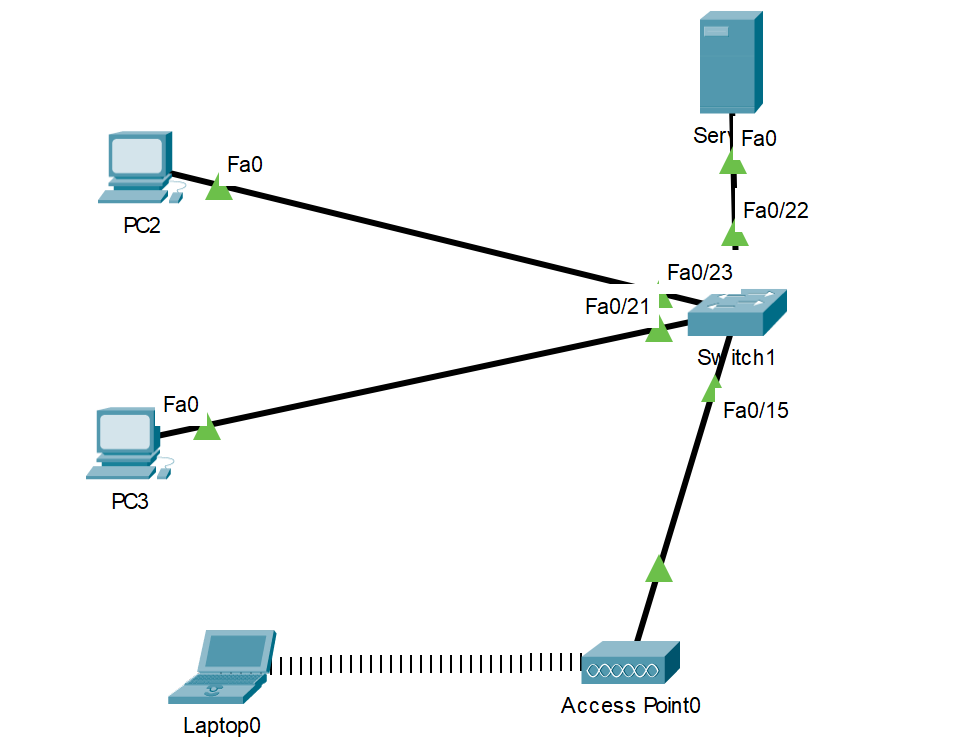

Comprobar conectividad en la red local
1. Tarea: Crear red con 2PC, laptop wifi + 1 switch
2. Asignar IPs manuales
3. Hacer Ping y verificar
4. Simular envio de email

#### B) Practica1 Lab Redes

**Práctica calificada**
a. Topología de red
Dispositivos mínimos:
* 1 router inalámbrico con acceso simulado a Internet.
* 2 switches (uno para estudiantes y otro para administración).
* 6 PCs para administración.
* 1 servidor interno (portal de usuarios + DNS).
* 6 laptops conectadas por Wi-Fi (estudiantes).
b. Configuración
Cree 2 VLANs:
* Cree 2 VLANs:
* VLAN 15: Estudiantes.
* VLAN 25: Administración + Servidor.
* Configure el router para inter-VLAN routing.
* Configure DHCP con rangos distintos para cada VLAN.
* Configure el servidor con IP fija y habilite servicios de DNS y HTTP.
* Configure la red Wi-Fi con SSID: Residencia-WiFi y clave:
  campus2025.
**Pruebas de conectividad**
Verifique que:
* Las laptops de estudiantes tengan conectividad entre sí y salida a Internet
simulada.
* Los PCs administrativos puedan acceder al servidor interno.
* Los estudiantes accedan al portal escribiendo www.residencia.edu
  en el navegador.
* La administración tenga conectividad restringida únicamente a su VLAN y
  al servidor.

---

#### A)

**1. Tarea: Crear red con 2PC, laptop wifi + 1 switch**

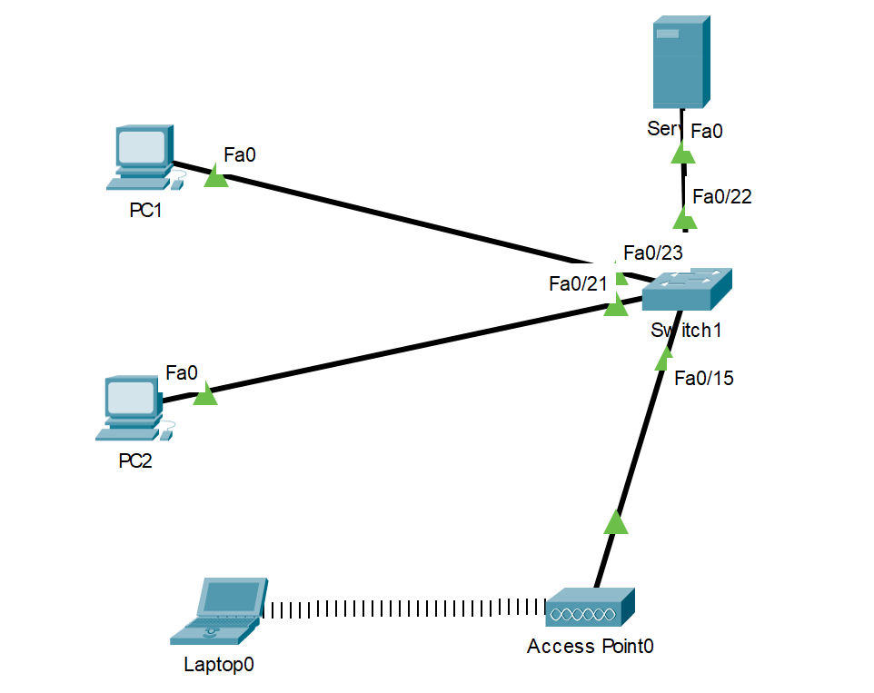

**2. Asignar IPs manuales**

| Dispositivo | IP          | Máscara |
| ----------- | ----------- | ------- |
| PC1         | 192.168.1.2 | /24     |
| PC2         | 192.168.1.3 | /24     |
| Laptop0     | 192.168.1.4 | /24     |
| Server      | 192.168.1.7 | /24     |
**3. Hacer Ping y verificar**

Ping de PC1 al Server

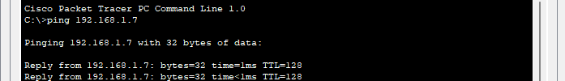

Ping de PC1 a PC2

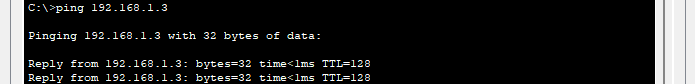

Ping de PC1 a Laptop0

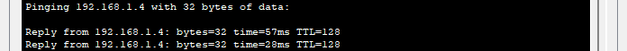

**4. Simular envío de email**

Activamos el servicio de EMAIL

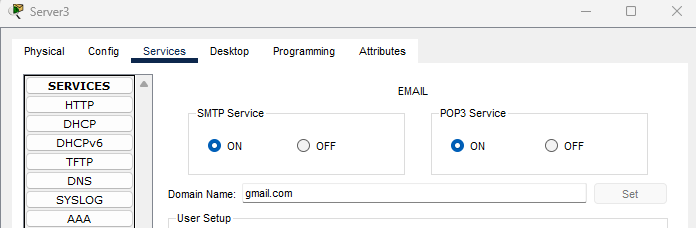

Creamos los usuarios

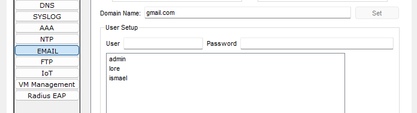

Configurar los correos

Desktop → **Email**
En PC1

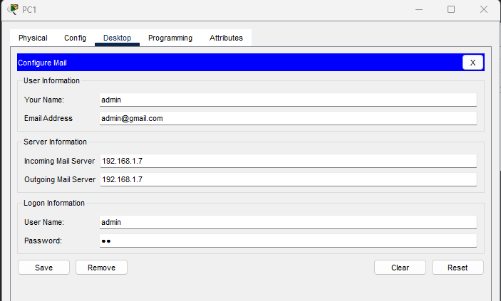

En PC2

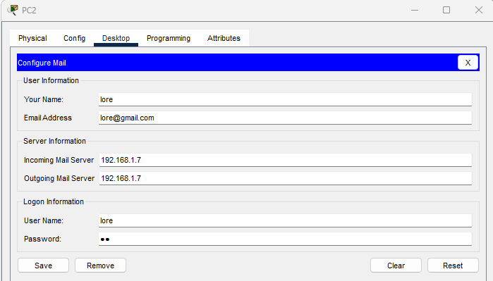

En PC3

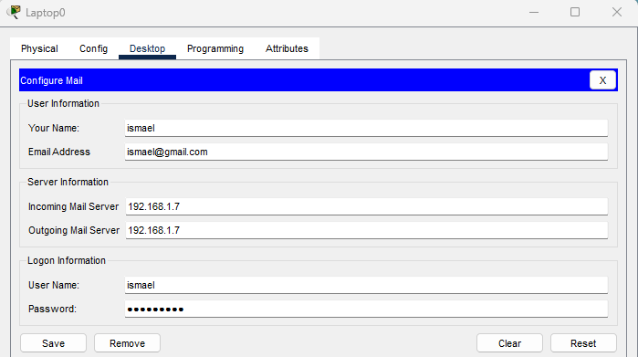

**Verificar el email en Packet Tracer**

De PC1 a Laptop0

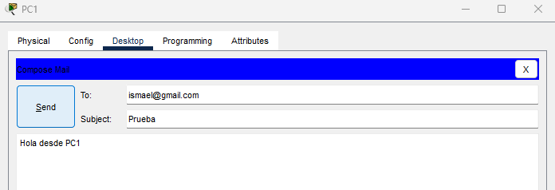

En Laptop0

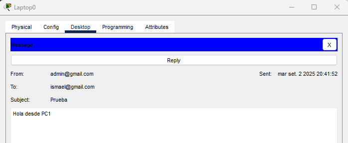

#### B)

**a. Topología de red**

Armamos la Topologia

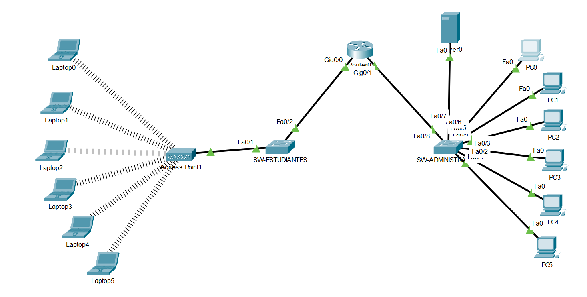

Usaremos este **plan de direccionamiento**:

| VLAN              | Red             | Gateway      | DHCP              |
| ----------------- | --------------- | ------------ | ----------------- |
| 10 Estudiantes    | 192.168.15.0/24 | 192.168.15.1 | 192.168.15.11-100 |
| 25 Administración | 192.168.25.0/24 | 192.168.25.1 | 192.168.25.11-100 |
Servidor: 192.168.25.2

**b. Configuración**

* Cree 2 VLANs: 
	* VLAN 15: Estudiantes. 
	* VLAN 25: Administración + Servidor.

En Switch de Estudiantes (SW-EST)
```
vlan 15
name ESTUDIANTES

interface range fa0/1 
switchport mode access
switchport access vlan 15

interface g0/1
switchport mode trunk
```

En Switch Administración (SW-ADM)
```
vlan 25
name ADMIN

interface range fa0/1 - 7
switchport mode access
switchport access vlan 25

interface g0/1
switchport mode trunk
```

* Configure el router para inter-VLAN routing

En Router0
```
interface g0/0
no shutdown

interface g0/0.15
encapsulation dot1Q 15
ip address 192.168.15.1 255.255.255.0

interface g0/0.25
encapsulation dot1Q 25
ip address 192.168.25.1 255.255.255.0

exit
```

* Configure DHCP con rangos distintos para cada VLAN

```
ip dhcp excluded-address 192.168.15.1 192.168.15.10
ip dhcp excluded-address 192.168.25.1 192.168.25.10

ip dhcp pool VLAN15
network 192.168.15.0 255.255.255.0
default-router 192.168.15.1
dns-server 192.168.25.2

ip dhcp pool VLAN25
network 192.168.25.0 255.255.255.0
default-router 192.168.25.1
dns-server 192.168.25.2
```

* Configure el servidor con IP fija y habilite servicios de DNS y HTTP.

1. **IP manual:**

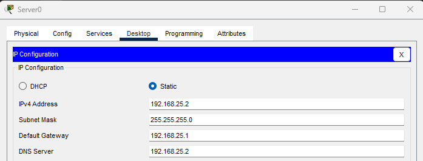

   2. **Servicio DNS**

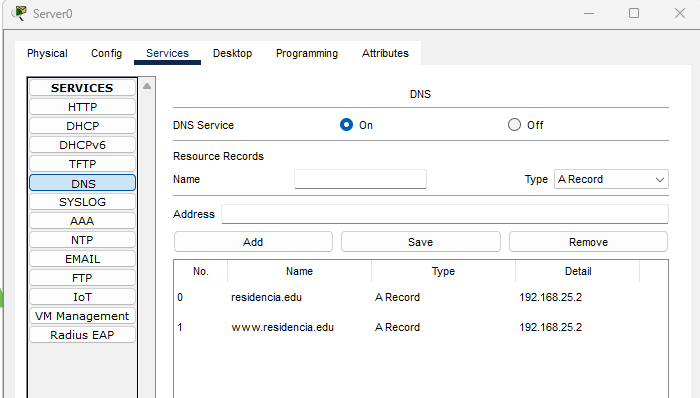

  3. **Servicio HTTP**

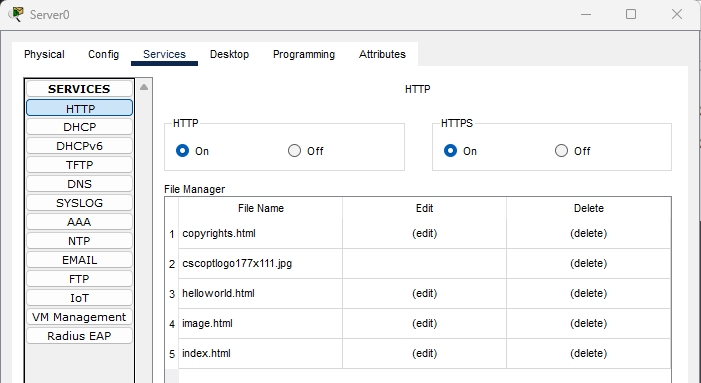

* En el Access Point, 
Configure la red Wi-Fi con SSID: Residencia-WiFi y clave: campus2025.

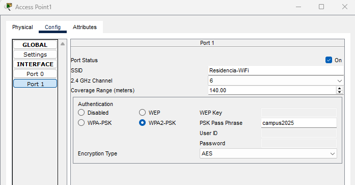

Conectar una Laptop al WiFi

- **Desktop** -> Abrir **PC Wireless

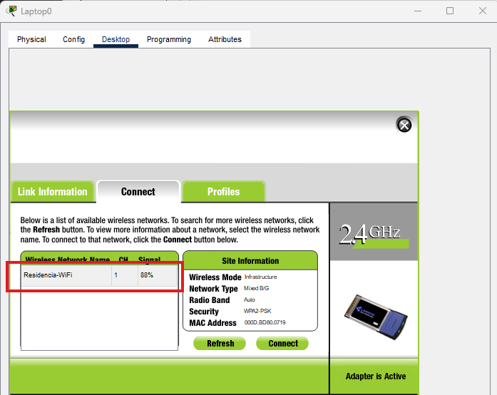

Ingresamos la contraseña

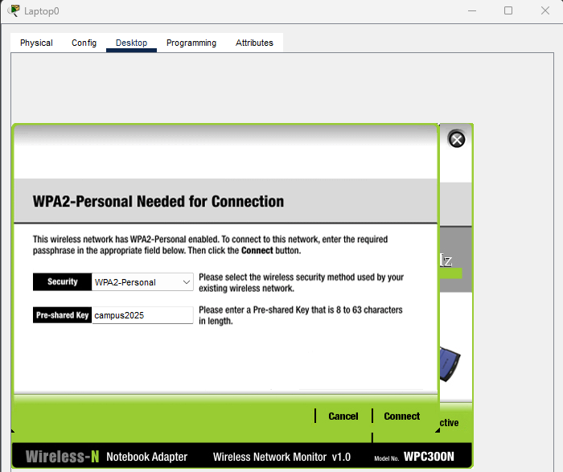

**Pruebas de conectividad**
Las laptops de estudiantes tengan conectividad entre sí y salida a Internet simulada.

1) Ping entre dos laptops de estudiantes
ping 192.168.15.X (IP de LAP-2)

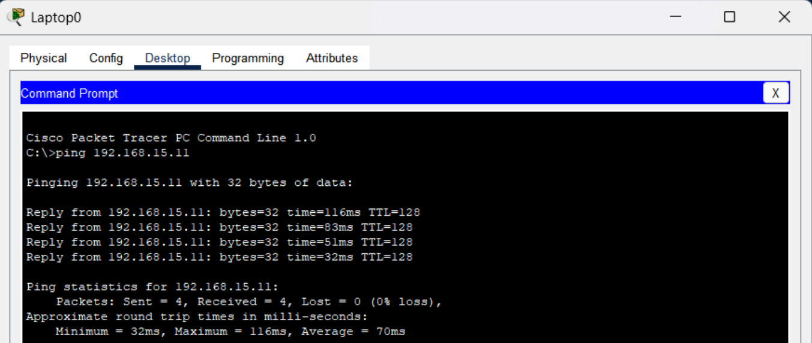

Ping al Router (salida a Internet simulada)

En Router0
```
Router(config)#int lo0
Router(config-if)#ip address 192.168.10.1 255.255.255.0
```

Desde laptop 0

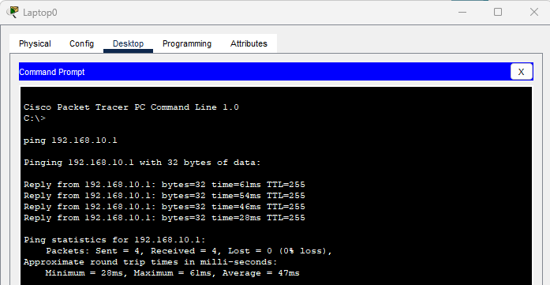

2) Ping PC Administración → Servidor

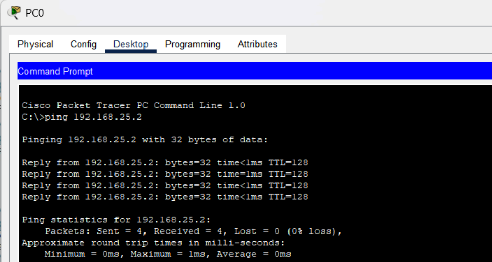

3) Navegador cargando www.residencia.edu

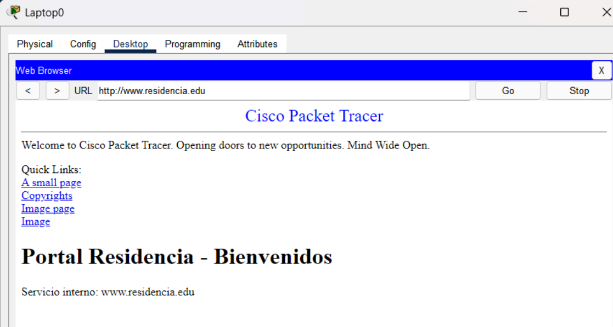

http://www.residencia.edu carga correctamente la página del servidor

4) Laptops: conexión Wi-Fi y dirección IP por DHCP

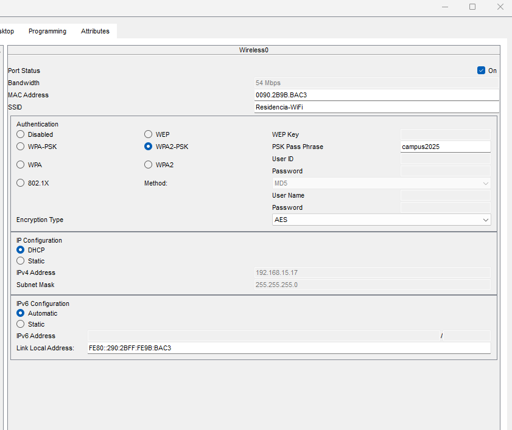

Laptop conectada a Residencia-WiFi con IP asignada por DHCP
