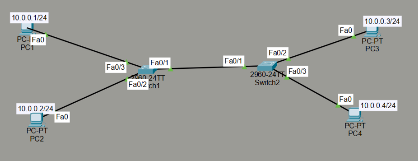

## 02 - LABORATORIO - VLANs - CCNA

#### A) VLAN Configuration 


1) Haga ping entre las computadoras para probar la conectividad.
2) Asigne PC1 y PC3 a la VL
3) AN1, y PC2 y PC4 a la VLAN2.
4) Intente hacer ping entre PC1 y PC3, y luego entre PC2 y PC4. ¿Por qué funciona el ping entre PC1 y PC3, pero no entre PC2 y PC4?
5) Configure las interfaces que conectan SW1 y SW2 como interfaces troncales.
6) Vuelva a hacer ping entre las computadoras. ¿Qué pings fallan y cuáles tienen éxito?

#### B) Naming VLANs

![[Pasted image 20260110153401.png]]

1. Configure los nombres de host de los switches como SW1 y SW2, respectivamente. 
2. Cree dos VLAN en cada switch con los siguientes nombres:
        VLAN 13 - Nombre: Administración
        VLAN 24 - Nombre: Ingeniería
3. Coloque PC1 y PC3 en la VLAN 13, y PC2 y PC4 en la VLAN 24.
4. Configure un enlace troncal entre SW1 y SW2.
5. Guarde la configuración actual de los switches.
6. Compruebe que las PC en la misma VLAN puedan hacer ping entre sí.

#### C) VLAN Configuration: Trunk Encapsulation 

![[Pasted image 20260108120710.png]]

1. Haga ping entre las PC para probar la conectividad.
2. Asigne las PC2 y PC3 a la VLAN 2.
3. Cree un enlace troncal entre SW1 y SW2.
4. Haga ping entre las PC para probar la conectividad.

---
#### A) VLAN Configuration

**1) Haga ping entre las computadoras para probar la conectividad. **

Ping 
![[Pasted image 20260106171744.png]]

**2. Asigne PC1 y PC3 a la VLAN1, y PC2 y PC4 a la VLAN2.**

**Switch 1**

```
Switch(config-if)#int fa0/2
Switch(config-if)#switchport mode access
Switch(config-if)#switchport access vlan 1

Switch(config-if)#int fa0/3
Switch(config-if)#switchport mode access
Switch(config-if)#switchport access vlan 2
% Access VLAN does not exist. Creating vlan 2
```
La VLAN 1 es la vlan Nativa.

**Switch 2**

```
Switch(config)#int fa0/2
Switch(config-if)#switchport mode access
Switch(config-if)#switchport access vlan 1

Switch(config-if)#int fa0/3
Switch(config-if)#switchport mode access
Switch(config-if)#switchport access vlan 2
% Access VLAN does not exist. Creating vlan 2
```

**3. Intente hacer ping entre PC1 y PC3, y luego entre PC2 y PC4. **

Ping PC1 y PC3
![[Pasted image 20260106171807.png]]
Ping PC2 y PC4
![[Pasted image 20260106171820.png]]

¿Por qué funciona el ping entre PC1 y PC3, pero no entre PC2 y PC4?

En PC1 PC3 funciona ping porque, VLAN 1 funciona porque es la VLAN por defecto (nativa), VLAN 1 forma un único dominio de broadcast

En cambio VLAN 2 es un dominio de broadcast distinto, y el ping no funciona porque el enlace entre switches no está configurado como trunk, por lo que la VLAN 2 no se transporta entre ellos, por eso no hay ping entre PC2 y PC4.

Cualquier VLAN distinta de la nativa se queda “atrapada” en su switch local si no hay trunk.

**4. Configure las interfaces que conectan SW1 y SW2 como interfaces troncales.**

**Switch 1**

```
Switch(config)#int fa0/1
Switch(config-if)#switchport mode trunk
```

**Switch 2**

```
Switch(config)#int fa0/1
Switch(config-if)#switchport mode trunk
```

**5. Vuelva a hacer ping entre las computadoras. **

¿Qué pings fallan y cuáles tienen éxito?
Los que estan en la misma vlan hay exito en el ping, y fallan en los que tán en VLANs distintas.

Los pings que falla son:
PC1 (10.0.0.1) con PC2 y PC4 
PC3 (10.0.0.3) con PC2 y PC4 
Las que tiene éxito son:
entre PC1 (10.0.0.1) y PC3 (10.0.0.3) 
y entrePC2 (10.0.0.2) y PC4 (10.0.0.4) 

#### B) Naming VLANs

**1. Configure los nombres de host de los switches como SW1 y SW2, respectivamente. **

En Switch1

```
Switch>enab
Switch#conf t
Enter configuration commands, one per line. End with CNTL/Z.
Switch(config)#hostname SW1
```

En Switch2

```
Switch>enab
Switch#conf t
Enter configuration commands, one per line. End with CNTL/Z.
Switch(config)#hostname SW2
```

**2. Cree dos VLAN en cada switch con los siguientes nombres:**
        VLAN 13 - Nombre: MANAGEMENT
        VLAN 24 - Nombre: Ingeniería

En SW1 y en SW2
```
SW1(config)#vlan 13
SW1(config-vlan)#name MANAGEMENT
```

```
SW1(config-vlan)#vlan 24
SW1(config-vlan)#name INGENIERIA
```

```
SW1(config-vlan)#do show vlan brief
```
![[Pasted image 20260110154054.png]]

**3. Configure un enlace troncal entre SW1 y SW2 y configure un enlace troncal entre SW1 y SW2.**
En SW1
```
Switch(config)#int Fa0/1
Switch(config-if)#switchport mode access
Switch(config-if)#switchport access vlan 13

Switch(config-if)#int fa0/2
Switch(config-if)#switchport mode access
Switch(config-if)#switchport access vlan 24
```

```
SW1(config-vlan)#int fa0/1
SW1(config-if)#switchport mode trunk
```

En SW2
```
Switch(config)#int Fa0/1
Switch(config-if)#switchport mode access
Switch(config-if)#switchport access vlan 13

Switch(config-if)#int fa0/2
Switch(config-if)#switchport mode access
Switch(config-if)#switchport access vlan 24
```

```
SW2(config)#int Fa0/1
SW2(config-if)#switchport mode trunk
```

**4. Guarde la configuración actual de los switches.**

```
SW1#write
Building configuration...
[OK]
```
