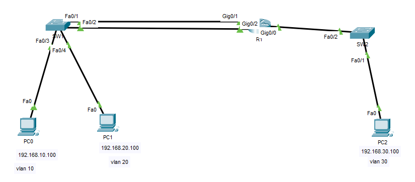
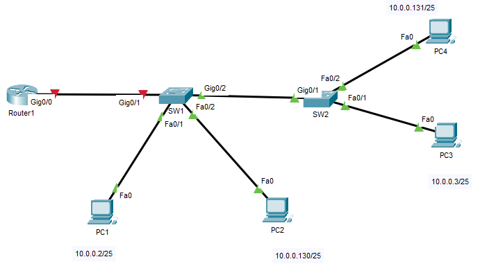
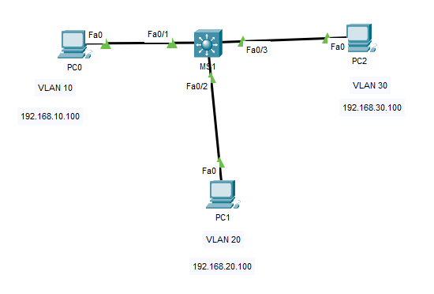
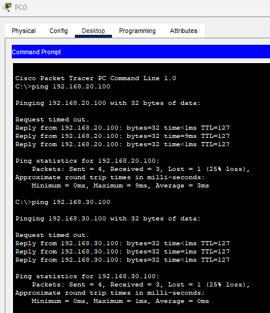
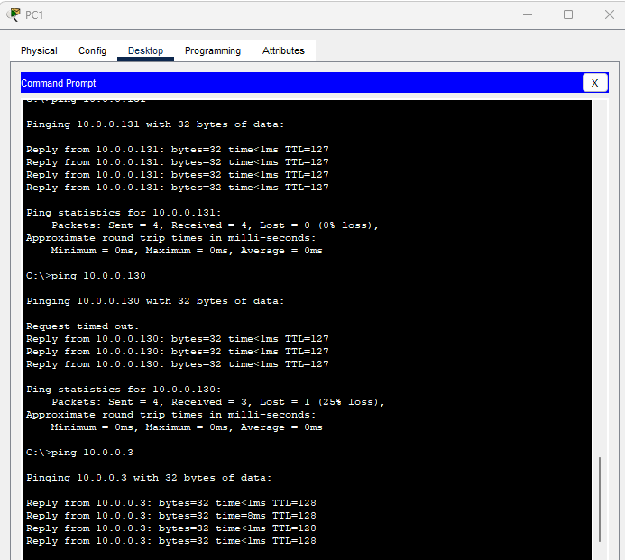
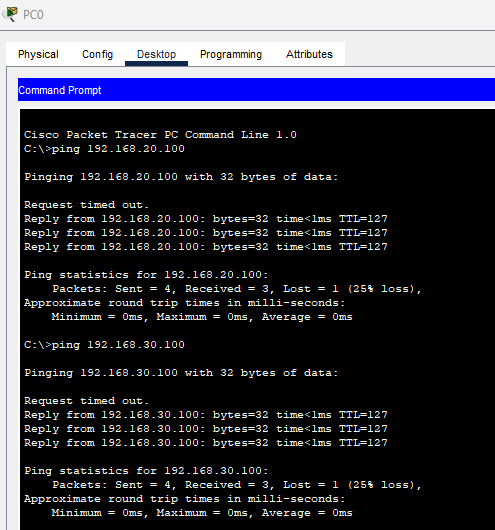

## 03 - LABORATORIO - Inter-VLAN Routing 01 -CCNA

#### A) Enrutamiento Inter-VLAN tradicional


#### B) Inter-VLAN Routing



1. Haga ping entre las PC. ¿Qué pings son exitosos?
2. Asigne PC1 y PC3 a la VLAN 13, y PC2 y PC4 a la VLAN 24.
3. Cree un enlace troncal entre SW1 y SW2.
4. Configure el enrutamiento entre VLAN mediante subinterfaces en la interfaz G0/0 del R1. Use la dirección 10.0.0.1/25 para la VLAN 13 y 10.0.0.129/25 para la VLAN 24. 
5. Pruebe la conectividad haciendo ping entre las PC.

#### C) Enrutamiento Inter-VLAN multicapa (MLS) 



---

#### A) Enrutamiento Inter-VLAN tradicional

En SW1

```
interface FastEthernet0/1
switchport access vlan 10
switchport mode access

interface FastEthernet0/2
switchport access vlan 20
switchport mode access

interface FastEthernet0/3
description Servidor VLAN10
switchport mode access
switchport access vlan 10

interface FastEthernet0/4
description Servidor VLAN20
switchport mode access
switchport access vlan 20
```

En R1

```
interface GigabitEthernet0/0
ip address 192.168.30.1 255.255.255.0

interface GigabitEthernet0/1
description esta es VLAN10
ip address 192.168.10.1 255.255.255.0

interface GigabitEthernet0/2
description esta es VLAN20
ip address 192.168.20.1 255.255.255.0
```

En SW2

```
interface FastEthernet0/1
switchport mode access
switchport access vlan 30

interface FastEthernet0/2
switchport mode access
switchport access vlan 30
```

Verificacion:


#### B) Inter-VLAN Routing

**1. Haga ping entre las PC. ¿Qué pings son exitosos?**

Los pings exitosos son entre:
PC1⇔ PC3 
PC2 ⇔ PC4
No hay ping entre PC1 y PC4 o entre PC3 y PC2 porque, están en subredes IP diferentes.

| PC         | RED           |
| ---------- | ------------- |
| PC1 Y PC 3 | 10.0.0.0/25   |
| PC2 Y PC4  | 10.0.0.128/25 |
**2.  Asigne PC1 y PC3 a la VLAN 13, y PC2 y PC4 a la VLAN 24.**

**Configuración**

Configuración del **Switch 1**

```
Switch(config)#int Fa0/1
Switch(config-if)#switchport mode access
Switch(config-if)#switchport access vlan 13
% Access VLAN does not exist. Creating vlan 13

Switch(config-if)#int fa0/2
Switch(config-if)#switchport mode access
Switch(config-if)#switchport access vlan 24
% Access VLAN does not exist. Creating vlan 24
```

Configuración del **Switch 2**

```
Switch(config)#int Fa0/2
Switch(config-if)#switchport mode access
Switch(config-if)#switchport access vlan 24
% Access VLAN does not exist. Creating vlan 24

Switch(config-if)#int Fa0/1
Switch(config-if)#switchport mode access
Switch(config-if)#switchport access vlan 13
% Access VLAN does not exist. Creating vlan 13
```

**3. Cree un enlace troncal entre SW1 y SW2.**

En **Switch 1**
```
Switch(config-if)#int Gig0/2
Switch(config-if)#switchport mode trunk
```

En **Switch 2**
```
Switch(config)#int g0/1
Switch(config-if)#switchport mode trunk
```

En switches actuales no tenemos que configuración el tipo de encapsulación.

**4. Configure el enrutamiento entre VLAN mediante subinterfaces en la interfaz G0/0 del R1. Use la dirección 10.0.0.1/25 para la VLAN 13 y 10.0.0.129/25 para la VLAN 24. 

Para configurar Inter-VLAN usaremos router on stick.
Configuración del **Router 1**

En R1
```
Router(config)#int g0/0
Router(config-if)#no shut
Router(config-if)#int g0/0.13
Router(config-subif)#encapsulation dot1Q 13
Router(config-subif)#ip address 10.0.0.1 255.255.255.128

Router(config-subif)#int g0/0.24
Router(config-subif)#encapsulation dot1Q 24
Router(config-subif)#ip address 10.0.0.129 255.255.255.128
```

Configuramos el enlace troncal en el switch en G0/1

```
Switch(config)#int gig0/1
Switch(config-if)#switchport mode trunk
```

**5. Pruebe la conectividad haciendo ping entre las PC.**

Ahora ya se puede hacer ping entre las VLANs


#### C) Enrutamiento Inter-VLAN multicapa (MLS) 

En MS1

Creamos las VLANs y asignamos cada interfaz a modo acceso.
```
interface FastEthernet0/1
switchport access vlan 10
switchport mode access

interface FastEthernet0/2
switchport access vlan 20
switchport mode access

interface FastEthernet0/3
switchport access vlan 30
switchport mode access
```

Creamos las interfaces SVI = Switch VLAN Interface. (interfaces virtuales) y le asignamos las direcciones ip que funcionarán como gateway.
```
interface Vlan10
no shut
ip address 192.168.10.1 255.255.255.0

interface Vlan20
no shut
ip address 192.168.20.1 255.255.255.0

interface Vlan30
no shut
ip address 192.168.30.1 255.255.255.0
```

Comando para el Multilayer Switch para que haga enrutamiento.
```
ip routing
```

Verificacion:



