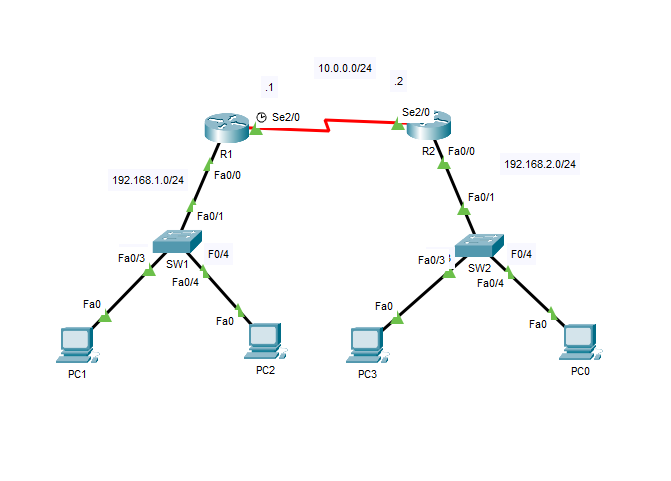
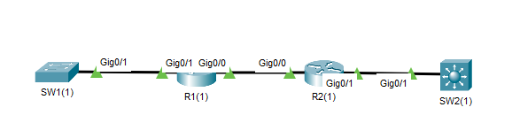

## 05 -  LABORATORIO - CDP (Cisco Discovery Protocol) - CCNA

#### A)



1. Use CDP para identificar las interfaces que se utilizan para conectar los routers y switches.
2. Determine qué lado de la conexión serial entre R1 y R2 es DCE y cuál es DTE. Establezca una velocidad de reloj de 64 KB/s en el lado DCE.
3. ¿Cuáles son los temporizadores predeterminados de envío y retención de CDP? Confirme esto con el comando "show" en uno de los dispositivos.
4. Deshabilite CDP globalmente en R1 e intente ver los vecinos de CDP.
5. Habilite CDP globalmente en R1 y vuelva a ver los vecinos de CDP inmediatamente. ¿SW1 y R2 aparecen instantáneamente?
6. Deshabilite CDP en las interfaces de switch conectadas a las PC.

#### B)



1. Use CDP para identificar qué interfaces se utilizan para conectar los enrutadores y conmutadores.
2. Use CDP para identificar el modelo de enrutador/conmutador de los dispositivos vecinos de cada dispositivo.
3. Use CDP para identificar la versión IOS de los dispositivos vecinos de cada dispositivo.

---
#### A)

**1. Use CDP para identificar las interfaces que se utilizan para conectar los routers y switches.**

En SW1
Activamos CDP
```
SW1(config)#cdp run
```

```
SW1#show cdp neighbors
Capability Codes: R - Router, T - Trans Bridge, B - Source Route Bridge
                  S - Switch, H - Host, I - IGMP, r - Repeater, P - Phone
Device ID Local Intrfce Holdtme Capability Platform Port ID
R1 Fas 0/1 133 R PT1000 Fas 0/0
```

En R1

```
R1#show cdp neighbors
Capability Codes: R - Router, T - Trans Bridge, B - Source Route Bridge
                  S - Switch, H - Host, I - IGMP, r - Repeater, P - Phone
Device ID Local Intrfce Holdtme Capability Platform Port ID
SW1 Fas 0/0 133 S 2960 Fas 0/1
R2 Ser 2/0 141 R PT1000 Ser 2/0
```

En R2

```
R2#show cdp neighbors
Capability Codes: R - Router, T - Trans Bridge, B - Source Route Bridge
                  S - Switch, H - Host, I - IGMP, r - Repeater, P - Phone
Device ID Local Intrfce Holdtme Capability Platform Port ID
SW2 Fas 0/0 124 S 2960 Fas 0/1
R1 Ser 2/0 125 R PT1000 Ser 2/0
```


En SW2

```
SW2#show cdp neighbors
Capability Codes: R - Router, T - Trans Bridge, B - Source Route Bridge
                  S - Switch, H - Host, I - IGMP, r - Repeater, P - Phone
Device ID Local Intrfce Holdtme Capability Platform Port ID
R2 Fas 0/1 120 R PT1000 Fas 0/0
```

**2. Determine qué lado de la conexión serial entre R1 y R2 es DCE (Equipo de comunicación de datos) y cuál es DTE (Equipo terminal de datos). Establezca una velocidad de reloj de 64 KB/s en el lado DCE.**

El lado DCE es el que proporciona la frecuencia de reloj de la conexion.

Vemos cual es la interfaz es cual

En R1
```
R1#sh controllers s2/0
Interface Serial2/0
Hardware is PowerQUICC MPC860
DCE V.35, clock rate 2000000
idb at 0x81081AC4, driver data structure at 0x81084AC0
```

La interfaz Serial de R1 es la que tiene **DCE**

Establecemos la velocidad de reloj.

```
R1(config)#int s2/0
R1(config-if)#clock ra
R1(config-if)#clock rate 64000
```

**3. ¿Cuáles son los temporizadores predeterminados de envío y retención de CDP? Confirme esto con el comando "show" en uno de los dispositivos.**

En R1
```
R1#show cdp interface s2/0
Serial2/0 is up, line protocol is up
Sending CDP packets every 60 seconds
Holdtime is 180 seconds
```

**4. Deshabilite CDP globalmente en R1 e intente ver los vecinos de CDP.**

```
R1(config)#no cdp run
^Z
R1#show cdp neighbors
% CDP is not enabled
```

**5. Habilite CDP globalmente en R1 y vuelva a ver los vecinos de CDP inmediatamente. ¿SW1 y R2 aparecen instantáneamente?**


```
R1(config)#cdp run
R1(config)#do show cdp neighbors
Capability Codes: R - Router, T - Trans Bridge, B - Source Route Bridge
S - Switch, H - Host, I - IGMP, r - Repeater, P - Phone
Device ID Local Intrfce Holdtme Capability Platform Port ID
```
No aparece ningún vecino, porque cdp el tiempo de envio es cdp es de 60s, luego de ese tiempo aparecera los vecinos

**6. Deshabilite CDP en las interfaces de switch conectadas a las PC.**

En SW1
```
SW1(config)#int F0/3
SW1(config-if)#no cdp enable
SW1(config-if)#int f0/4
SW1(config-if)#no cdp enable
```

En SW2
```
SW2(config)#int range f0/3 - 4
SW2(config-if-range)#no cdp enable
```

---

#### B)

**1. Use CDP para identificar qué interfaces se utilizan para conectar los enrutadores y conmutadores.**

En S1(1)
```
SW1#show cdp neighbors
Capability Codes: R - Router, T - Trans Bridge, B - Source Route Bridge
S - Switch, H - Host, I - IGMP, r - Repeater, P - Phone
Device ID Local Intrfce Holdtme Capability Platform Port ID
R1 Gig 0/1 166 R C1900 Gig 0/1
```

En R1(1)
```
R1#show cdp neighbors
Capability Codes: R - Router, T - Trans Bridge, B - Source Route Bridge
S - Switch, H - Host, I - IGMP, r - Repeater, P - Phone
Device ID Local Intrfce Holdtme Capability Platform Port ID
R2 Gig 0/0 131 R C2900 Gig 0/0
SW1 Gig 0/1 131 S 2960 Gig 0/1
```

R2(1)

```
R2#show cdp neighbors
Capability Codes: R - Router, T - Trans Bridge, B - Source Route Bridge
S - Switch, H - Host, I - IGMP, r - Repeater, P - Phone
Device ID Local Intrfce Holdtme Capability Platform Port ID
R1 Gig 0/0 153 R C1900 Gig 0/0
SW2 Gig 0/1 153 3560 Gig 0/1
```

En SW2(1)
```
SW2#show cdp ne
Capability Codes: R - Router, T - Trans Bridge, B - Source Route Bridge
S - Switch, H - Host, I - IGMP, r - Repeater, P - Phone
Device ID Local Intrfce Holdtme Capability Platform Port ID
R2 Gig 0/1 160 R C2900 Gig 0/1
```

**2. Use CDP para identificar el modelo de enrutador/conmutador de los dispositivos vecinos de cada dispositivo y use CDP para identificar la versión IOS de los dispositivos vecinos de cada dispositivo.**

Los comando a utilizar son 


```
show cdp neighbors detail
```


```
show cdp entry <R1(1)>
```

En S1(1), R1(1), S2(1), R2(1)