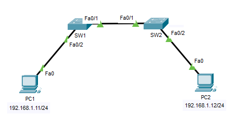
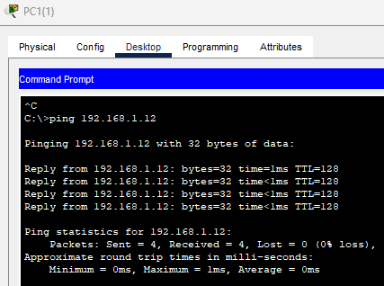
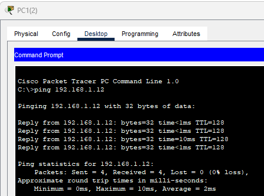
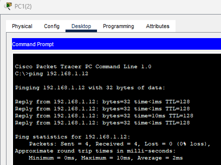
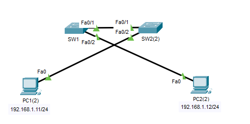
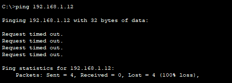
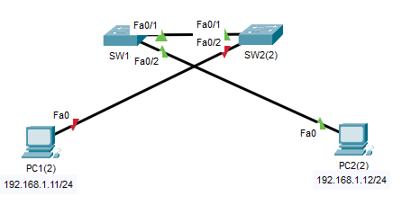
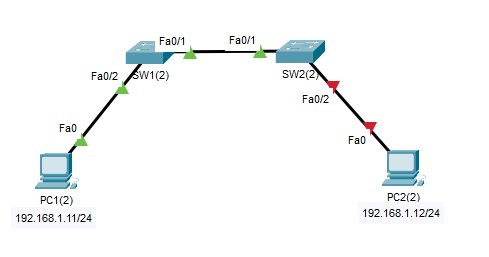
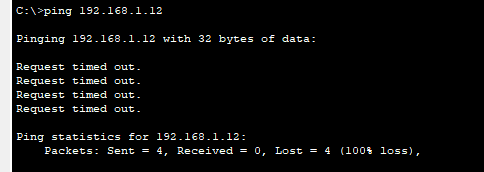
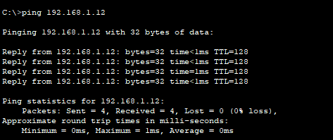

## 06 - LABORATORIO - Port Security - CCNA

#### A)



2. Desde la CLI de SW1, busque la dirección MAC de SW2. Desde la CLI de SW2, busque la dirección MAC de SW1.
3. ¿Por qué no aparecen las direcciones MAC de PC1 y PC2 en las tablas de direcciones MAC de SW1 y SW2?
4. Haga ping de PC1 a PC2 para generar tráfico entre ellas. Revise nuevamente las tablas de direcciones MAC de los switches.
5. Habilite la seguridad de puertos en las interfaces del switch conectadas a las PC.
6. ¿Cuántas direcciones MAC se permiten de forma predeterminada en una interfaz con seguridad de puertos habilitada? Configure esta opción explícitamente en cada switch.
7. ¿Cuál es la acción predeterminada en caso de una violación de la seguridad de puertos? Configure esta opción explícitamente en cada switch.
8. Configure manualmente la dirección MAC de PC1 como dirección MAC segura para SW1 F0/2
   Configure manualmente la dirección MAC de PC2 como dirección MAC segura para SW2 F0/2.

#### B)

1. Habilite la seguridad de puertos en los puertos del switch conectados a los hosts finales.
2. Haga ping de PC1 a PC2 para generar tráfico entre ellos.
3. Use el comando "show" para ver las direcciones MAC seguras en SW1. La dirección MAC de PC1 debería estar en la tabla.
4. Verifique la configuración de la interfaz F0/2 de SW1 en la configuración en ejecución. Anote las configuraciones.
5. Guarde la configuración en ejecución de SW1 y reinicie el switch.
6. Vuelva a ver las direcciones MAC seguras en SW1. ¿Sigue presente la dirección MAC de PC1?
7. Habilite las direcciones MAC seguras persistentes en la interfaz F0/2 de SW1 y haga ping de PC1 a PC2 para generar tráfico.
8. Vea las direcciones MAC seguras en SW1 y, a continuación, la configuración de F0/2 en la configuración en ejecución. ¿Qué ha cambiado?
9. Guarde la configuración en ejecución y reinicie el switch.
10. Revise nuevamente las direcciones MAC seguras en SW1. ¿Sigue presente la dirección MAC de la PC1?

#### C)

1. Haga ping de PC1 a PC2 para generar tráfico entre ellas.
2. Revise la tabla de direcciones MAC de SW1 y anote la dirección MAC de PC1.
3. Habilite la seguridad de puerto en la interfaz F0/2 de SW1 y configure manualmente la dirección MAC de PC1 como una dirección MAC segura.
4. Repita el proceso en SW2 para PC2.
5. Haga ping entre PC1 y PC2 para probar.
6. Retire los cables que conectan las PC a los switches y luego conecte PC1 a la interfaz F0/2 de SW2 y PC2 a la interfaz F0/2 de SW1.
7. Haga ping de PC1 a PC2. ¿Qué sucede?
8. Vuelva a conectar los cables como en la topología original.
9. Haga ping de PC1 a PC2. ¿Qué sucede?
10. Solucione el problema e intente hacer ping de PC1 a PC2 una vez más.

---
#### **A)**

**1. Desde la CLI de SW1, busque la dirección MAC de SW2. Desde la CLI de SW2, busque la dirección MAC de SW1.**

```
show mac address-table
```

En SW1

```
SW1#show mac address-table
Mac Address Table
-------------------------------------------
Vlan Mac Address Type Ports
---- ----------- -------- -----
1 0001.9626.4101 DYNAMIC Fa0/1
```

En SW2

```
SW2#show mac address-table
Mac Address Table
-------------------------------------------
Vlan Mac Address Type Ports
---- ----------- -------- -----
1 0006.2a8c.e501 DYNAMIC Fa0/1
```

**2. ¿Por qué no aparecen las direcciones MAC de PC1 y PC2 en las tablas de direcciones MAC de SW1 y SW2?**

Los switches intercambian tramas automáticamente (por ejemplo, BPDU de STP, CDP, DTP), al hacerlo, sus MAC de origen sí ingresan a la tabla MAC.

Mientras que las PCs no envían ningún tráfico, no han transmitido ARP, ICMP ni ningún otro paquete. Por lo tanto, el switch no ha visto su MAC de origen

**3. Haga ping de PC1 a PC2 para generar tráfico entre ellas. Revise nuevamente las tablas de direcciones MAC de los switches.**

```
SW1#show mac address-table
Mac Address Table
-------------------------------------------
Vlan Mac Address Type Ports
---- ----------- -------- -----
1 0001.9626.4101 DYNAMIC Fa0/1
1 0002.16e2.2193 DYNAMIC Fa0/2
1 0007.ec28.0631 DYNAMIC Fa0/1
```

**4. Habilite la seguridad de puertos en las interfaces del switch conectadas a las PC.**

Port Security solo funciona en puertos en modo access.

Si no configuras explícitamente switchport mode access, el puerto puede quedar en modo dinámico y Port Security no se activa correctamente.

En SW1
```
SW1(config)# interface fa0/2
SW1(config-if)# switchport mode access
SW1(config-if)# switchport port-security
```

En SW2

```
SW2(config)# interface fa0/2
SW2(config-if)# switchport mode access
SW2(config-if)# switchport port-security
```

**5.¿Cuántas direcciones MAC se permiten de forma predeterminada en una interfaz con seguridad de puertos habilitada? Configure esta opción explícitamente en cada switch.**

De forma predeterminada, una interfaz con Port Security habilitado permite 1 dirección MAC en el puerto.

```
SW1(config-if)#switchport port-security maximum 1
```

```
SW2(config-if)#switchport port-security maximum 1
```

**6. ¿Cuál es la acción predeterminada en caso de una violación de la seguridad de puertos? Configure esta opción explícitamente en cada switch.**

Si se viola la reglas que configuramos:
* `protect` Solo Descarta silenciosamente las tramas provenientes de la MAC no permitida.
* `restrict`Registra la violación, envía alertas y descarta las tramas de la MAC no permitida
* `shutdown`Registra la violación y deshabilita completamente el puerto, el puerto pasa a estado err-disabled

```
SW1#show port-security
Secure Port MaxSecureAddr CurrentAddr SecurityViolation Security Action
                 (Count)     (Count)            (Count)
--------------------------------------------------------------------
        Fa0/2        1        0                    0      Shutdown
----------------------------------------------------------------------
```

Vemos que la opción por predeterminado es `Shutdown`

```
SW1(config-if)#switchport port-security violation shutdown
```

```
SW2(config-if)#switchport port-security violation shutdown
```

**7. Configure manualmente la dirección MAC de PC1 como dirección MAC segura para SW1 F0/2
   Configure manualmente la dirección MAC de PC2 como dirección MAC segura para SW2 F0/2.**

Primero averiguamos las address mac de las PCs
PC1: `0002.16E2.2193`
PC2:  `0007.EC28.0631`

En SW1
```
SW1(config-if)#switchport port-security mac-addres 0002.16E2.2193
```

En SW2

```
SW1(config-if)#switchport port-security mac-addres 0007.EC28.0631
```
   
Verificamos:

```
SW1#show port-security address
Secure Mac Address Table
-----------------------------------------------------------------------------
Vlan Mac Address Type Ports Remaining Age
(mins)
---- ----------- ---- ----- -------------
1 0002.16E2.2193 SecureConfigured Fa0/2 -
-----------------------------------------------------------------------------
Total Addresses in System (excluding one mac per port) : 0
Max Addresses limit in System (excluding one mac per port) : 1024
```
---
#### **B)**

**1. Habilite la seguridad de puertos en los puertos del switch conectados a los hosts finales.**

En SW1
```
SW1(config)# interface fa0/2
SW1(config-if)# switchport mode access
SW1(config-if)# switchport port-security
```

En SW2

```
SW2(config)# interface fa0/2
SW2(config-if)# switchport mode access
SW2(config-if)# switchport port-security
```

**2. Haga ping de PC1 a PC2 para generar tráfico entre ellos.**



**3. Use el comando "show" para ver las direcciones MAC seguras en SW1. La dirección MAC de PC1 debería estar en la tabla.**

```
SW1#show port-security address
Secure Mac Address Table
-----------------------------------------------------------------------------
Vlan Mac Address Type Ports Remaining Age
                                (mins)
---- ----------- ---- ----- -------------
1 0001.C9D9.2D55 DynamicConfigured FastEthernet0/2 -
-----------------------------------------------------------------------------
Total Addresses in System (excluding one mac per port) : 0
Max Addresses limit in System (excluding one mac per port) : 1024
```

**4. Verifique la configuración de la interfaz F0/2 de SW1 en la configuración en ejecución. Anote las configuraciones.**

```
show running-config

interface FastEthernet0/2
switchport mode access
switchport port-security
```

**5. Guarde la configuración en ejecución de SW1 y reinicie el switch.**

```
SW1#write
Building configuration...
[OK]

SW1#reload
```

**6. Vuelva a ver las direcciones MAC seguras en SW1. ¿Sigue presente la dirección MAC de PC1?**

No
```
SW1#show port-security address
Secure Mac Address Table
-----------------------------------------------------------------------------
Vlan Mac Address Type Ports Remaining Age
(mins)
---- ----------- ---- ----- -------------
-----------------------------------------------------------------------------
Total Addresses in System (excluding one mac per port) : 0
Max Addresses limit in System (excluding one mac per port) : 1024
```

**7. Haga ping de PC1 a PC2. ¿Qué sucede?**

```
switchport port-security mac-address sticky
```
Con este comando habilitamos el aprendizaje dinámico y automático de direcciones MAC.


Generamos trafico.


**8. Vea las direcciones MAC seguras en SW1 y, a continuación, la configuración de F0/2 en la configuración en ejecución. ¿Qué ha cambiado?**

Ahora se ve la direccion MAC de PC1 que esta conectado a Fa0/2
```
SW1#show port-security address
Secure Mac Address Table
-----------------------------------------------------------------------------
Vlan Mac Address Type Ports Remaining Age
                               (mins)
---- ----------- ---- ----- -------------
1 0001.C9D9.2D55 SecuritySticky FastEthernet0/2 -
-----------------------------------------------------------------------------
Total Addresses in System (excluding one mac per port) : 0
Max Addresses limit in System (excluding one mac per port) : 1024
```

En la conf de fa0/2

```
show run

interface FastEthernet0/2
switchport mode access
switchport port-security
switchport port-security mac-address sticky
switchport port-security mac-address sticky 0001.C9D9.2D55
```

Con `switchport port-security mac-address sticky` la direciones MAC quedan fijas y visibles en la configuración.

**9. Guarde la configuración en ejecución y reinicie el switch.**

```
SW1#wr
SW1#write
Building configuration...
[OK]

SW1#reload
```

**10. Revise nuevamente las direcciones MAC seguras en SW1. ¿Sigue presente la dirección MAC de la PC1?**

Si 
```
SW1#show port-security address
Secure Mac Address Table
-----------------------------------------------------------------------------
Vlan Mac Address Type Ports Remaining Age
                               (mins)
---- ----------- ---- ----- -------------
1 0001.C9D9.2D55 SecuritySticky FastEthernet0/2 -
-----------------------------------------------------------------------------
Total Addresses in System (excluding one mac per port) : 0
Max Addresses limit in System (excluding one mac per port) : 1024
```
---

#### **C)**

**1. Haga ping de PC1 a PC2 para generar tráfico entre ellas.**



**2. Revise la tabla de direcciones MAC de SW1 y anote la dirección MAC de PC1.**


```
SW1#sh mac address-table
Mac Address Table
-------------------------------------------
Vlan Mac Address Type Ports
---- ----------- -------- -----
1 0007.ec10.b6eb DYNAMIC Fa0/2
1 000a.f369.4165 DYNAMIC Fa0/1
1 0090.215b.1aee DYNAMIC Fa0/1
```
Vemos la dirección mac de `fa0/2` que es de la PC1.

**3. Habilite la seguridad de puerto en la interfaz F0/2 de SW1 y configure manualmente la dirección MAC de PC1 como una dirección MAC segura.**

En SW1
```
SW1(config)#int Fa0/2
SW1(config-if)#siw
SW1(config-if)#switchport mode access
SW1(config-if)#switchport port-security
SW1(config-if)#switchport port-security mac
SW1(config-if)#switchport port-security mac-address 0007.ec10.b6eb
```

**4. Repita el proceso en SW2 para PC2.**

En SW2

```
SW2(config)#int fa0/2
SW2(config-if)#switchport mode access
SW2(config-if)#switchport port-security
SW2(config-if)#switchport port-security mac
SW2(config-if)#switchport port-security mac-address 000A.F369.4165
```

**5. Haga ping entre PC1 y PC2 para probar.**



**6. Retire los cables que conectan las PC a los switches y luego conecte PC1 a la interfaz F0/2 de SW2 y PC2 a la interfaz F0/2 de SW1.**



**7. Haga ping de PC1 a PC2. ¿Qué sucede?**


No hay conexion.



**8. Vuelva a conectar los cables como en la topología original.**



**9. Haga ping de PC1 a PC2. ¿Qué sucede?**


No hay conexion.
El problema es que al insertar otro dispositivo con una direccion mac diferente, se detecta una violación.
Al hacer un ping de PC1 a PC2 se detecto la violacion de **Fa0/2** de **SW1**.

**10. Solucione el problema e intente hacer ping de PC1 a PC2 una vez más.**

Según el modo configuración es el de default es el `shutdown`, por lo que pasaremos a encender la interfaz.

```
SW2(config)#int Fa0/2
SW2(config-if)#shut
%LINK-5-CHANGED: Interface FastEthernet0/2, changed state to administratively down
SW2(config-if)#no shut
SW2(config-if)#
%LINK-5-CHANGED: Interface FastEthernet0/2, changed state to up
%LINEPROTO-5-UPDOWN: Line protocol on Interface FastEthernet0/2, changed state to up
```

Hacemos ping:


