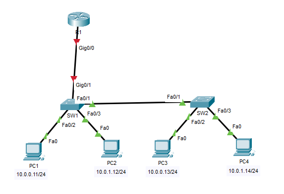
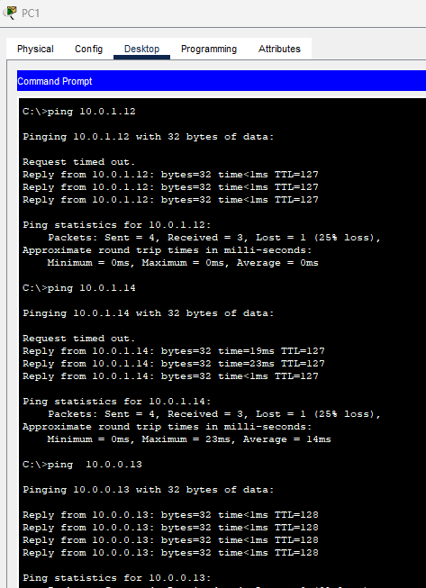
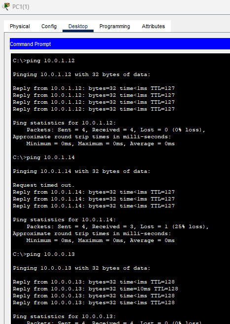

## 07 - LABORATORIO - Review Configuration 01 - CCNA

### A)



1. Configure los nombres de host de R1, SW1 y SW2 según el diagrama.
2. Configure una clave secreta de habilitación de "CCNA" para cada dispositivo de red.
3. Configure los puertos de switch a los que están conectadas las PC como puertos de acceso en las siguientes VLAN:
    VLAN13: PC1, PC3
    VLAN24: PC2, PC4
4. Utilice CDP para identificar las interfaces que se utilizan para conectar SW1 y SW2, y configure un enlace troncal entre ellas.
5. Configure la seguridad de los puertos de switch conectados a las PC con los siguientes ajustes:
   - aprendizaje de dirección MAC fija habilitado
   - acción de violación: ''restrict''
6. Configure el enrutamiento entre VLAN con el método "router on a stick", según el diagrama de red y las siguientes direcciones de subinterfaz:
    VLAN13: 10.0.0.1
   VLAN24: 10.0.1.1
7. Haga ping entre las PC para confirmar la conectividad completa, incluso entre diferentes VLAN.

### B) Troubleshooting

Hay de 1 a 2 configuraciones incorrectas por dispositivo de red (R1, SW1, SW2). Encuentre los errores y corríjalos. Se habrán solucionado todos los problemas cuando cada PC pueda hacer ping a las demás.

Los dispositivos se configuran según las instrucciones del laboratorio anterior (#A), que son las siguientes:
1. Configure los nombres de host de R1, SW1 y SW2 según el diagrama.
2. Configure una clave secreta de habilitación de "CCNA" para cada dispositivo de red.
3. Configure los puertos de switch a los que están conectadas las PC como puertos de acceso en las siguientes VLAN:
    VLAN13: PC1, PC3
    VLAN24: PC2, PC4
4. Utilice CDP para identificar las interfaces que se utilizan para conectar SW1 y SW2, y configure un enlace troncal entre ellas. 
5. Configure la seguridad de los puertos del switch conectados a las PC con los siguientes ajustes:
   - Aprendizaje de direcciones MAC sticky habilitado
   - Acción en caso de violación: 'restringir'
6. Configure el enrutamiento entre VLAN con el método 'router on a stick', según el diagrama de red y las siguientes direcciones de subinterfaz:
    VLAN13: 10.0.0.1
    VLAN24: 10.0.1.1
7. Haga ping entre las PC para confirmar la conectividad completa, incluso entre diferentes VLAN.

---
### **A)**

**1. Configure los nombres de host de R1, SW1 y SW2 según el diagrama.**

```
Router(config)#hostname R1
```

```
Switch(config)#hostname SW1
```

```
Switch(config)#hostname SW2
```

**2. Configure una clave secreta de habilitación de "CCNA" para cada dispositivo de red.**

```
(config)#enable secret CCNA
```

**3. Configure los puertos de switch a los que están conectadas las PC como puertos de acceso en las siguientes VLAN:**
    VLAN13: PC1, PC3
    VLAN24: PC2, PC4


En SW1
```
SW1(config)#int Fa0/2
SW1(config-if)#switchport mode access
SW1(config-if)#switchport access vlan 13
% Access VLAN does not exist. Creating vlan 13

SW1(config-if)#int Fa0/3
SW1(config-if)#switchport mode access
SW1(config-if)#switchport access vlan 24
% Access VLAN does not exist. Creating vlan 24
```

En SW2

```
SW2(config)#int Fa0/2
SW2(config-if)#switchport mode access
SW2(config-if)#switchport access vlan 13
% Access VLAN does not exist. Creating vlan 13

SW2(config-if)#int Fa0/3
SW2(config-if)#switchport mode access
SW2(config-if)#switchport access vlan 24
% Access VLAN does not exist. Creating vlan 24
```


**4. Utilice CDP para identificar las interfaces que se utilizan para conectar SW1 y SW2, y configure un enlace troncal entre ellas.**

En SW1 

```
SW1#show cdp neighbors

Capability Codes: R - Router, T - Trans Bridge, B - Source Route Bridge
S - Switch, H - Host, I - IGMP, r - Repeater, P - Phone
Device ID Local Intrfce Holdtme Capability Platform Port ID
SW2 Fas 0/1 137 S 2960 Fas 0/1
```

En SW2

```
SW2#show cdp neighbors

Capability Codes: R - Router, T - Trans Bridge, B - Source Route Bridge
S - Switch, H - Host, I - IGMP, r - Repeater, P - Phone
Device ID Local Intrfce Holdtme Capability Platform Port ID
SW1 Fas 0/1 132 S 2960 Fas 0/1
```

Configuramos el enlace troncal entre ellas.

```
(config)#int Fa0/1
(config-if)#switchport mode trunk

%LINEPROTO-5-UPDOWN: Line protocol on Interface FastEthernet0/1, changed state to down

%LINEPROTO-5-UPDOWN: Line protocol on Interface FastEthernet0/1, changed state to up
```

**5. Configure la seguridad de los puertos de switch conectados a las PC con los siguientes ajustes:**
   - sticky MAC address learning enabled
   - violation action: 'restrict'

```
SW1(config-if)#int range Fa0/2 - 3
SW1(config-if-range)#switchport port-security
SW1(config-if-range)#switchport port-security mac-address sticky
SW1(config-if-range)#switchport port-security violation restrict
```

**6. Configure el enrutamiento entre VLAN con el método "router on a stick", según el diagrama de red y las siguientes direcciones de subinterfaz:**
   VLAN13: 10.0.0.1
   VLAN24: 10.0.1.1

Configuración en R1
```
R1(config)#int G0/0
R1(config)#no shut
R1(config-if)#int g0/0.13
R1(config-subif)#encapsulation dot1Q 13
R1(config-subif)#ip address 10.0.0.1 255.255.255.0

R1(config-subif)#int g0/0.24
R1(config-subif)#encapsulation dot1Q 24
R1(config-subif)#ip address 10.0.1.1 255.255.255.0
```

Configuración en el Switch
```
SW1(config-if)#int g0/1
SW1(config-if)#switchport mode trunk
```

**7. Haga ping entre las PC para confirmar la conectividad completa, incluso entre diferentes VLAN.**



### **B)**

De primera no se lograr realizar un `ping` con éxito entre ninguna pc.

1. Primer problema econtrado
La interfaz Fa0/2 en SW2 se encuentra en la vlan 23
```
SW2#show vlan brief
VLAN Name Status Ports
---- -------------------------------- --------- -------------------------------
1 default active Fa0/1, Fa0/4, Fa0/5, Fa0/6
Fa0/7, Fa0/8, Fa0/9, Fa0/10
Fa0/11, Fa0/12, Fa0/13, Fa0/14
Fa0/15, Fa0/16, Fa0/17, Fa0/18
Fa0/19, Fa0/20, Fa0/21, Fa0/22
Fa0/23, Fa0/24, Gig0/1, Gig0/2
13 VLAN0013 active
23 VLAN0023 active Fa0/2
24 VLAN0024 active Fa0/3
```

Lo cambiamos con:

```
SW2(config)#int f0/2
SW2(config-if)#switchport access vlan 13
```

2. El segundo seria que la interfaz F0/1 d }e SW2 no esta en modo trunk
```
SW2#show run
interface FastEthernet0/1
switchport mode access
```

Lo ponemos en modo trunk
```
SW2(config)#int f0/1
SW2(config-if)#switchport mode trunk
```

Ya se puede lograr hacer ping entre PC2 con PC4, pero PC3 no lograr hacer ping con nadie.

3. Al hacer un chequeo al `port-security`
En SW1
```
SW1#show port-security
Secure Port MaxSecureAddr CurrentAddr SecurityViolation Security Action
(Count) (Count) (Count)
--------------------------------------------------------------------
Fa0/2 1 1 12 Restrict
Fa0/3 1 1 0 Restrict
----------------------------------------------------------------------
```
Vemos que hay un conteo de 12 violaciones.

Y vemos que tiene asignado una dirección mac diferente
```
interface FastEthernet0/2
switchport access vlan 13
switchport mode access
switchport port-security
switchport port-security violation restrict
switchport port-security mac-address AAAA.AAAA.AAAA
```

Lo quitamos:
```
SW1(config)#int f0/2
SW1(config-if)#no switchport port-security mac-address AAAA.AAAA.AAAA
```

Lo configuramos bien:
```
SW1(config-if)#switchport port-security mac-address sticky
```

Ya hay exito de ping entre las PCs de misma vlan


```
R1#sh ru
interface GigabitEthernet0/0.13
encapsulation dot1Q 13
ip address 10.0.0.2 255.255.255.0
!
interface GigabitEthernet0/0.24
encapsulation dot1Q 2
ip address 10.0.1.1 255.255.255.0
```
Vemos que la vlan 24 tiene el dot1Q 2 y tiene que se 24

```
R1(config)#int g0/0
R1(config-if)#int g0/0.24
R1(config-subif)#encapsulation dot1Q 24
```

Tambien vemos que la subinterfaz g0/0.13 tiene la dirección ip address 10.0.0.2 255.255.255.0
y deberia tener la ip address 10.0.0.1 255.255.255.0

Lo cambiamos
```
R1(config)#int g0/0.13
R1(config-subif)#no ip address 10.0.0.2 255.255.255.0
R1(config-subif)#no ip address 10.0.0.1 255.255.255.0
```

Finalmente se logra hacer ping entre todas las PCs



