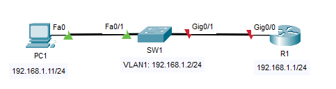
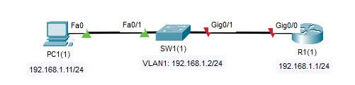
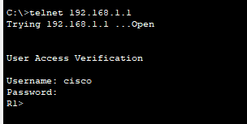
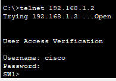
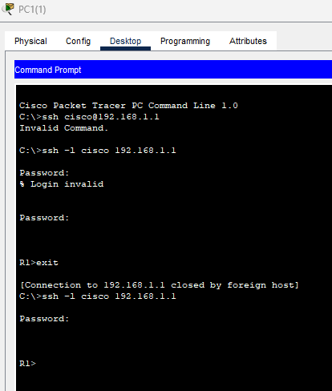

## 08 - LABORATORIO - Telnet y SSH - CCNA
### Telnet



1. Configure la interfaz G0/0 de R1 y la interfaz VLAN1 de SW1 con las direcciones IP indicadas.
2. Configure la siguiente cuenta de usuario en SW1 y R1:
   nombre de usuario: cisco / contraseña: CCNA
3. Configure las líneas VTY 0 a 15 en SW1 y R1 de la siguiente manera:
- Requerir el uso de la base de datos de usuarios local para conectarse a las líneas VTY
- Permitir solo conexiones Telnet a las líneas VTY
4. Intente establecer una conexión Telnet con cada dispositivo desde la PC1.

### SSH



1. Configure los nombres de host de SW1 y R1.
2. Configure la interfaz G0/0 y la interfaz VLAN1 de SW1 con las direcciones IP indicadas.
3. Configure la siguiente cuenta de usuario en SW1 y R1:
   usuario: cisco / contraseña: CCNA
4. Configure el nombre de dominio DNS cisco.com en SW1 y R1.
5. Genere las claves que se utilizarán para cifrar los paquetes SSH en cada dispositivo, con un tamaño de módulo de 1024.
6. Configure las líneas VTY 0 a 15 en SW1 y R1 de la siguiente manera:
- Requerir el uso de la base de datos de usuarios local para conectarse a las líneas VTY
- Permitir solo conexiones SSH a las líneas VTY
- Finalizar las conexiones después de 5 minutos de inactividad
7. Habilite la versión 2 de SSH en cada dispositivo.
8. Intente conectarse a cada dispositivo mediante SSH desde la PC1.

---
#### Telnet

**1. Configure la interfaz G0/0 de R1 y la interfaz VLAN1 de SW1 con las direcciones IP indicadas.**

En SW1:
```
SW1(config)# interface vlan 1
SW1(config-if)# ip address 192.168.1.2 255.255.255.0
SW1(config-if)# no shut
```

En R1:

```
R1(config)#int gig0/0
R1(config-if)#ip address 192.168.1.1 255.255.255.0
R1(config-if)#no shut
%LINK-5-CHANGED: Interface GigabitEthernet0/0, changed state to up
%LINEPROTO-5-UPDOWN: Line protocol on Interface GigabitEthernet0/0, changed state to up
```

**2. Configure la siguiente cuenta de usuario en SW1 y R1:
   nombre de usuario: cisco / contraseña: CCNA**

En SW1:

```
SW1(config-if)#username cisco password CCNA
```

En R1:

```
R1(config)#username cisco password CCNA
```

**3. Configure las líneas VTY 0 a 15 en SW1 y R1 de la siguiente manera:**

VTY (Virtual Teletype, Teletipo Virtual) son interfaces lógicas en routers y switches que permiten el acceso remoto y la administración de dispositivos a través de la red usando protocolos como Telnet o SSH

Conectamos todas las lineas de VTY 

En SW1 y R1:
```
R1(config)#line vty 0 15
```


- Requerir el uso de la base de datos de usuarios local para conectarse a las líneas VTY
En SW1 y R1:
```
R1(config-line)#login local
```

- Permitir solo conexiones Telnet a las líneas VTY
En SW1 y R1:
```
R1(config-line)#transport input telnet
```

```
show ru

line vty 0 4
login local
transport input telnet
line vty 5 15
login local
transport input telnet
```

**4. Intente establecer una conexión Telnet con cada dispositivo desde la PC1.**



Para el caso del SW1:

```
ip default-gateway 192.168.1.1
```
Indica por dónde salir cuando necesita comunicarse con equipos que no están en su misma subred



---
#### SSH


**1. Configure los nombres de host de SW1 y R1.**

En SW1
```
Switch(config)#hostname SW1
```

En R1
```
Router(config)#hostname R1
```

**2. Configure la interfaz G0/0 y la interfaz VLAN1 de SW1 con las direcciones IP indicadas.**

En SW1
```
SW1(config-if)# int Fa0/2
SW1(config-if)#ip address 192.168.1.2 255.255.255.0
SW1(config-if)#no shut
```

En SW2
```
R1(config)#int G0/0
R1(config-if)#ip address 192.168.1.1 255.255.255.0
R1(config-if)#no shut
```

**3. Configure la siguiente cuenta de usuario en SW1 y R1:**
   usuario: cisco / contraseña: CCNA

En SW1 y R1:
```
(config)#username cisco password CCNA
```

**4. Configure el nombre de dominio DNS cisco.com en SW1 y R1.**

En SW1 y R1:

```
(config)#ip domain-name cisco.com
```

**5. Genere las claves que se utilizarán para cifrar los paquetes SSH en cada dispositivo, con un tamaño de módulo de 1024.**

En SW1 y R1:

```
(config)#crypto key generate rsa
The name for the keys will be: R1.cisco.com
Choose the size of the key modulus in the range of 360 to 4096 for your
General Purpose Keys. Choosing a key modulus greater than 512 may take
a few minutes.

How many bits in the modulus [512]: 1024

% Generating 1024 bit RSA keys, keys will be non-exportable...[OK]
```

**6. Configure las líneas VTY 0 a 15 en SW1 y R1 de la siguiente manera:**

```
(config-line)#line vty 0 15
```

- Requerir el uso de la base de datos de usuarios local para conectarse a las líneas VTY

```
(config-line)#login local
```

- Permitir solo conexiones SSH a las líneas VTY

```
(config-line)#transport input ssh
```

- Finalizar las conexiones después de 5 minutos de inactividad

```
(config-line)#exec-timeout 5
```


**7. Habilite la versión 2 de SSH en cada dispositivo.**

En SW1 y R1:

```
(config)#ip ssh version 2
```

**8. Intente conectarse a cada dispositivo mediante SSH desde la PC1.**



