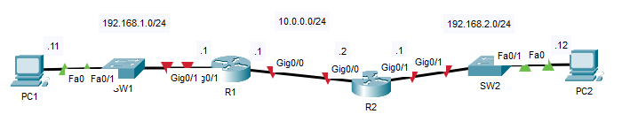
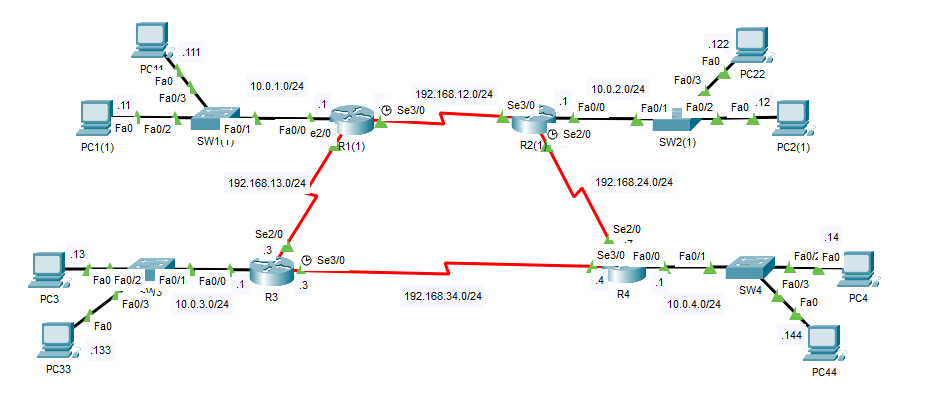
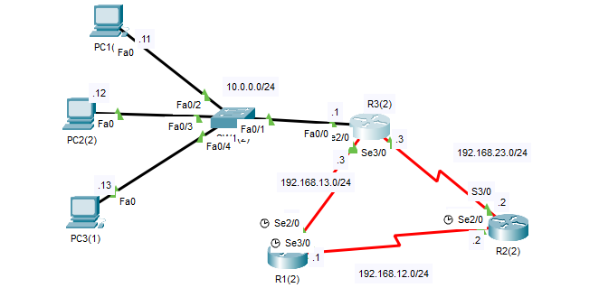
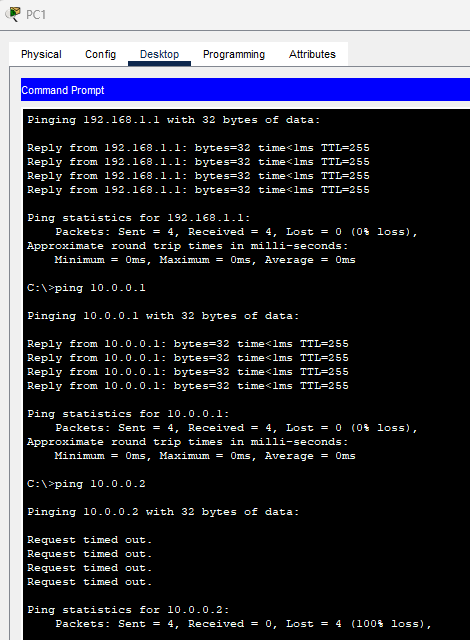
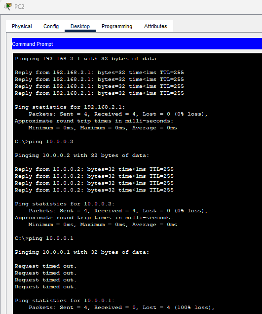
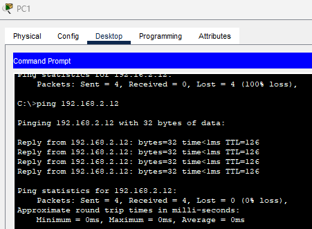
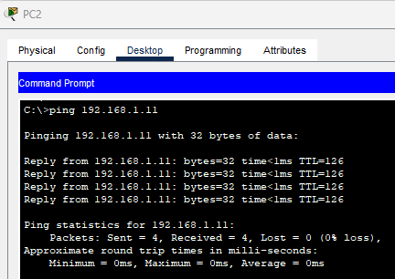
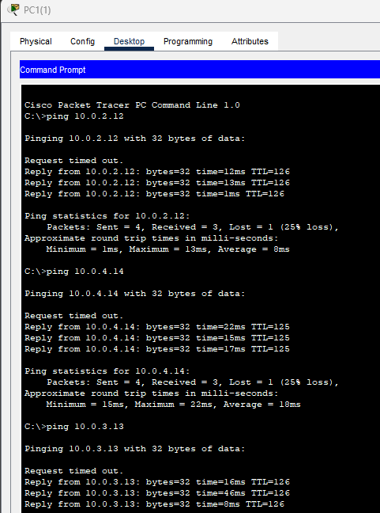

## 09 - LABORATORIO - Static Routing - CCNA

#### A)



1. Configure las interfaces G0/0 y G0/1 de R1 y R2 según el diagrama de red y habilítelas.
2. Desde la PC1, haga ping a la interfaz G0/1 de R1, a la interfaz G0/0 de R1, a la interfaz G0/0 de R2, a la interfaz G0/1 de R2 y, finalmente, a la PC2. ¿Qué pings son correctos? ¿Cuáles fallan?
3. De manera similar, haga ping desde la PC2 a la interfaz G0/1 de R2 y, luego, progresivamente, hacia la PC1. ¿Qué pings son correctos? ¿Cuáles fallan?
4. Configure rutas estáticas en R1 y R2 para que la PC1 pueda comunicarse con la PC2 y viceversa.
   Configure las rutas a las subredes de las que forman parte las PC, no directamente a ellas.
Pruebe con ping o tracert desde cada PC.

#### B)



Configure rutas estáticas en cada enrutador para permitir la conectividad completa en toda la red.
Ha completado el laboratorio correctamente cuando cada PC pueda hacer ping a cualquier otro punto de la red.

#### C)



(RIP está configurado en todas las interfaces del enrutador, excepto entre R1 y R3).
R1 recibe su ruta a 10.0.0.0/24 a través de RIP en su interfaz S3/0.
Configure una ruta estática flotante en R1 para permitirle acceder a la red 10.0.0.0/24 a través de su interfaz S2/0 en caso de que falle la conexión con R2.

#### D)


---

#### A)

**1. Configure las interfaces G0/0 y G0/1 de R1 y R2 según el diagrama de red y habilítelas.**

En R1:
```
R1(config)#int g0/0
R1(config-if)#ip address 10.0.0.1 255.255.255.0
R1(config-if)#no shut

R1(config-if)#int g0/1
R1(config-if)#ip address 192.168.1.1 255.255.255.0
R1(config-if)#no shut
```

En R2:
```
R2(config)#int g0/0
R2(config-if)#ip address 10.0.0.2 255.255.255.0
R2(config-if)#no shut

R2(config-if)#int g0/1
R2(config-if)#ip addr 192.168.2.1
R2(config-if)#no shut
```

**2. Desde la PC1, haga ping a la interfaz G0/1 de R1, a la interfaz G0/0 de R1, a la interfaz G0/0 de R2, a la interfaz G0/1 de R2 y, finalmente, a la PC2. ¿Qué pings son correctos? ¿Cuáles fallan?**



Ping a G0/1 de R1, 
FUNCIONA, PC1 y R1 están en la misma red

Ping a G0/0 de R1
FUNCIONA, El paquete llega a R1 (gateway) y la IP destino es una interfaz del propio R1.

Ping a G0/0 de R2
FALLA, R2 recibe el echo-request, pero:
R2 NO tiene ruta hacia 192.168.1.0/24, no sabe cómo devolver el echo-reply.

Ping a G0/1 de R2
FALLA, R1 no conoce la red 192.168.2.0/24.

**3. De manera similar, haga ping desde la PC2 a la interfaz G0/1 de R2 y, luego, progresivamente, hacia la PC1. ¿Qué pings son correctos? ¿Cuáles fallan?**

De misma manera para con PC2



Llega a hacer ping a G0/0 y a G0/1 de R2.

**4. Configure rutas estáticas en R1 y R2 para que la PC1 pueda comunicarse con la PC2 y viceversa.**

En R1
```
R1(config)#ip route 192.168.2.0 255.255.255.0 10.0.0.2
```

En R2
```
R2(config)#ip route 192.168.1.0 255.255.255.0 10.0.0.1
```

**Pruebe con ping o tracert desde cada PC.**






#### B)

**Configure rutas estáticas en cada enrutador para permitir la conectividad completa en toda la red.**
Todas las direcciones IP están preconfiguradas.

En R1:
```
R1(config)#ip route 192.168.24.0 255.255.255.0 192.168.12.2
R1(config)#ip route 192.168.34.0 255.255.255.0 192.168.13.3
R1(config)#ip route 10.0.3.0 255.255.255.0 192.168.13.3
R1(config)#ip route 10.0.2.0 255.255.255.0 192.168.12.2
R1(config)#ip route 10.0.4.0 255.255.255.0 192.168.12.2
```

En R2:
```
R2(config)#ip route 192.168.13.0 255.255.255.0 192.168.12.1
R2(config)#ip route 192.168.34.0 255.255.255.0 192.168.24.4
R2(config)#ip route 10.0.1.0 255.255.255.0 192.168.12.1
R2(config)#ip route 10.0.3.0 255.255.255.0 192.168.12.1
R2(config)#ip route 10.0.4.0 255.255.255.0 192.168.24.4
```

En R3:
```
R3(config)#ip route 192.168.12.0 255.255.255.0 192.168.13.1
R3(config)#ip route 192.168.24.0 255.255.255.0 192.168.34.4
R3(config)#ip route 10.0.1.0 255.255.255.0 192.168.13.1
R3(config)#ip route 10.0.4.0 255.255.255.0 192.168.34.4
R3(config)#ip route 10.0.2.0 255.255.255.0 192.168.34.4
```

En R4:
```
R4(config)#ip route 192.168.12.0 255.255.255.0 192.168.24.2
R4(config)#ip route 192.168.13.0 255.255.255.0 192.168.34.3
R4(config)#ip route 10.0.3.0 255.255.255.0 192.168.34.3
R4(config)#ip route 10.0.2.0 255.255.255.0 192.168.24.2
R4(config)#ip route 10.0.1.0 255.255.255.0 192.168.24.2
```

Hacemos ping de la PC1 a PC2, PC3, PC4



#### C)

R1 recibe su ruta a 10.0.0.0/24 a través de RIP en su interfaz S3/0.
**Configure una ruta estática flotante en R1 para permitirle acceder a la red 10.0.0.0/24 a través de su interfaz S2/0 en caso de que falle la conexión con R2.**

Primero vemos las redes que le router conoce
```
R1(config)#do show ip ro

10.0.0.0/24 is subnetted, 1 subnets
R 10.0.0.0 [120/2] via 192.168.12.2, 00:00:01, Serial3/0
C 192.168.12.0/24 is directly connected, Serial3/0
C 192.168.13.0/24 is directly connected, Serial2/0
R 192.168.23.0/24 [120/1] via 192.168.12.2, 00:00:01, Serial3/0
```

Configuramos la ruta estatica.
```
R1(config)#ip route 10.0.0.0 255.255.255.0 192.168.13.3
```

Verificamos 
```
R1#show ip route

10.0.0.0/24 is subnetted, 1 subnets
S 10.0.0.0 [1/0] via 192.168.13.3
C 192.168.12.0/24 is directly connected, Serial3/0
C 192.168.13.0/24 is directly connected, Serial2/0
R 192.168.23.0/24 [120/1] via 192.168.12.2, 00:00:02, Serial3/0
```

Vemos que la **distancia administrativa** se cambio a 1: `[120/2] -> [1/0]` y que tomo de prioridad a la ruta estática.

Pero nos pidieron  **ruta estática flotante**, osea que solo se introduce en la tabla de enrutamiento cuando la ruta normal no esta disponible.

Para ello cambiaremos la distancia a una mas alta.
Distancia administrativa que estaba configurada por rip: `[120]`

Lo cambiaremos el de la ruta estática a `[121]`
```
R1(config)#ip route 10.0.0.0 255.255.255.0 192.168.13.3 121
```


```
R1(config)#do sho ip ro

10.0.0.0/24 is subnetted, 1 subnets
R 10.0.0.0 [120/2] via 192.168.12.2, 00:00:24, Serial3/0
C 192.168.12.0/24 is directly connected, Serial3/0
C 192.168.13.0/24 is directly connected, Serial2/0
R 192.168.23.0/24 [120/1] via 192.168.12.2, 00:00:24, Serial3/0
```
Ahora vemos que no se muestra la ruta estática.

Simulando un error de interfaz
```
R1(config)#int s3/0
R1(config-if)#shut
```

```
R1(config-if)#do sho ip ro

10.0.0.0/24 is subnetted, 1 subnets
S 10.0.0.0 [121/0] via 192.168.13.3
C 192.168.13.0/24 is directly connected, Serial2/0
```
Vemos que la ruta estática tomo el lugar.
