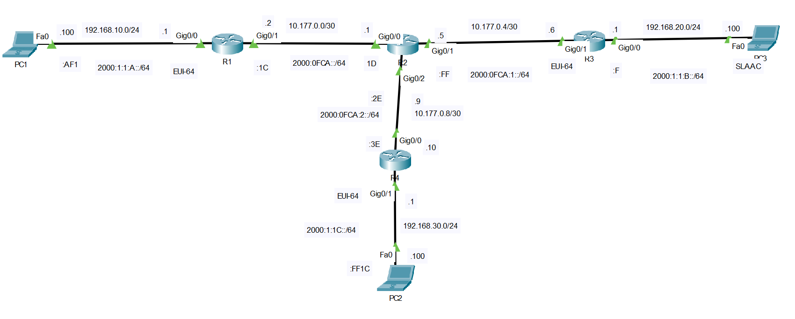
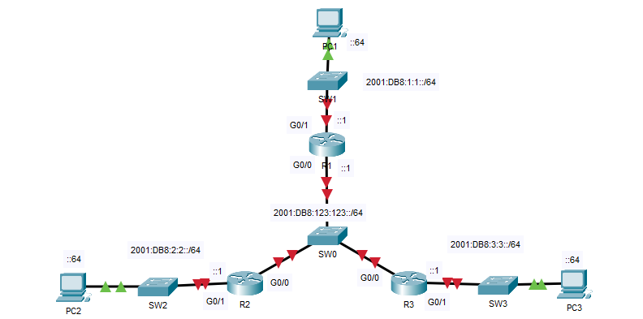
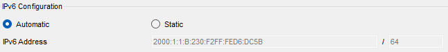

## 09 - LABORATORIO - Enrutamiento estático en IPv4 e IPv6 - CCNA

#### A) IPv4 e IPv6



1. Verifique conectividad IPv4 e IPv6 en cada enlace local antes de configurar enrutamiento 
2. Configure el enrutamiento estático de acuerdo a los siguientes requerimientos:

- IPv4:
PC1 debe ser configurado con una ruta por defecto hacia R1.
R1 debe ser configurado con todas las rutas faltantes específicas.
R2 debe ser configurado con todas las rutas faltantes específicas.
R3 debe llevar una ruta por defecto hacia R2 con la IP de siguiente salto como argumento.
R4 debe llevar una ruta por defecto hacia R2 con la interfaz de salida como argumento.

- IPv6:
PC1 debe utilizar la dirección global de R1 como gateway.
PC2 debe utilizar la dirección de enlace local (link-local) de R4 como gateway.
PC3 debe recibir su configuración IP automáticamente mediante SLAAC.
R1 debe tener una ruta por defecto hacia R2 con la IP link-local de R2 como argumento.
R4 debe tener una ruta por defecto hacia R2 con la interfaz de salida como argumento.
R2 debe ser configurado con todas las rutas faltantes específicas.

#### B) IPv6



1. Habilite IPv6 en R1, R2 y R3 y configure las direcciones IPv6 en: 
   Interfaces G0/0 y G0/1 de R1 
   Interfaz G0/1 de R2 
   Interfaz G0/1 de R3
2. Configure SLAAC en las interfaces G0/0 de R2 y R3.
3. Configure rutas IPv6 estáticas para proporcionar conectividad total a la red.

---
#### A)

**1. Verifique conectividad IPv4 e IPv6 en cada enlace local antes de configurar enrutamiento **

**CONFIGURACIÓN**

En R1
```
interface GigabitEthernet0/0
ip address 192.168.10.1 255.255.255.0
ipv6 address 2000:1:1:A::/64 eui-64
ipv6 enable

interface GigabitEthernet0/1
ip address 10.177.0.2 255.255.255.252
ipv6 address 2000:0FCA::1C/64
ipv6 enable
```

en R2

```
interface GigabitEthernet0/0
ip address 10.177.0.1 255.255.255.252
ipv6 address 2000:0FCA::1D/64
ipv6 enable

interface GigabitEthernet0/1
ip address 10.177.0.5 255.255.255.252
ipv6 address 2000:0FCA:1::FF/64
ipv6 enable

interface GigabitEthernet0/2
ip address 10.177.0.9 255.255.255.252
ipv6 address 2000:0FCA:2::2E/64
ipv6 enable
```

en R3

```
interface GigabitEthernet0/0
ip address 192.168.20.1 255.255.255.0
ipv6 address 2000:1:1:B::F/64
ipv6 enable

interface GigabitEthernet0/1
ip address 10.177.0.6 255.255.255.252
ipv6 address 2000:0FCA:1::/64 eui-64
ipv6 enable
```

en R4

```
interface GigabitEthernet0/0
ip address 10.177.0.10 255.255.255.252
ipv6 address 2000:0FCA:2::3E/64
ipv6 enable

interface GigabitEthernet0/1
ip address 192.168.30.1 255.255.255.0
ipv6 address 2000:1:1:C::/64 eui-64
ipv6 enable
```

**2. Configure el enrutamiento estático de acuerdo a los siguientes requerimientos:**

- **IPv4**:

**PC1 debe ser configurado con una ruta por defecto hacia R1**

```
Default Gateway: 192.168.10.1
```

**R1 debe ser configurado con todas las rutas faltantes específicas.**

El enrutamiento estático se basa en enseñarle al router todas las demas router que el no conoce manualmente.

`ip route <IP_destino> <maskara> <a_travez_de_que_quien(next_hop)>`

En R1
```
ip route 10.177.0.4 255.255.255.252 10.177.0.1
ip route 192.168.20.0 255.255.255.0 10.177.0.1
ip route 10.177.0.8 255.255.255.252 10.177.0.1
ip route 192.168.30.0 255.255.255.0 10.177.0.1
```

**R2 debe ser configurado con todas las rutas faltantes específicas**

En R2

```
ip route 192.168.10.0 255.255.255.0 10.177.0.2
ip route 192.168.20.0 255.255.255.0 10.177.0.6
ip route 192.168.30.0 255.255.255.0 10.177.0.10
```

**R3 debe llevar una ruta por defecto hacia R2 con la IP de siguiente salto como argumento**

En R3
Deafult gateway
`ip route <0.0.0.0> <0.0.0.0> <a_travez_de_que_quien(next_hop)>`


```
ip route 0.0.0.0 0.0.0.0 10.177.0.5
```


**R4 debe llevar una ruta por defecto hacia R2 con la interfaz de salida como argumento**

```
ip route 0.0.0.0 0.0.0.0 GigabitEthernet0/0
```

- **IPv6:**

**PC1 debe utilizar la dirección global de R1 como gateway**

De R1:
```
GigabitEthernet0/0 [up/up]
FE0::2E0:8FFF:FE1D:3B01
2000:1:1:A:2E0:8FFF:FE1D:3B01
```

Entonces en PC1:

`Default Gateway: 2000:1:1:A:2E0:8FFF:FE1D:3B01`

**PC2 debe utilizar la dirección de enlace local (link-local) de R4 como gateway**

De R4:
```
GigabitEthernet0/1 [up/up]
FE80::2E0:A3FF:FE81:D602
2000:1:1:C:2E0:A3FF:FE81:D602
```

`Default Gateway: FE80::2E0:A3FF:FE81:D602`

Entonces en PC2:

`Default Gateway: FE80::2E0:A3FF:FE81:D602`

**PC3 debe recibir su configuración IP automáticamente mediante SLAAC.**

SLAAC(Stateless Address Autoconfiguration): protocolo de capa 3 que permite que un dispositivo se auto-asigne su dirección IPv6 sin DHCP.

Primero habilitamos el enrutamiento IPv6 unicast, **en todos los routers** con el comando:
```
ipv6 unicast-routing
```
Permite que el equipo reenvíe paquetes IPv6 entre interfaces, es decir, que actúe como router IPv6.




**R1 debe tener una ruta por defecto hacia R2 con la IP link-local de R2 como argumento.**

```
ipv6 route ::/0 FE80::20A:F3FF:FEB9:1501
```

**R4 debe tener una ruta por defecto hacia R2 con la interfaz de salida como argumento.**

```
ipv6 route ::/0 GigabitEthernet0/0 2000:0FCA:2::2E
```

**R2 debe ser configurado con todas las rutas faltantes específicas.**

```
ipv6 route 2000:1:1:A::/64 2000:0FCA::1C
ipv6 route 2000:1:1:B::/64 2000:0FCA:1:0:2E0:A3FF:FE75:3202
ipv6 route 2000:1:1:C::/64 2000:0FCA:2::3E
```

Para completar todo el proceso de enrutamiento de la topología.

En R3
```
ipv6 route ::/0 2000:FCA:1::FF
```

#### B)

**1. Habilite IPv6 en R1, R2 y R3 y configure las direcciones IPv6 en:** 
   Interfaces G0/0 y G0/1 de R1 
   Interfaz G0/1 de R2 
   Interfaz G0/1 de R3

En R1
```
R1(config)#ipv6 unicast-routing
R1(config-if)#ipv6 address 2001:db8:123::1/64
R1(config-if)#no shut
R1(config-if)#int g0/1
R1(config-if)#ipv6 add 2001:db8:1:1::1/64
R1(config-if)#no shut
```

En R2
```
R2(config)#ipv6 unicast-routing
R2(config)#int g0/1
R2(config-if)#ipv6 add 2001:db8:2:2::1/64
R2(config-if)#no shut
```

En R3
```
R3(config)#ipv6 unicast-routing
R3(config)#int g0/1
R3(config-if)#ipv6 add 2001:db8:3:3::1/64
R3(config-if)#no shut
```

**2. Configure SLAAC en las interfaces G0/0 de R2 y R3.**

En R3
```
R3(config-if)#int g0/0
R3(config-if)#no shut
R3(config-if)#ipv6 add auto
```

En R2
```
R2(config-if)#int g0/0
R2(config-if)#ipv6 add auto
R2(config-if)#no shut
```

**3. Configure rutas IPv6 estáticas para proporcionar conectividad total a la red.**

Dirección SLAAC de R2:  `2001:DB8:123:0:2D0:97FF:FEB4:740D`
Dirección SLAAC de R3:  `2001:DB8:123:0:230:F2FF:FE3E:593E`
Se actualizo con:
`no ipv6 unicast-routing`
`ipv6 unicast-routing` 

En R1
```
R1(config)#ipv6 route 2001:db8:2:2::/64 2001:DB8:123:0:2D0:97FF:FEB4:740D
R1(config)#ipv6 route 2001:db8:2:2::/64 2001:DB8:123:0:230:F2FF:FE3E:593E
```

En R3
```
R3(config)#ipv6 route 2001:db8:2:2::/64 2001:DB8:123:0:2D0:97FF:FEB4:740D
R3(config)#ipv6 route 2001:db8:2:2::/64 2001:db8:123:123::1
```

En R2
```
R2(config)#ipv6 route 2001:db8:3:3::/64 2001:DB8:123:0:230:F2FF:FE3E:593E
R2(config)#ipv6 route 2001:db8:3:3::/64 2001:db8:123:123::1
```
