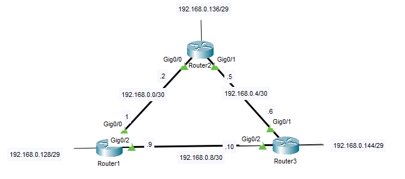
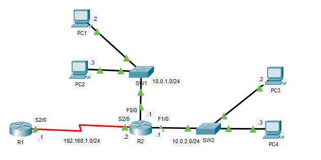
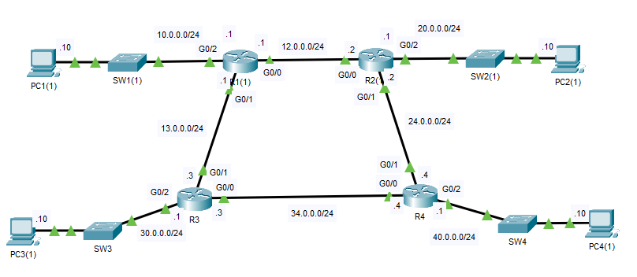
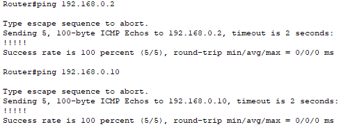
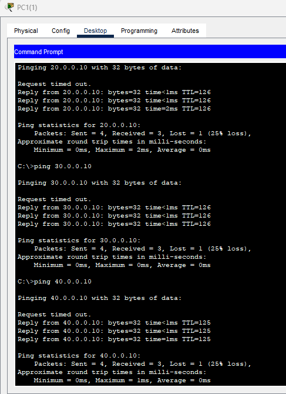

## 11 - LABORATORIO - Enrutamiento dinámico RIP - CCNA

#### A) Enrutamiento dinámico RIPv1



Instrucciones:
1) Verificar conectividad IP a nivel de vecinos directamente conectados en todos los routers
2) Configurar RIP para lograr el intercambio de rutas entre los vecinos y verificar que las LAN tengan conectividad entre ellas
3) Verificar que se esté enviando y recibiendo la versión 2 de RIP en todos los routers
4) Habilitar la depuración (DEBUG) de mensajes RIP en R1 para analizar en mayor
   detalle los mensajes entrantes y salientes
5) Evitar el envío de mensajes RIP en la interfaz de R1 que contiene la IP
   192.168.0.129
6) R2 tiene una ruta por defecto apuntando a una interfaz Nullo. Tanto R1 como R3 deben conocer esa ruta a través de RIP
#### B)



1. Paso 1: Configure RIP (no habilite la versión 2) en R1 y R2, y anuncie las redes en cada una de sus interfaces.
2. Paso 2: Después de dar tiempo a RIP para que converja, revise la tabla de enrutamiento de R1. ¿Qué ruta ha aprendido?
3. Paso 3: Habilite la versión 2 de RIP y deshabilite el resumen automático en R1 y R2.
4. Paso 4: Después de dar tiempo a RIP para que converja, revise nuevamente la tabla de enrutamiento de R1. ¿Qué rutas ha aprendido?

#### C)



La red se ha preconfigurado según el diagrama.
Configure RIPv2 en cada enrutador para permitir la conectividad completa en toda la red.
Desactive las actualizaciones de enrutamiento en las interfaces conectadas a los conmutadores.

---

#### A)

**1) Verificar conectividad IP a nivel de vecinos directamente conectados en todos los routers**

En R1

```
interface g0/0
 ip address 192.168.0.1 255.255.255.252
 no shutdown

interface g0/2
 ip address 192.168.0.9 255.255.255.252
 no shutdown

interface Loopback0
 ip address 192.168.0.129 255.255.255.248
 no shutdown
```

En R2

```
interface g0/0
 ip address 192.168.0.2 255.255.255.252
 no shutdown

interface g0/1
 ip address 192.168.0.5 255.255.255.252
 no shutdown

interface Loopback0
 ip address 192.168.0.137 255.255.255.248
 no shutdown
```

En R3

```
interface g0/0
 ip address 192.168.0.10 255.255.255.252
 no shutdown

interface g0/1
 ip address 192.168.0.6 255.255.255.252
 no shutdown

interface Loopback0
 ip address 192.168.0.145 255.255.255.248
 no shutdown
```

Si hay ping entre lo routers


**2) Configurar RIP para lograr el intercambio de rutas entre los vecinos y verificar que las LAN tengan conectividad entre ellas**

En R1
```
router rip
version 2
network 192.168.0.0
```

En R2
```
router rip
version 2
network 192.168.0.0
```

En R3
```
router rip
 version 2
 network 192.168.0.0
```

Para verificar las rutas aprendidas por RIP
```
show ip route rip
```

```
Router#show ip route rip
192.168.0.0/24 is variably subnetted, 9 subnets, 3 masks
R 192.168.0.4/30 [120/1] via 192.168.0.10, 00:00:24, GigabitEthernet0/2
[120/1] via 192.168.0.2, 00:00:21, GigabitEthernet0/0
R 192.168.0.136/29 [120/1] via 192.168.0.2, 00:00:21, GigabitEthernet0/0
R 192.168.0.144/29 [120/1] via 192.168.0.10, 00:00:24, GigabitEthernet0/2
```

**3) Verificar que se esté enviando y recibiendo la versión 2 de RIP en todos los routers**

Para verificar la version
```
show ip protocols
```

```
Router#show ip protocols
Routing Protocol is "rip"
Sending updates every 30 seconds, next due in 20 seconds
Invalid after 180 seconds, hold down 180, flushed after 240
Outgoing update filter list for all interfaces is not set
Incoming update filter list for all interfaces is not set
Redistributing: rip
Default version control: send version 2, receive 2
Interface Send Recv Triggered RIP Key-chain
GigabitEthernet0/0 22
GigabitEthernet0/2 22
Automatic network summarization is in effect
Maximum path: 4
Routing for Networks:
192.168.0.0
Routing Information Sources:
Gateway Distance Last Update
192.168.0.10 120 00:00:08
192.168.0.2 120 00:00:29
Distance: (default is 120)
```

**4) Habilitar la depuración (DEBUG) de mensajes RIP en R1 para analizar en mayor
   detalle los mensajes entrantes y salientes**
   
```
Router#debug ip rip
RIP protocol debugging is on
Router#RIP: received v2 update from 192.168.0.2 on GigabitEthernet0/0
192.168.0.4/30 via 0.0.0.0 in 1 hops
192.168.0.136/29 via 0.0.0.0 in 1 hops
192.168.0.144/29 via 0.0.0.0 in 2 hops
RIP: received v2 update from 192.168.0.10 on GigabitEthernet0/2
192.168.0.4/30 via 0.0.0.0 in 1 hops
192.168.0.136/29 via 0.0.0.0 in 2 hops
192.168.0.144/29 via 0.0.0.0 in 1 hops
RIP: sending v2 update to 224.0.0.9 via GigabitEthernet0/0 (192.168.0.1)
RIP: build update entries
192.168.0.8/30 via 0.0.0.0, metric 1, tag 0
192.168.0.128/29 via 0.0.0.0, metric 1, tag 0
192.168.0.144/29 via 0.0.0.0, metric 2, tag 0
RIP: sending v2 update to 224.0.0.9 via GigabitEthernet0/2 (192.168.0.9)
RIP: build update entries
192.168.0.0/30 via 0.0.0.0, metric 1, tag 0
192.168.0.128/29 via 0.0.0.0, metric 1, tag 0
192.168.0.136/29 via 0.0.0.0, metric 2, tag 0
RIP: received v2 update from 192.168.0.2 on GigabitEthernet0/0
192.168.0.4/30 via 0.0.0.0 in 1 hops
192.168.0.136/29 via 0.0.0.0 in 1 hops
192.168.0.144/29 via 0.0.0.0 in 2 hops
RIP: received v2 update from 192.168.0.10 on GigabitEthernet0/2
192.168.0.4/30 via 0.0.0.0 in 1 hops
192.168.0.136/29 via 0.0.0.0 in 2 hops
192.168.0.144/29 via 0.0.0.0 in 1 hops
```

```
undebug all
```

**5) Evitar el envío de mensajes RIP en la interfaz de R1 que contiene la IP
   192.168.0.129**

```
router rip
 passive-interface loopback 0
```

**6) R2 tiene una ruta por defecto apuntando a una interfaz Null0. Tanto R1 como R3 deben conocer esa ruta a través de RIP**

En R2:
```
ip route 0.0.0.0 0.0.0.0 Null0
```

En R1 y R3:
```
Router(config)#router rip
Router(config-router)# default-information originate
```

Un router NO instala una ruta RIP si la red no existe o no es necesaria.

Se recomiendo activar la no autosumarización(el router **resume automáticamente** las rutas).
```
router rip
 no auto-summary
```


#### B)

**1. Paso 1: Configure RIP (no habilite la versión 2) en R1 y R2, y anuncie las redes en cada una de sus interfaces.**

En R1
```
R1(config)#router rip
R1(config-router)#network 192.168.1.0
```

En R2
```
R2(config)#router rip
R2(config-router)#network 192.168.1.0
R2(config-router)#network 10.0.0.0
```

**2. Paso 2: Después de dar tiempo a RIP para que converja, revise la tabla de enrutamiento de R1. ¿Qué ruta ha aprendido?**

```
R1#show ip route

R 10.0.0.0/8 [120/1] via 192.168.1.2, 00:00:17, Serial2/0
C 192.168.1.0/24 is directly connected, Serial2/0
```
Aprendió la ruta 10.0.0.0 y no las `.1.0` y `.2.4`.
RIPv1 resume automáticamente las redes en clases

**3. Paso 3: Habilite la versión 2 de RIP y deshabilite el auto-summary en R1 y R2.**

En R1 y R2:
```
(config-router)#version 2
(config-router)#no auto-summary
```

**4. Paso 4: Después de dar tiempo a RIP para que converja, revise nuevamente la tabla de enrutamiento de R1. ¿Qué rutas ha aprendido?**

```
R1#show ip route

10.0.0.0/8 is variably subnetted, 3 subnets, 2 masks
R 10.0.0.0/8 [120/1] via 192.168.1.2, 00:01:38, Serial2/0
R 10.0.1.0/24 [120/1] via 192.168.1.2, 00:00:12, Serial2/0
R 10.0.2.0/24 [120/1] via 192.168.1.2, 00:00:12, Serial2/0
C 192.168.1.0/24 is directly connected, Serial2/0
```

RIPv2 no resume las rutas, trabaja con Classless a diferencia de RIPv1 que es  Classful.

#### C)

**Configure RIPv2 en cada enrutador para permitir la conectividad completa en toda la red y desactive las actualizaciones de enrutamiento en las interfaces conectadas a los conmutadores.**

La red se ha preconfigurado según el diagrama.

En R1
```
R1(config)#route rip
R1(config-router)#version 2
R1(config-router)#no auto-summary
R1(config-router)#network 10.0.0.0
R1(config-router)#network 12.0.0.0
R1(config-router)#network 13.0.0.0

R1(config-router)#passive-interface g0/2
```

En R2
```
R2(config)#router rip
R2(config-router)#ver 2
R2(config-router)#no au
R2(config-router)#netw 12.0.0.0
R2(config-router)#netw 24.0.0.0
R2(config-router)#netw 20.0.0.0

R2(config-router)#passive-interface g0/2
```

En R3
```
R3(config)#router rip
R3(config-router)#ver 2
R3(config-router)#no au
R3(config-router)#netw 30.0.0.0
R3(config-router)#net 34.0.0.0
R3(config-router)#net 13.0.0.0

R3(config-router)#passive-interface g0/2
```

En R4
```
R4(config)#router rip
R4(config-router)#ver 2
R4(config-router)#no aut
R4(config-router)#net 24.0.0.0
R4(config-router)#net 34.0.0.0
R4(config-router)#net 40.0.0.0

R4(config-router)#passive-interface g0/2
```

Verificamos 
En R4
```
R4(config-router)#do show ip proto
Routing Protocol is "rip"
Sending updates every 30 seconds, next due in 28 seconds
Invalid after 180 seconds, hold down 180, flushed after 240
Outgoing update filter list for all interfaces is not set
Incoming update filter list for all interfaces is not set
Redistributing: rip
Default version control: send version 2, receive 2
Interface Send Recv Triggered RIP Key-chain
GigabitEthernet0/0 22
GigabitEthernet0/1 22
Automatic network summarization is not in effect
Maximum path: 4
Routing for Networks:
24.0.0.0
34.0.0.0
40.0.0.0

Passive Interface(s):
GigabitEthernet0/2
Routing Information Sources:
Gateway Distance Last Update
24.0.0.2 120 00:00:06
34.0.0.3 120 00:00:27
Distance: (default is 120)
```

Hacemos ping de PC1 a las demas PCs


