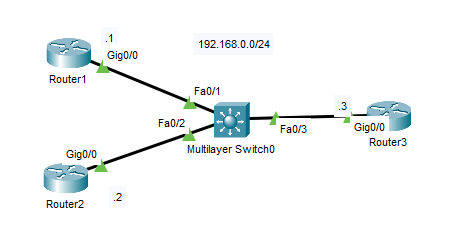
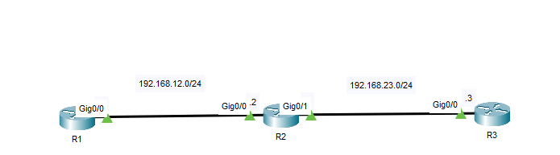
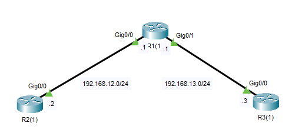
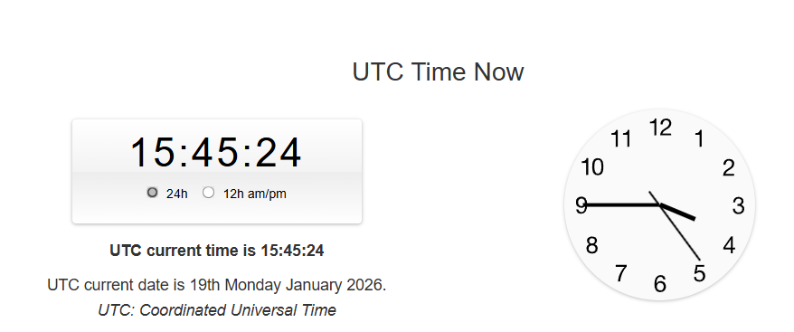
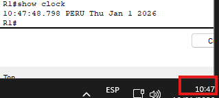

## 12 - LABORATORIO - NTP (network time protocol) - CCNA

#### A) Sincronización 



#### B)



1. Configure la zona horaria, la hora y la fecha en R1 para que coincidan con su hora local.
2. Configure R1 como un servidor NTP con el nivel de estrato predeterminado.
3. Configure R2 para sincronizar su hora con R1.
4. Configure R3 para sincronizar su hora con R2.

#### C)



1. Configure la zona horaria, la hora y la fecha en R1 para que coincidan con su hora local.
2. Configure R1 como un servidor NTP con el nivel de estrato predeterminado.
   ---R1 debe autenticar NTP:
    Clave 1: 'cisco1'
    Clave 2: 'cisco2'
3. Configure R2 para sincronizar su hora con R1.
   ---R2 debe autenticar NTP:
   Clave 1: 'cisco1'
4. Configure R3 para sincronizar su hora con R1.
   ---R3 debe autenticar NTP:
   Clave 2: 'cisco2'

---
#### A)

En R1

Cambiamos la hora
```
Router1#clock set 13:50:02 15 Jan 2016
```

Verificamos
```
Router1#show clock
*13:50:50.126 UTC Fri Jan 15 2016
```

Ahora vamos a sincronizar la hora en todos los dispositivos

Elegimos a R3 como NTP server

Vemos la hora en R3
```
Router3#show clock
14:59:5.980 UTC Wed Oct 15 2025
```

Lo definimos como NTP server
```
Router3(config)#ntp master
```
Permitimos las consultas en el puerto UDP123 y porcesando las redes del NTPserver


En R1 indicamos cual es el NTP server
```
Router1(config)#ntp server 192.168.0.3
```

Verificamos
```
Router1#show clock
15:3:36.871 UTC Wed Oct 15 2025
```

Ahora en R2
```
Router(config)#ntp server 192.168.0.3
```

Dispositivos Conectados.

Podemos verificar el NTP server y detalles con
```
Router1#show ntp associations

address            ref clock   st when poll reach delay offset disp
*~192.168.0.3     127.127.1.1   8   3    16   41    5.00 1.00 0.00
* sys.peer, # selected, + candidate, - outlyer, x falseticker, ~ configured
```

Podemos cambiar el stratum
En R3
```
Router3(config)#ntp master 3
```

Y de acuerdo a la jerarquia, R1 y R2 deberan quedar un nivel mas abajo

```
Router#show ntp associations

address         ref clock  st  when poll reach delay offset disp
*~192.168.0.3 127.127.1.1   3   12     16 377  0.00   0.00    0.12
* sys.peer, # selected, + candidate, - outlyer, x falseticker, ~ configured
```
Podemos que que el el estratu del NTP server es 3

y con el comando: `show ntp status` el de R1 y R2.

```
Router#show ntp status

Clock is synchronized, stratum 4, reference is 192.168.0.3

nominal freq is 250.0000 Hz, actual freq is 249.9990 Hz, precision is 2**24
reference time is EC6D665B.000000C8 (15:16:43.200 UTC Wed Oct 15 2025)
clock offset is 0.00 msec, root delay is 0.00 msec
root dispersion is 10.65 msec, peer dispersion is 0.12 msec.
loopfilter state is 'CTRL' (Normal Controlled Loop), drift is - 0.000001193 s/s system poll interval is 4, last update was 4 sec ago.
```

#### B) 

**1. Configure la zona horaria, la hora y la fecha en R1 para que coincidan con su hora local.**

```
R1(config)#do show clock
*10:41:50.176 UTC Sun Feb 28 1993
```

Para configurar con respecto a mi hora loca (Perú)
```
R1(config)#clock timezone PERU -5
R1(config)#do show clock

*5:43:54.174 PERU Sun Feb 28 1993
```

Y para establecer la hora UTC



```
R1#clock set 15:46:00 Jan 01 2026
```



**2. Configure R1 como un servidor NTP con el nivel de estrato predeterminado.**

En R1
```
R1(config)#ntp master
```
Si no especificamos en nivel de estrato por defecto se coloca el 8

**3. Configure R2 para sincronizar su hora con R1.**

En R2
NTP sincroniza la hora en UTC a todos los dispositivos

```
R2(config)#clock timezone PERU -5
R2(config)#ntp server 192.168.10.1
```

**4. Configure R3 para sincronizar su hora con R2.**

```
R3(config)#clock timezone PERU -5
R3(config)#ntp server 192.168.23.2
```

#### C)

**1. Configure la zona horaria, la hora y la fecha en R1 para que coincidan con su hora local.**

```
R1#clock set 08:51:00 Jan 20 2026
R1(config)#clock timezone PET -5
```

**2. Configure R1 como un servidor NTP con el nivel de estrato predeterminado.
   ---R1 debe autenticar NTP:**
    Clave 1: 'cisco1'
    Clave 2: 'cisco2'

```
R1(config)#ntp master

R1(config)#ntp authenticate
R1(config)#ntp authentication-key 1 md5 cisco1
R1(config)#ntp authentication-key 2 md5 cisco1

R1(config)#ntp trusted-key 1
R1(config)#ntp trusted-key 2
```

**3. Configure R2 para sincronizar su hora con R1.
   ---R2 debe autenticar NTP:**
   Clave 1: 'cisco1'


```
R2(config)#clock timezone PET -5

R2(config)#ntp authenticate
R2(config)#ntp authentication-key 1 md5 cisco1
R2(config)#ntp trusted-key 1
R2(config)#ntp server 192.168.12.1 key 1
```

**4. Configure R3 para sincronizar su hora con R1.
   ---R3 debe autenticar NTP:**
   Clave 2: 'cisco2'

```
R3(config)#clock timezone PET -5

R3(config)#ntp authenticate
R3(config)#ntp authentication-key 2 md5 cisco2
R3(config)#ntp trusted-key 2
R3(config)#ntp server 192.168.13.1 key 2
```

