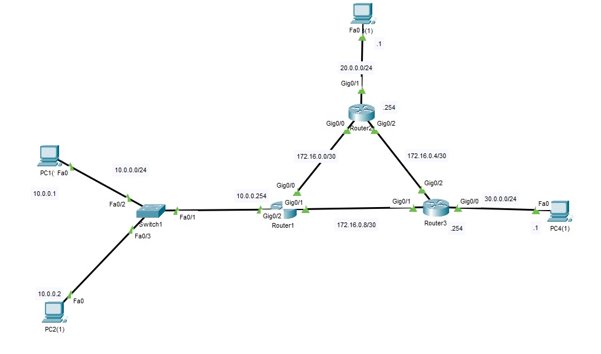
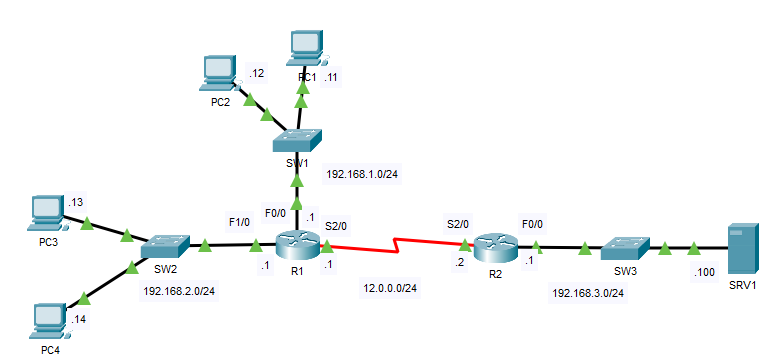
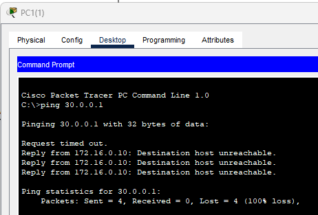
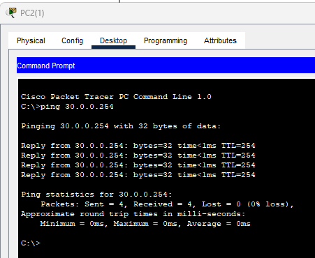
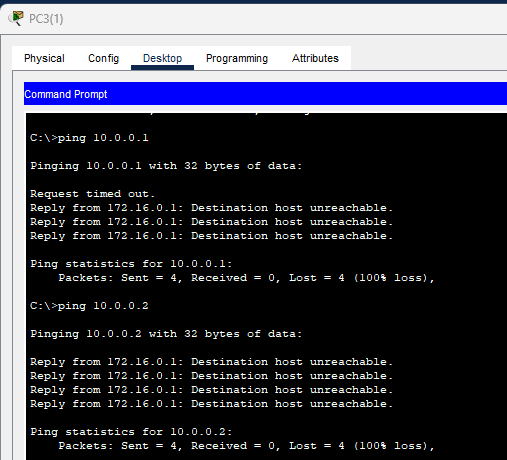
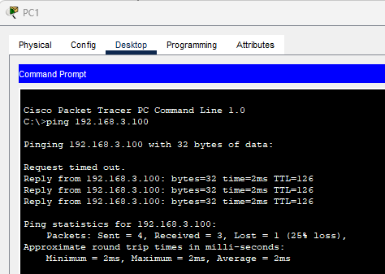
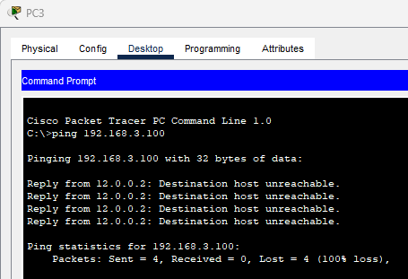
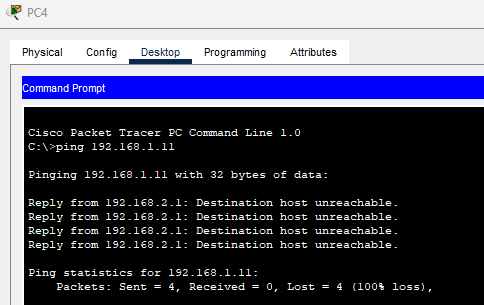

## 13 - LABORATORIO - Standard ACLs (Access Control Lists) - CCNA

#### A)



* Bloquear el acceso de la red 10.0.0.0/24 a la red 30.0.0.0/24, excepto al host 10.0.0.2. Además asegúrese que la red 20.0.0.0/24 no pueda ingresar a la red 10.0.0.0/24.

#### B)



* Configure las ACL estándar para cumplir con los siguientes requisitos:
   ---Solo las computadoras en la red 192.168.1.0/24 pueden acceder a SRV1
   ---La PC4 no puede comunicarse con la red 192.168.1.0/24.

---

#### A)

**Bloquear el acceso de la red 10.0.0.0/24 a la red 30.0.0.0/24, excepto al host 10.0.0.2.**

Las ACL standard se controla el trafico basandose unicamente en la direccion de origen

En R3
```
access-list 1 permit hosts 10.0.0.2
access-list 1 deny 10.0.0.0 0.0.0.255
access-list 1 permit any

int g0/0
   ip access-group 1 out
```

De la Red `10.0.0.0/24`

Ping a PC4



Ping a PC4



**Además asegúrese que la red 20.0.0.0/24 no pueda ingresar a la red 10.0.0.0/24.**

En  R1

```
ip access-list standard SEGURIDAD_RED_10
   deny 20.0.0.0 0.0.0.255
   permit any
int g0/2
   ip access-group SEGURIDAD_RED_10
```

Hacemos ping de `20.0.0.0/24` a `10.0.0.0/24`



 
 Y para usamos el comando 
```
Router#show access-lists
```

En R3
```
Router#show access-lists
Standard IP access list 1
10 permit host 10.0.0.2
20 deny 10.0.0.0 0.0.0.255 (7 match(es))
30 permit any (7 match(es))
```

En R1
```
Router#show access-lists
Standard IP access list SEGURIDAD_RED_10
10 deny 20.0.0.0 0.0.0.255 (7 match(es))
20 permit any (15 match(es))
```

---
#### B)

**Configure las ACL estándar para cumplir con los siguientes requisitos:**

---Solo las computadoras en la red 192.168.1.0/24 pueden acceder a SRV1

En R2

```
R2(config)#access-list 1 permit 192.168.1.0 0.0.0.255
R2(config)#int f0/0
R2(config-if)#ip access-group 1 out
```

Ping de de 192.168.1.0/24 a SRV1



   
Ping de 192.168.2.0/24 a SRV1



  ---La PC4 no puede comunicarse con la red 192.168.1.0/24.

En  R1

```
R1(config)#access-list 1 deny 192.168.2.14
R1(config)#int f0/0
R1(config-if)#ip access-group 1 out
```

Hacemos ping de PC4 a la red 192.168.1.0/24



