## 13 - LABORATORIO - Extended ACLs (Access Control Lists) 01 - CCNA

#### A) Extended ACLs 

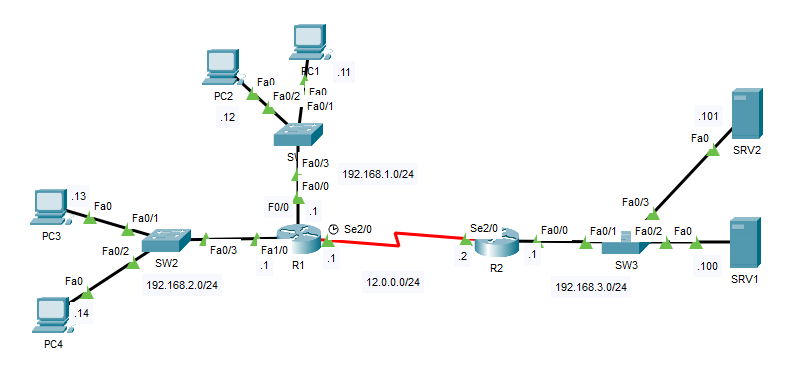

* Configure las ACL extendidas para cumplir con los siguientes requisitos:
   ---Solo la PC1 puede acceder a SRV1
   ---Solo los hosts en la red 192.168.2.0/24 pueden acceder a SRV2
#### B) 

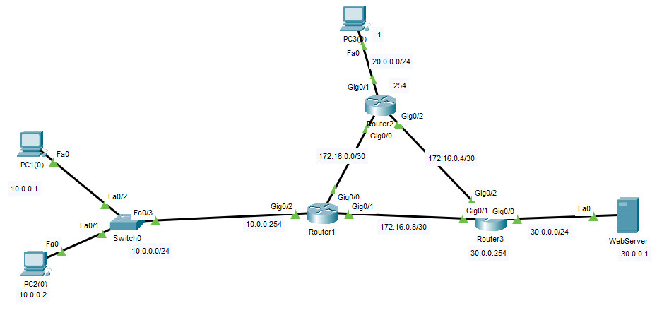

1. El host 10.0.0.1 no debe acceder al servicio Web en 30.0.0.1
2. El host 10.0.0.2 no debe hacer ping al servidor Web
3. El R3 no debe permitir que el servidor Web haga ping al resto de la red, pero sí deberá permitir que se pueda llegar con ping al servidor
4. La red 10.0.0.0/24 no debe acceder a la red 20.0.0.0/24
5. Solamente el host 10.0.0.1 tiene permitido hacer telnet a los routers.

#### C) ACL en IPv6

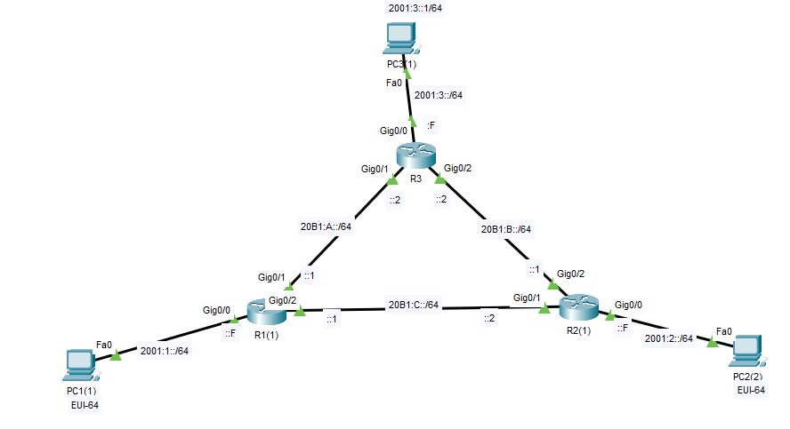

* Este ejercicio tiene por objetivo implementar controles de seguridad basados en ACL para IPv6.
* La topología está preconfigurada con direccionamiento y enrutamiento, por lo que todos los hosts deberían tener conectividad entre sí antes de comenzar el laboratorio.
* Todas las contraseñas son "nla" (sin comillas).

* Instrucciones
   1) El PC2 debe responder PINGS solamente desde la LAN de R3
   2) El PC de la LAN de R3 debe acceder solamente a la interfaz Web de R3. Para todos
  los otros sitios Web, el acceso debe estar bloqueado.
   3) PC1 no debe poder acceder de ningún modo a la LAN de R3

---

#### A)

**Configure las ACL extendidas para cumplir con los siguientes requisitos:**
 ---Solo la PC1 puede acceder a SRV1
 ---Solo los hosts en la red 192.168.2.0/24 pueden acceder a SRV2
En R1
```
R1(config)#access-list 100 permit ip host 192.168.1.11 host 192.168.3.100
R1(config)#access-list 100 deny ip any host 192.168.3.100

R1(config)#access-list 100 permit ip 192.168.2.0 0.0.0.255 host 192.168.3.101
R1(config)#access-list 100 deny ip any host 192.168.3.101
R1(config)#access-list 100 permit ip any any

R1(config)#int s2/0
R1(config-if)#ip access-group 100 out
```

#### B)

**1. El host 10.0.0.1 no debe acceder al servicio Web en 30.0.0.1**
**2. El host 10.0.0.2 no debe hacer ping al servidor Web**
**4. La red 10.0.0.0/24 no debe acceder a la red 20.0.0.0/24**

En R1
```
ip access-list extended SEC_RED10
   deny tcp host 10.0.0.1 host 30.0.0.1 eq 80
   deny tcp host 10.0.0.1 host 30.0.0.1 eq 443
   deny icmp host 10.0.0.2 30.0.0.0 0.0.0.255 echo
   deny ip 10.0.0.0 0.0.0.255 20.0.0.0 0.0.0.255
   permit ip any any
int g0/2
   ip access-gourp SEC_RED10 in
```


Vemos la pagina web desde la PC2 `10.0.0.2`

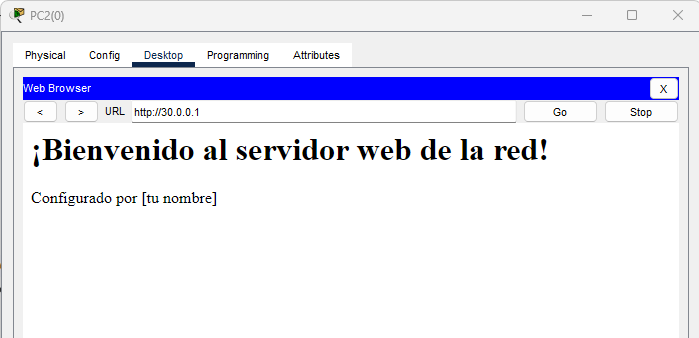

Desde la PC1

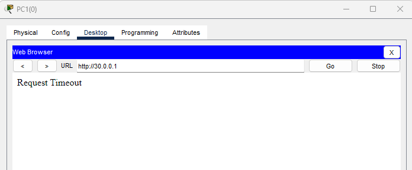

Ping desde PC2 `10.0.0.2`

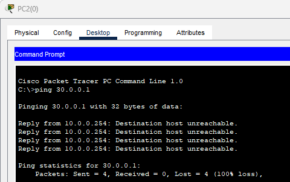

Ping de `10.0.0.0/24` a `20.0.0.0/24`

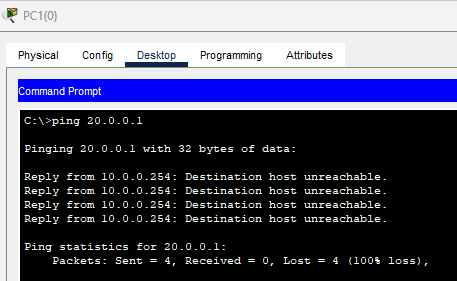


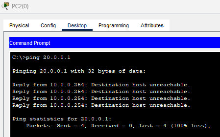

```
Router#show access-lists
Extended IP access list SEC_RED10
10 deny tcp host 10.0.0.1 host 30.0.0.1 eq www (47 match(es))
20 deny tcp host 10.0.0.1 host 30.0.0.1 eq 443
30 deny icmp host 10.0.0.2 30.0.0.0 0.0.0.255 echo (4 match(es))
40 deny ip 10.0.0.0 0.0.0.255 20.0.0.0 0.0.0.255 (8 match(es))
50 permit ip any any (53 match(es))
60 deny icmp host 10.0.0.2 host 30.0.0.1 echo
Standard IP access list 1
10 permit host 10.0.0.1
```
 

**3. El R3 no debe permitir que el servidor Web haga ping al resto de la red, pero sí deberá permitir que se pueda llegar con ping al servidor**

En R3

```
ip access-list ectended SEC_WEB
   deny icmp host 30.0.0.1 any
   permit ip any any
int gig0/0
   ip access-group SEC_WEB in
```

```
Router#show access-lists
Extended IP access list SEC_WEB
10 deny icmp host 30.0.0.1 any echo (8 match(es))
20 permit ip any any (14 match(es))
Standard IP access list 1
10 permit host 10.0.0.1
```

Ping a diferentes puntos de la red

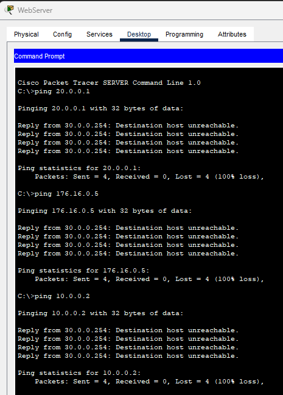

Pero si se logra hacer ping al servidor

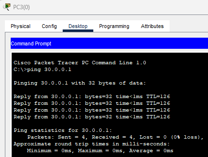

**5. Solamente el host 10.0.0.1 tiene permitido hacer telnet a los routers.**

En todos lo Routers para configurar Telnet

```
line vty 0 4
   password 123
   login
```

Para esto es mejor crear una acces list estándar

```
access-list 1 permit host 10.0.0.1
line vty 0 4 
   access-class 1 in
```

Exito entrando desde `10.0.0.1`

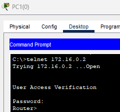

y desde los otros dispositivos.

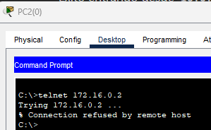

#### C)

En IPv6 solo existe lista de acceso extendidas y nombradas.

**1) El PC2 debe responder PING solamente desde la LAN de R3**

En R2
```
ipv6 access-list POLITICAS
   pemit icmp 2001:3::/64 2001:2::260:47FF:FE88:6E67 
int Gig0/0
   ipv6 traffic-filte POLITICAS out   
```

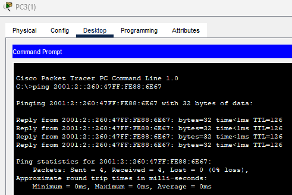


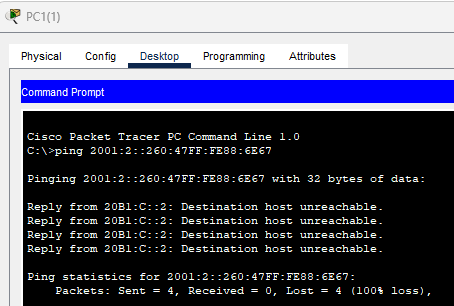

**3) PC1 no debe poder acceder de ningún modo a la LAN de R3**

En R1
```
Router(config)#ipv6 access-list PC1
Router(config-ipv6-acl)#deny ipv6 2001:1::20C:85FF:FE06:91E1/64 2001:3::F/64

Router(config-ipv6-acl)#int g0/0
Router(config-if)#ipv6 traffic-filter PC1 in
```

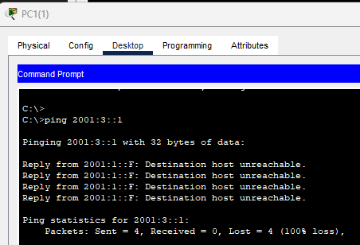

**2) El PC de la LAN de R3 debe acceder solamente a la interfaz Web de R3. Para todos
  los otros sitios Web, el acceso debe estar bloqueado.**

en r3
para levantar el servicio web en el router
```
ip http server
   username nla privilege 15 password nla
   ip http authentication local 
```


```
ipv6 access-list PERMIT_HTTP
   permit tcp 2001:3::1/64 2001:3::F/64 eq 80
   deny tcp 2001:3::1/64 any eq 80
   permit any any
int gig0/0
   traffic-filter PERMITE_HTTP in
```
  