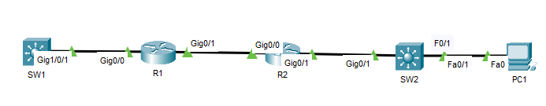

## 15 - LABORATORIO - LLDP (Link Layer Discovery Protocol) - CCNA


(Asegúrese de que las opciones "Mostrar etiquetas de modelo de dispositivo" y "Mostrar siempre etiquetas de puerto en el espacio de trabajo lógico" en el menú Opciones -> Preferencias estén deshabilitadas).

1. Desactive CDP y active LLDP en cada dispositivo de red.
2. Utilice el comando "show" para encontrar los valores predeterminados del temporizador para LLDP.
3. Utilice LLDP para identificar las interfaces que se utilizan para conectar los routers y switches.
4. Utilice LLDP para identificar la versión de IOS de los dispositivos vecinos.
5. Evite que la interfaz F0/1 de SW2 envíe o reciba actualizaciones de LLDP.
---

**1. Desactive CDP y active LLDP en cada dispositivo de red.**

```
no cdp run
lldp run
```

**2. Utilice el comando "show" para encontrar los valores predeterminados del temporizador para LLDP.**

```
SW1#show lldp

Global LLDP Information:
Status: ACTIVE
LLDP advertisements are sent every 30 seconds
LLDP hold time advertised is 120 seconds
LLDP interface reinitialisation delay is 2 seconds
```

**3. Utilice LLDP para identificar las interfaces que se utilizan para conectar los routers y switches.**

En SW1
```
SW1#show lldp neighbors

Capability codes:
(R) Router, (B) Bridge, (T) Telephone, (C) DOCSIS Cable Device
(W) WLAN Access Point, (P) Repeater, (S) Station, (O) Other
Device ID Local Intf Hold-time Capability Port ID
R1 Gig1/0/1 120 R Gig0/0
Total entries displayed: 1
```

En R1
```
R1#show lldp neighbors

Capability codes:
(R) Router, (B) Bridge, (T) Telephone, (C) DOCSIS Cable Device
(W) WLAN Access Point, (P) Repeater, (S) Station, (O) Other
Device ID Local Intf Hold-time Capability Port ID
SW1 Gig0/0 120 R Gig1/0/1
R2 Gig0/1 120 R Gig0/0
Total entries displayed: 2
```

En R2
```
R2#show lldp neighbors

Capability codes:
(R) Router, (B) Bridge, (T) Telephone, (C) DOCSIS Cable Device
(W) WLAN Access Point, (P) Repeater, (S) Station, (O) Other
Device ID Local Intf Hold-time Capability Port ID
R1 Gig0/0 120 R Gig0/1
SW2 Gig0/1 120 R Gig0/1
Total entries displayed: 2
```

En SW2
```
SW2#show lldp neighbors

Capability codes:
(R) Router, (B) Bridge, (T) Telephone, (C) DOCSIS Cable Device
(W) WLAN Access Point, (P) Repeater, (S) Station, (O) Other
Device ID Local Intf Hold-time Capability Port I
R2 Gig0/1 120 R Gig0/1
Total entries displayed: 1
```

**4. Utilice LLDP para identificar la versión de IOS de los dispositivos vecinos.**

Para ver la version
```
show lldp neighbors detail
```

```
SW2#show lldp neighbors detail

------------------------------------------------
Chassis id: 000C.8581.9A02
Port id: Gig0/1
Port Description: GigabitEthernet0/1
System Name: R2
System Description:
Cisco IOS Software, C2900 Software (C2900-UNIVERSALK9-M), Version 15.1(4)M4, RELEASE SOFTWARE (fc2)
Technical Support: http://www.cisco.com/techsupport
Copyright (c) 1986-2012 by Cisco Systems, Inc.
Compiled Thurs 5-Jan-12 15:41 by pt_team
Time remaining: 90 seconds
System Capabilities: R
Enabled Capabilities: R
Management Addresses - not advertised
Auto Negotiation - supported, enabled
Physical media capabilities:
1000baseT(FD)
Media Attachment Unit type: 10
Vlan ID: 1
Total entries displayed: 1
```

**5. Evite que la interfaz F0/1 de SW2 envíe o reciba actualizaciones de LLDP.**

```
SW2(config)#int f0/1
SW2(config-if)#no lldp receive
SW2(config-if)#no lldp transmit
```

