## 16 - LABORATORIO - DHCP (Dynamic Host Configuration Protocol) - CCNA

#### A)

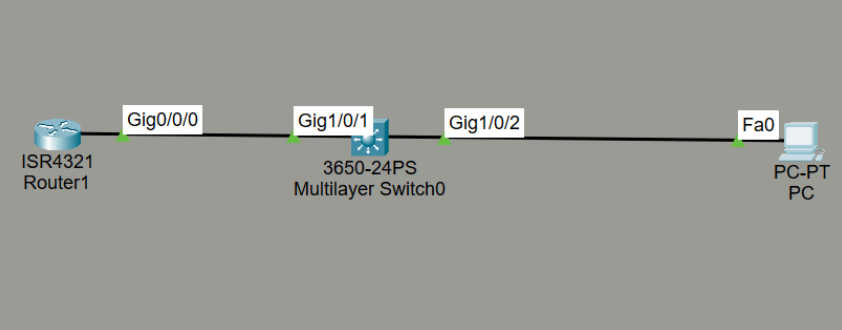

Configure DHCP en el Router1 de la siguiente manera:
1) Rango de direcciones excluidas: 10.1.1.1 a 10.1.1.100
2) Nombre del grupo: pc
3) Red: 10.1.1.0/24
4) Puerta de enlace predeterminada: Router1
5) Servidor DNS: Router1
6) Compruebe que la PC pueda hacer ping al loopback del Router1

#### B)

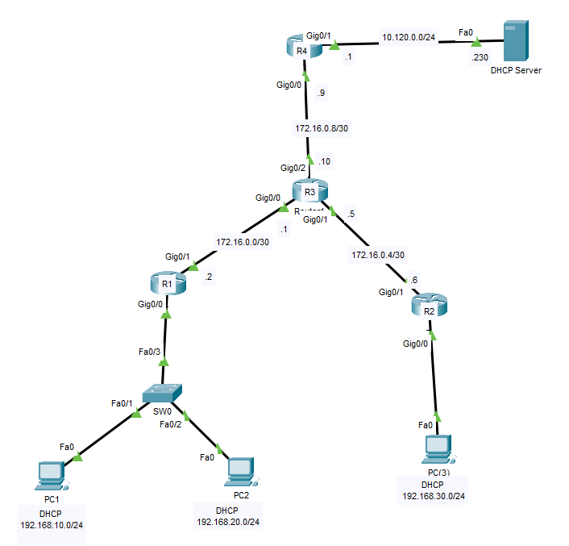

1. R1 debe proveer de DHCP a la VLAN10 y VLAN20. La VLAN10 debe tener asignado
   un tiempo de concesión de 10 horas. No se deben incluir las primeras 10 IP de cada bloque IP en ambas VLANs.
2. PC3 debe recibir el direccionamiento IP correcto que le permita conectarse al resto de la red. Para la red 192.168.30.0/24 el servidor DHCP debe ser la máquina remota conectada a R4.

#### C)

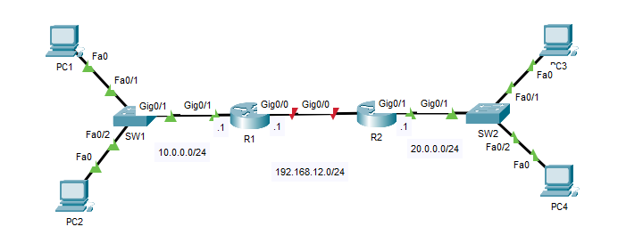

1. Configure tres grupos DHCP en R1:
   Grupo 10:
   Rango: 10.0.0.0/24
   Puerta de enlace predeterminada: 10.0.0.1
   Servidor DNS: 10.0.0.1
   Direcciones excluidas: 10.0.0.1 - 10.0.0.10

   Grupo 20:
   Rango: 20.0.0.0/24
   Puerta de enlace predeterminada: 20.0.0.1
   Servidor DNS: 20.0.0.1
   Direcciones excluidas: 20.0.0.1 - 20.0.0.10

   Grupo 12:
   Rango: 192.168.12.0/24

2. Configure la interfaz G0/0 de R2 como cliente DHCP y luego habilite la interfaz.
3. Configure la interfaz G0/1 de R2 como agente de retransmisión DHCP para que los hosts en La red 20.0.0.0/24 puede obtener direcciones IP

----
#### A)

Configuración del **Router1**

```
enable
conf t
interface g0/0/0
ip address 10.1.1.1 255.255.255.0
no shutdown
```

Crear Loopback
```
interface loopback0
ip address 1.1.1.1 255.255.255.255
```

1. Rango de direcciones excluidas: 10.1.1.1 a 10.1.1.100
```
ip dhcp excluded-address 10.1.1.1 10.1.1.100
```
2. Nombre del grupo: pc
```
ip dhcp pool pc
```
3. Red: 10.1.1.0/24
```
network 10.1.1.0 255.255.255.0
```
4. Puerta de enlace predeterminada: Router1
```
default-router 10.1.1.1
```
Define el gateway que el servidor DHCP le entregará a los clientes cuando les asigne una IP.

5. Servidor DNS: Router1
```
dns-server 10.1.1.1
```

Configuracion de **Switch**

```
Switch(config)# interface gig1/0/1
Switch(config-if)# switchport mode access

Switch(config)# interface gig1/0/2
Switch(config-if)# switchport mode access
```
Mode access porque no vamos a usar VLANs aquí.

**IP que el DHCP le asigno a la PC**

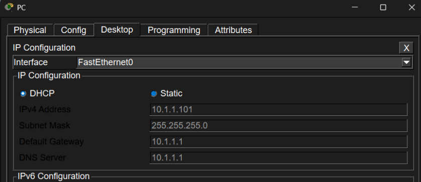

6. **Compruebe que la PC pueda hacer ping al loopback del Router1**

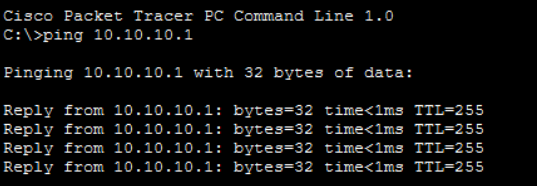

#### B)

**1. R1 debe proveer de DHCP a la VLAN10 y VLAN20. La VLAN10 debe tener asignado
   un tiempo de concesión de 10 horas. No se deben incluir las primeras 10 IP de cada bloque IP en ambas VLANs.**

En SW0

```
vlan 10
name VLAN10

vlan 20
name VLAN20

interface fa0/1
switchport mode access
switchport access vlan 10

interface fa0/2
switchport mode access
switchport access vlan 20

interface fa0/3
switchport mode trunk
```

En R1

```
interface gig0/0
no shutdown

interface gig0/0.10
encapsulation dot1Q 10
ip address 192.168.10.1 255.255.255.0

interface gig0/0.20
encapsulation dot1Q 20
ip address 192.168.20.1 255.255.255.0
```

DHCP en R1

```
ip dhcp excluded-address 192.168.10.1 192.168.10.10
ip dhcp excluded-address 192.168.20.1 192.168.20.10

ip dhcp pool VLAN10
network 192.168.10.0 255.255.255.0
default-router 192.168.10.1
lease 0 10

ip dhcp pool VLAN20
network 192.168.20.0 255.255.255.0
default-router 192.168.20.1
```

IPs que le asignaron a PC1 y PC2

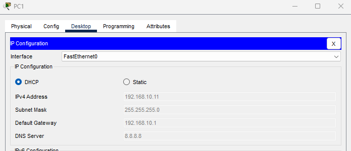


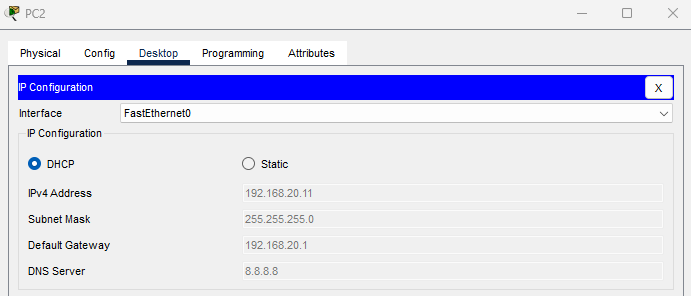

**2. PC3 debe recibir el direccionamiento IP correcto que le permita conectarse al resto de la red. Para la red 192.168.30.0/24 el servidor DHCP debe ser la máquina remota conectada a R4.**

En R2

```
interface gig0/0
ip address 192.168.30.1 255.255.255.0
ip helper-address 10.120.0.230
no shutdown
```
**Un cliente solo puede recibir DHCP de otra red si el router actúa como DHCP Relay usando `ip helper-address`.**


En R1, R2, R3 y R4:
**Routing**

```
router rip
version 2
no auto-summary
network 172.16.0.0
network 192.168.10.0
network 192.168.20.0
network 192.168.30.0
network 10.120.0.0
```

En el DHCP Server

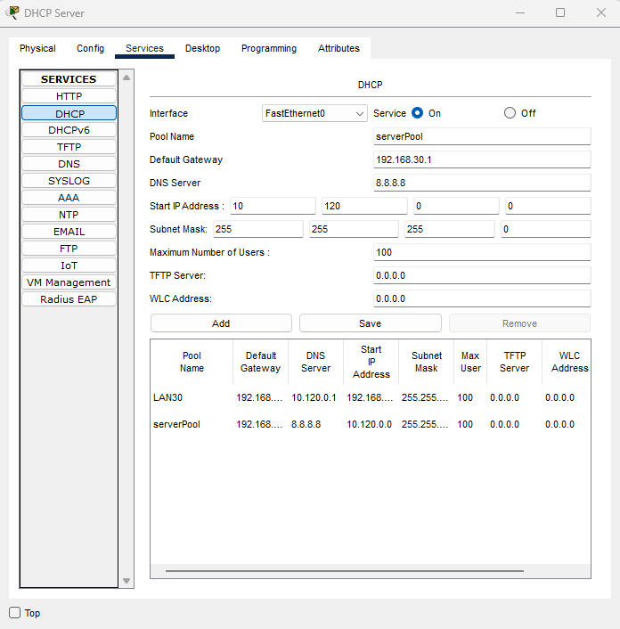

IP que se le asigno a PC3

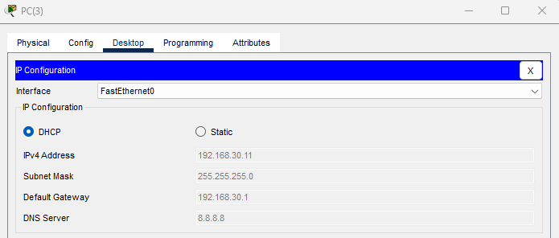

#### C)

**1. Configure tres pools DHCP en R1:**

En R1

   **pool 10:**
   Rango: 10.0.0.0/24
   Puerta de enlace predeterminada: 10.0.0.1
   Servidor DNS: 10.0.0.1
   Direcciones excluidas: 10.0.0.1 - 10.0.0.10

```
R1(config)#ip dhcp excluded-address 10.0.0.1 10.0.0.10

R1(config)#ip dhcp pool 10POOL
R1(dhcp-config)#network 10.0.0.0 255.255.255.0
R1(dhcp-config)#default-router 10.0.0.1
R1(dhcp-config)#dns-server 10.0.0.1
```

   **pool 20:**
   Rango: 20.0.0.0/24
   Puerta de enlace predeterminada: 20.0.0.1
   Servidor DNS: 20.0.0.1
   Direcciones excluidas: 20.0.0.1 - 20.0.0.10

```
R1(config)#ip dhcp excluded-address 20.0.0.1 20.0.0.10

R1(config)#ip dhcp pool 20POOL
R1(dhcp-config)#net 20.0.0.0 255.255.255.0
R1(dhcp-config)#default-router 20.0.0.1
R1(dhcp-config)#dns-server 20.0.0.1
```

   **pool 12:**
   Rango: 192.168.12.0/24
   
```
R1(config)#ip dhcp pool 12POOL
R1(dhcp-config)#network 192.168.12.0 255.255.255.0
```

En PC1

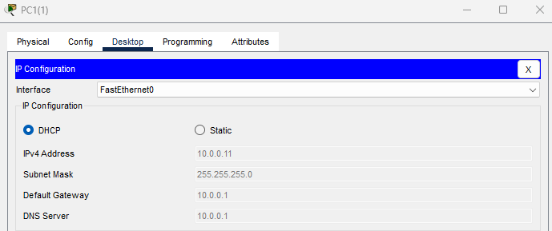

En PC2

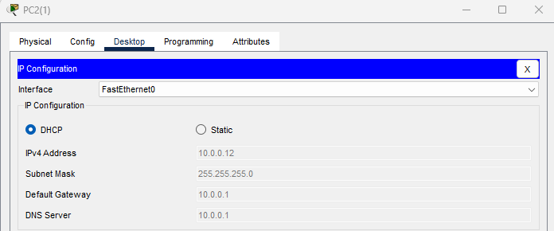

**2. Configure la interfaz G0/0 de R2 como cliente DHCP y luego habilite la interfaz.**

En R2
```
R2(config)#int g0/0
R2(config-if)#ip address dhcp
R2(config-if)#no shut
```


**3. Configure la interfaz G0/1 de R2 como agente de retransmisión DHCP para que los hosts en La red 20.0.0.0/24 puede obtener direcciones IP**

```
R2(config)#int g0/1
R2(config-if)#ip helper-address 192.168.12.1
```

En PC3

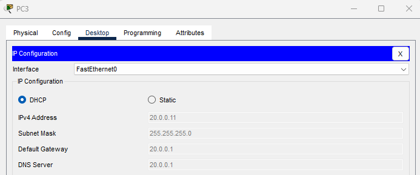

En PC4

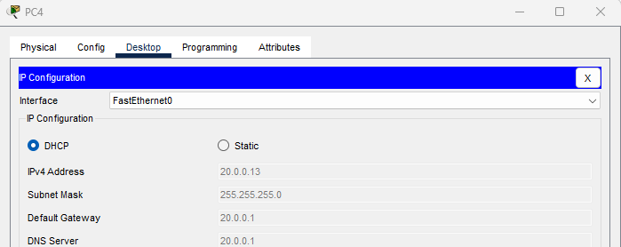

