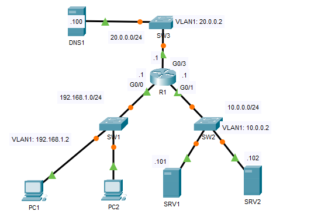
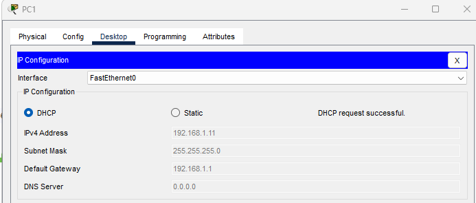
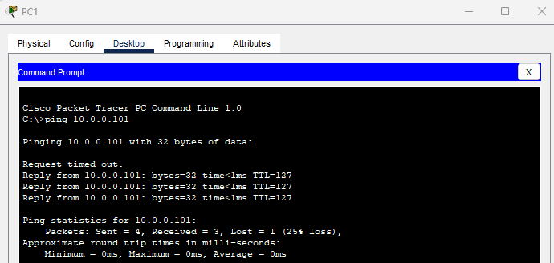
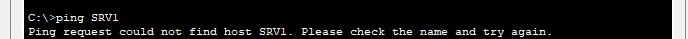
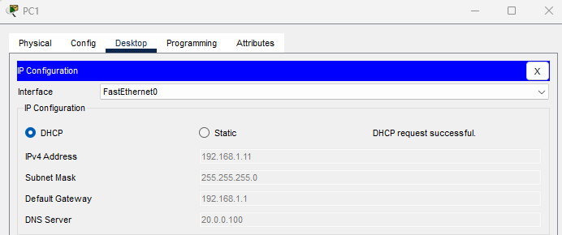
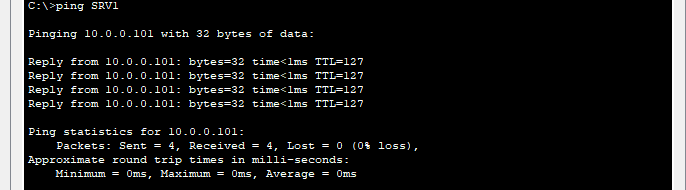
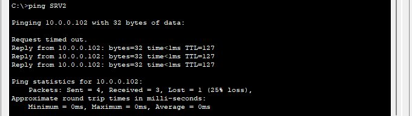
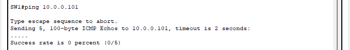
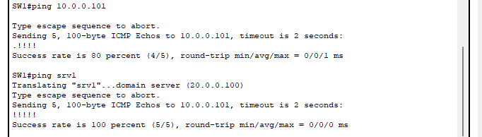

## 17 - LABORATORIO - DNS (Domain Name System) - CCNA



1. Configure el siguiente pool DHCP en R1:
   1pool:
   Red: 192.168.1.0/24
   Puerta de enlace predeterminada: 192.168.1.1
   Rango de direcciones excluidas: 192.168.1.1 - 192.168.1.10
2. Desde la PC1, intente hacer ping a SRV1 por dirección IP y luego por nombre. ¿Falló alguno de los dos?
3. Agregue 20.0.0.100 como servidor DNS al pool DHCP 1pool.
4. Desde la PC1, haga ping a SRV1 y SRV2 por nombre. ¿Tiene éxito el ping?
5. En SW1, intente hacer ping a SRV1 por dirección IP y por nombre.
6. En SW1, especifique manualmente R1 como puerta de enlace predeterminada y DNS1 como servidor DNS, y luego vuelva a intentar el ping.

---

**1. Configure el siguiente pool DHCP en R1:**

   1pool:
   Red: 192.168.1.0/24
   Puerta de enlace predeterminada: 192.168.1.1
   Rango de direcciones excluidas: 192.168.1.1 - 192.168.1.10

```
R1(config)#ip dhcp excluded-address 192.168.1.1 192.168.1.10
R1(config)#ip dhcp pool 1POOL
R1(dhcp-config)#network 192.168.1.0 255.255.255.0
R1(dhcp-config)#default-router 192.168.1.1
```



**2. Desde la PC1, intente hacer ping a SRV1 por dirección IP y luego por nombre. ¿Falló alguno de los dos?**

Ping por dirección IP


Ping por su nombre


Solo hubo exito con la IP address.

**3. Agregue 20.0.0.100 como servidor DNS al pool DHCP 1pool.**

```
R1(dhcp-config)#dns-server 20.0.0.100
```



**4. Desde la PC1, haga ping a SRV1 y SRV2 por nombre. ¿Tiene éxito el ping?**




Hay exito al hacer ping.


**5. En SW1, intente hacer ping a SRV1 por dirección IP y por nombre.**


El ping falla, porque el switch no recibe el default gateway proporcionada por el dhcp server.


**6. En SW1, especifique manualmente R1 como puerta de enlace predeterminada y DNS1 como servidor DNS, y luego vuelva a intentar el ping.**

Lo configuramos 
```
SW1(config)#ip default-gateway 192.168.1.1
SW1(config)#ip name-server 20.0.0.100
```

Ping


