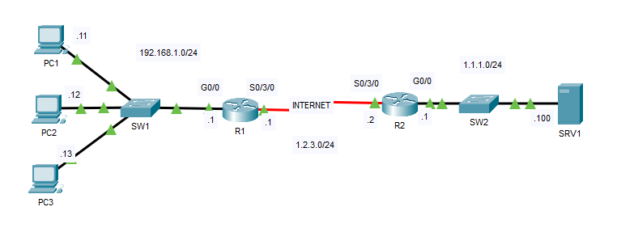
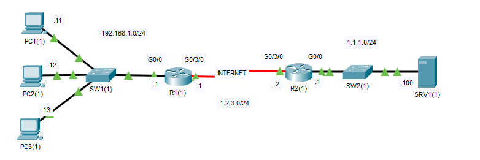
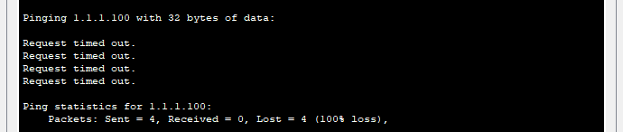
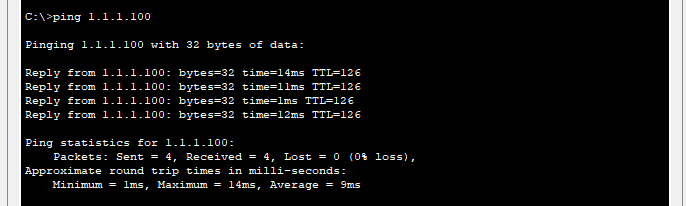
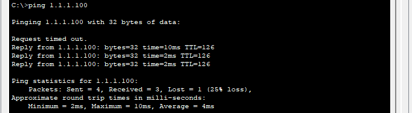
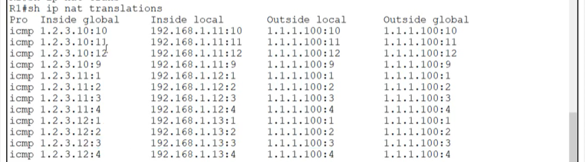

## 18 - LABORATORIO - NAT (Network Address Translation) - CCNA

#### A) Static NAT



1. Se ha configurado RIP para que R1 y R2 puedan acceder a sus redes internas.
   ¿Por qué PC1, PC2 y PC3 no pueden hacer ping a SRV1 correctamente?
   (Pista: La conexión serial entre R1 y R2 simula Internet con ACL).
2. Configure NAT estática en R1 para traducir las direcciones de PC1, PC2 y PC3 a 1.2.3.11, 1.2.3.12 y 1.2.3.13, respectivamente.
3. Intente hacer ping a SRV1 desde cada PC nuevamente. ¿Los pings son correctos?

#### B) Dynamic NAT



1. RIP se ha configurado para que R1 y R2 puedan acceder a sus redes internas.
   ¿Por qué PC1, PC2 y PC3 no pueden hacer ping a SRV1 correctamente?
   (Pista: La conexión serial entre R1 y R2 simula Internet con ACL).
2. Configure NAT dinámica en R1 para traducir la subred 192.168.1.0/24 al rango de direcciones 1.2.3.10 - 1.2.3.20.
3. Haga ping desde cada PC a SRV1 y luego use el comando "show" en R1 para verificar las traducciones.

---

#### A) Static NAT

**1. Se ha configurado RIP para que R1 y R2 puedan acceder a sus redes internas.
   ¿Por qué PC1, PC2 y PC3 no pueden hacer ping a SRV1 correctamente?
   (Pista: La conexión serial entre R1 y R2 simula Internet con ACL).**



Ninguna PC logra hacer ping con SRV1

¿Por qué PC1, PC2 y PC3 no pueden hacer ping a SRV1 correctamente?
Esa ACL está filtrando tráfico ICMP, los mensajes de respuesta (ICMP Echo Reply).

Las ACL simula internet, y en Internet no se puede hacer ping a una IP privada (192.168.x.x) porque las direcciones RFC 1918 no son enrutable y requieren NAT para comunicarse con redes públicas.

**2. Configure NAT estática en R1 para traducir las direcciones de PC1, PC2 y PC3 a 1.2.3.11, 1.2.3.12 y 1.2.3.13, respectivamente.**

En R1
```
R1(config)#int g0/0
R1(config-if)#ip nat inside
R1(config-if)#int s0/3/0
R1(config-if)#ip nat outside
R1(config-if)#exit

R1(config)#ip nat inside source static 192.168.1.11 1.2.3.11
R1(config)#ip nat inside source static 192.168.1.12 1.2.3.12
R1(config)#ip nat inside source static 192.168.1.13 1.2.3.13
```

**3. Intente hacer ping a SRV1 desde cada PC nuevamente. ¿Los pings son correctos?**

Ping exitoso.



#### B) Dynamic NAT

**1. RIP se ha configurado para que R1 y R2 puedan acceder a sus redes internas.**
   ¿Por qué PC1, PC2 y PC3 no pueden hacer ping a SRV1 correctamente?
   (Pista: La conexión serial entre R1 y R2 simula Internet con ACL).


**2. Configure NAT dinámica en R1 para traducir la subred 192.168.1.0/24 al rango de direcciones 1.2.3.10 - 1.2.3.20.**

```
R1(config)#int g0/0
R1(config-if)#ip nat inside 
R1(config-if)#int s0/3/0
R1(config-if)#ip nat outside 
```

ACL para identificar la red privada
```
R1(config)#access-list 1 permit 192.168.1.0 0.0.0.255
```

Pool de direcciones públicas
```
R1(config)#ip nat pool POOL1 1.2.3.10 1.2.3.20 netmask 255.255.255.0
```

NAT, asociar ACL con el pool
```
R1(config)#ip nat inside source list 1 pool POOL1
```


**3. Haga ping desde cada PC a SRV1 y luego use el comando "show" en R1 para verificar las traducciones.**



Ping exitoso.

```
R1#show ip nat translations
```



