## 19 - LABORATORIO - PAT (Port Address Translation) - CCNA

#### A) NAT/PAT

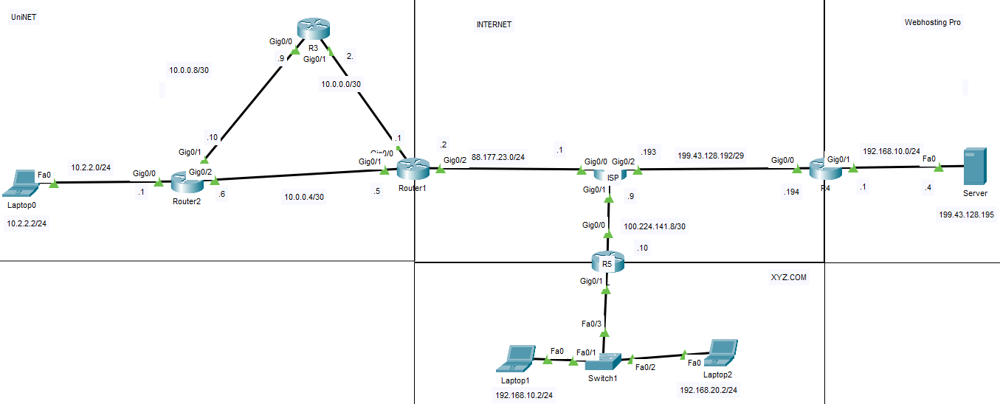

1. Verificar conectividad inicial dentro de la red de cada empresa. 
   Los hosts internos deberán al menos alcanzar con ping la dirección IP pública de su router de borde. 2
2. Los usuarios de UniNET deberán salir a Internet con las direcciones IP 88.177.23.10 a 88.177.23.20. 
   Verificar enviando un ping desde el PC interno hacia el ISP. 
   En R1 se debe ejecutar el comando "debug ip icmp" para revisar la dirección de origen de los mensajes ping.
3. La red XYZ.COM deberá salir a Internet con la dirección IP asignada a la interfaz G0/0 de R5.  Verificar enviando un ping desde el PC interno hacia el ISP. 
   En R5 se debe ejecutar el comando "debug ip icmp" para revisar la dirección de origen de los   mensajes ping.
4) La empresa Webhosting Pro debe salir a Internet con la dirección IP pública asignada a la interfaz Gi0/0 de R4. Adicionalmente, el servidor interno con la IP 192.168.0.4 debe ser accesible desde Internet con la IP 199.43.128.195
5) Verificar conectividad de extremo a extremo (Internet solamente).

#### B) PAT

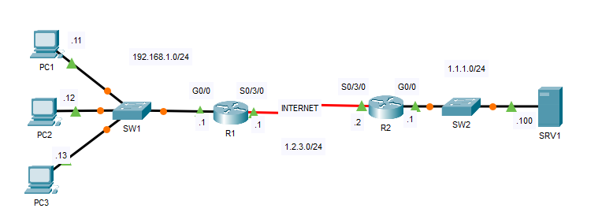

1. RIP se ha configurado para que R1 y R2 puedan acceder a sus redes internas.
   ¿Por qué PC1, PC2 y PC3 no pueden hacer ping correctamente a SRV1?
   (Pista: La conexión serial entre R1 y R2 simula Internet con ACL).
2. Configure PAT en R1 para traducir direcciones en la red 192.168.1.0/24 a la interfaz S0/3/0 de R1.
   (¡Asegúrese de sobrecargar la interfaz!).
3. Haga ping desde cada PC a SRV1 y luego use el comando "show" en R1 para verificar las traducciones.

---
#### A) NAT/PAT

**1. Verificar conectividad inicial dentro de la red de cada empresa. 
   Los hosts internos deberán al menos alcanzar con ping la dirección IP pública de su router de borde. 2**

Ping en UniNET

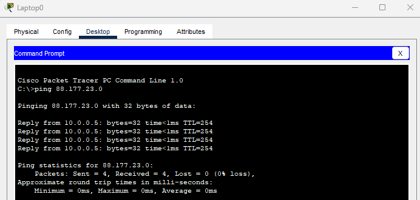

Ping en XYZ.COM

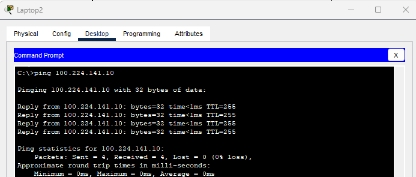

Ping en Webhosting Pro

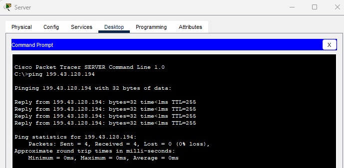

**2. Los usuarios de UniNET deberán salir a Internet con las direcciones IP 88.177.23.10 a 88.177.23.20.**

En R1

ACL para red interna UniNET
```
ip access-list standard N4T
 permit 10.2.2.0 0.0.0.255 
```

Pool de direcciones públicas
```
ip nat pool UNINET 88.177.23.10 88.177.23.20 netmask 255.255.255.0
```

Asociar ACL + pool
```
ip nat inside source list N4T pool UNINET
```

Marcar interfaces
```
interface g0/1   
 ip nat inside

interface g0/2   
 ip nat outside
```

Verificación

Desde la PC UniNET:
```
ping 88.177.23.1
```

En R1:
```
R1#debug ip nat
IP NAT debugging is on
Router#debug ip icmp
ICMP packet debugging is on

NAT: s=10.2.2.2->88.177.23.10, d=88.177.23.1 [17]
NAT*: s=88.177.23.1, d=88.177.23.10->10.2.2.2 [12]
NAT: s=10.2.2.2->88.177.23.10, d=88.177.23.1 [18]
NAT*: s=88.177.23.1, d=88.177.23.10->10.2.2.2 [13]
NAT: s=10.2.2.2->88.177.23.10, d=88.177.23.1 [19] 
NAT*: s=88.177.23.1, d=88.177.23.10->10.2.2.2 [14] 
NAT: s=10.2.2.2->88.177.23.10, d=88.177.23.1 [20]  
NAT*: s=88.177.23.1, d=88.177.23.10->10.2.2.2 [15]
```

**3. La red XYZ.COM deberá salir a Internet con la dirección IP asignada a la interfaz G0/0 de            R5. Verificar enviando un ping desde el PC interno hacia el ISP.**

ACL de redes internas
```
ip access-list standard N4T
 permit 192.168.10.0 0.0.0.255
 permit 192.168.20.0 0.0.0.255
 exit
```

NAT overload - PAT
```
ip nat inside source list N4T interface g0/0 overload
```

Interfaces
```
interface g0/1 
 ip nat inside

interface g0/0 
 ip nat outside
```

En R5 se debe ejecutar el comando "debug ip icmp" para revisar la dirección de origen de los  mensajes ping.

```
R5#clear ip nat translation *
R5#debug ip nat
IP NAT debugging is on
R5#debug ip icmp
ICMP packet debugging is on

R5#
ICMP: echo reply sent, src 100.224.141.10, dst 192.168.20.2
ICMP: echo reply sent, src 100.224.141.10, dst 192.168.20.2  
ICMP: echo reply sent, src 100.224.141.10, dst 192.168.20.2  
ICMP: echo reply sent, src 100.224.141.10, dst 192.168.20.2
```

**4) La empresa Webhosting Pro debe salir a Internet con la dirección IP pública asignada a la interfaz Gi0/0 de R4.** **Adicionalmente, el servidor interno con la IP 192.168.0.4 debe ser accesible desde Internet con la IP 199.43.128.195**

ACL
```
ip access-list standard N4T
 permit 192.168.10.0 0.0.0.255
```

Salida a Internet (PAT)
```
ip nat inside source list N4T interface g0/0 overload
```

traducción NAT estática 1 a 1: IP privada ⇔ IP publica 
```
ip nat inside source static 192.168.10.4 199.43.128.195
```

Interfaces
```
interface g0/1   
 ip nat inside
 
interface g0/0   
 ip nat outside
```

**5) Verificar conectividad de extremo a extremo (Internet solamente).**

Ping de Laptop0(UniNET) al ISP

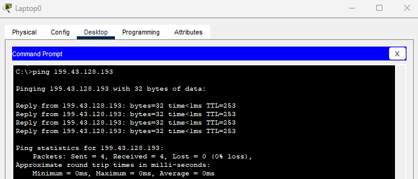

Ping de Laptop1(XYZ.com) al ISP

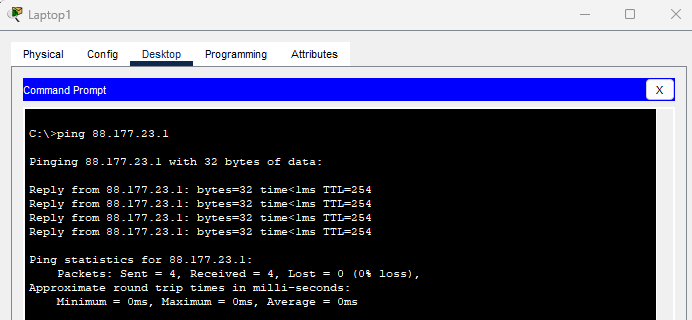

Ping de Laptop 0(UniNET) y Laptop2(XYZ.com) al Server(Webhosting Pro) 

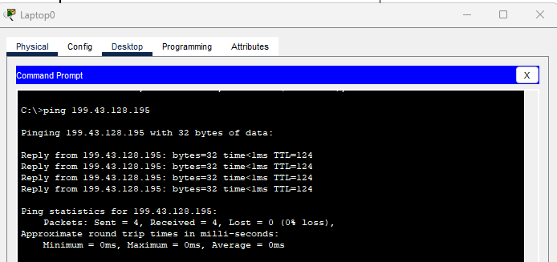


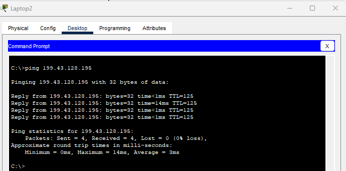

#### B) PAT

**1. RIP se ha configurado para que R1 y R2 puedan acceder a sus redes internas.**
   
   
   **¿Por qué PC1, PC2 y PC3 no pueden hacer ping correctamente a SRV1?
   (Pista: La conexión serial entre R1 y R2 simula Internet con ACL).
   **

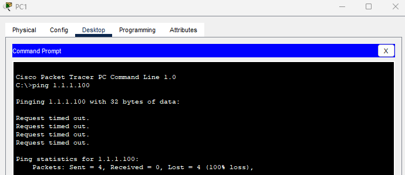

 Internet NO enruta direcciones privadas (RFC 1918).
 Las IP 192.168.1.0/24 son privadas.
 R2 (ISP) no tiene rutas válidas de retorno hacia esas IP privadas.

**2. Configure PAT en R1 para traducir direcciones en la red 192.168.1.0/24 a la interfaz S0/3/0 de R1.**

Interfaces
```
R1(config)#int g0/0
R1(config-if)#ip nat inside

R1(config-if)#int s0/3/0
R1(config-if)#ip nat outside
R1(config-if)#exit
```

ACL
```
R1(config)#access-list 1 permit 192.168.1.0 0.0.0.255
```

PAT
```
R1(config)#ip nat inside source list 1 interface s0/3/0 overload
```


**3. Haga ping desde cada PC a SRV1 y luego use el comando "show" en R1 para verificar las traducciones.**

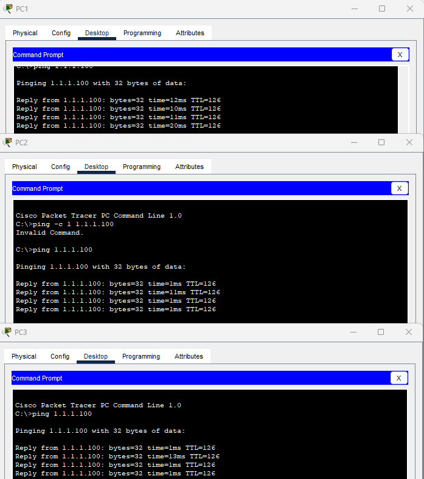

```
R1#sh ip nat translations
```

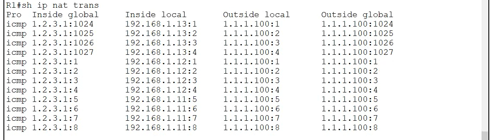

