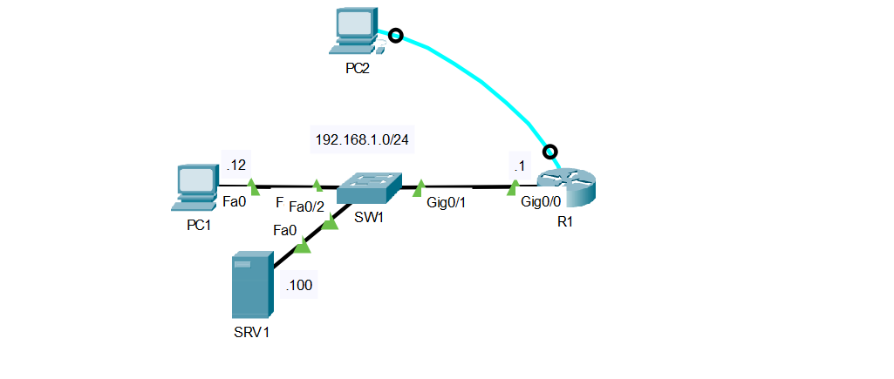
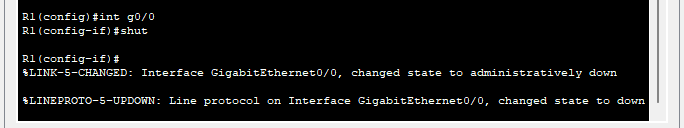
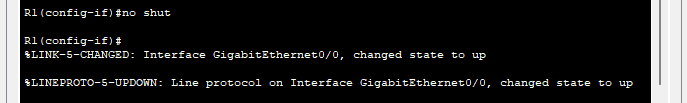
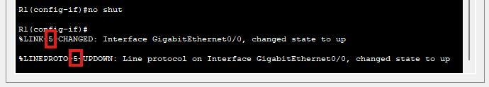
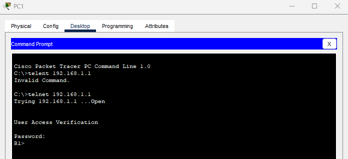
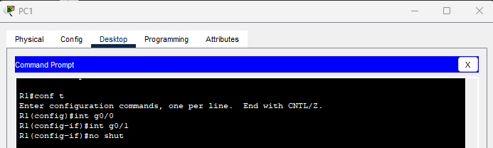
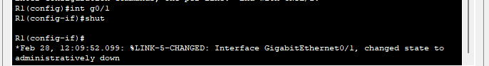
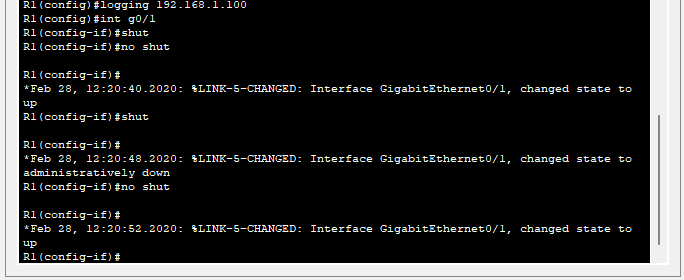
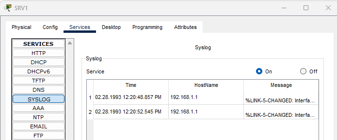

## 20 - LABORATORIO - Syslog - CCNA



1. Conéctese al puerto de consola de R1 mediante PC2:
   - Apague la interfaz G0/0
   - Tras recibir un mensaje de syslog, vuelva a habilitar la interfaz.
   - ¿Cuál es la gravedad de los mensajes de syslog?
   - Habilite las marcas de fecha y hora con milisegundos para el registro de mensajes.
2. Configure el secreto de habilitación "ccna".
   - Configure las líneas VTY para permitir Telnet y requerir la contraseña "ccent" para conectarse.
3. Conéctese por Telnet desde PC1 a la interfaz G0/0 de R1 y, a continuación, ejecute un "no shutdown" en la interfaz G0/1 no utilizada.
   - ¿Por qué no aparece ningún mensaje de syslog?
   - Configure R1 para que los mensajes de registro/depuración se muestren en las líneas VTY.
4. Configure el registro síncrono en las líneas de consola y VTY.
5. Habilite el registro en el búfer y configure su tamaño en 8192 bytes.
6. Habilite el registro en el servidor syslog SRV1.

---
**1. Conéctese al puerto de consola de R1 mediante PC2:**

   - Apague la interfaz G0/0



   - Tras recibir un mensaje de syslog, vuelva a habilitar la interfaz.



   - ¿Cuál es la gravedad de los mensajes de syslog?



El nivel 5 indican que son informativos.

   - Habilite las marcas de fecha y hora con milisegundos para el registro de mensajes.
   
```
R1(config)#service timestamps log datetime msec
```

Al apagar la interfaz.
```
R1(config-if)#

*Feb 28, 10:08:38.088: %LINK-5-CHANGED: Interface GigabitEthernet0/0, changed state to administratively down
*Feb 28, 10:08:38.088: %LINEPROTO-5-UPDOWN: Line protocol on Interface GigabitEthernet0/0, changed state to down
```

Al prenderlo
```
R1(config-if)#

*Feb 28, 10:09:22.099: %LINK-5-CHANGED: Interface GigabitEthernet0/0, changed state to up
*Feb 28, 10:09:22.099: %LINEPROTO-5-UPDOWN: Line protocol on Interface GigabitEthernet0/0, changed state to up
```

**2. Configure el secreto de habilitación "ccna".**
- Configure las líneas VTY para permitir Telnet y requerir la contraseña "ccent" para conectarse.
```
R1(config)#enable secret ccna
R1(config)#line vty 0 15
R1(config-line)#password ccent
R1(config-line)#transport input telnet
```



**3. Conéctese por Telnet desde PC1 a la interfaz G0/0 de R1 y, a continuación, ejecute un "no shutdown" en la interfaz G0/1 no utilizada.**



 - ¿Por qué no aparece ningún mensaje de syslog?
Porque de forma predeterminada los mensajes de syslog no se muestra en las lineas vty.

   - Configure R1 para que los mensajes de registro/depuración se muestren en las líneas VTY.
```
R1#terminal monitor
```



**4. Configure el registro síncrono en las líneas de consola y VTY.**

```
R1(config)#line con 0
R1(config-line)#logging synchronous

R1(config-line)#line vty 0 15
R1(config-line)#logging synchronous
```

**5. Habilite el registro en el búfer y configure su tamaño en 8192 bytes.**

```
R1(config)#logging buffered 8192

R1(config)#do show logg
Syslog logging: enabled (0 messages dropped, 0 messages rate-limited,
0 flushes, 0 overruns, xml disabled, filtering disabled) 
No Active Message Discriminator.
No Inactive Message Discriminator.
Console logging: level debugging, 12 messages logged, xml disabled,
filtering disabled
Monitor logging: level debugging, 1 messages logged, xml disabled,
filtering disabled
Buffer logging: level debugging, 0 messages logged, xml disabled,
filtering disabled 
Logging Exception size (4096 bytes)
Count and timestamp logging messages: disabled
Persistent logging: disabled
No active filter modules.
ESM: 0 messages dropped
Trap logging: level informational, 12 message lines logged
Log Buffer (8192 bytes):
```

**6. Habilite el registro en el servidor syslog SRV1.**

```
R1(config)#logging 192.168.1.100
```






