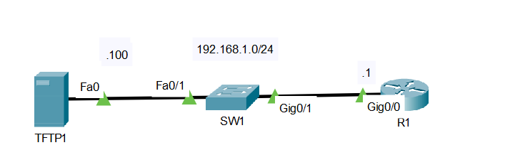
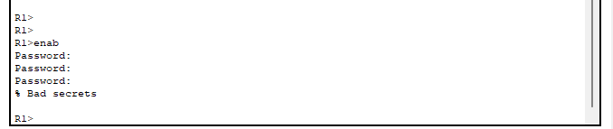
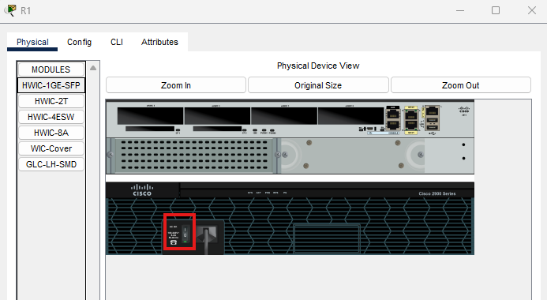
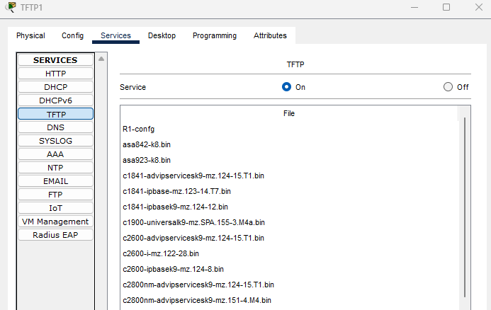

## 21 - LABORATORIO - Recuperación de contraseña, copia de seguridad de configuración, actualización de IOS - CCNA




1. Recuperar la contraseña en R1 (cambiar la clave secreta de habilitación a ccna):
   Instrucciones para iniciar R1 en modo ROMMON en Packet Tracer:
     (En la pestaña "Físico" de Packet Tracer, apagar y encender el interruptor de encendido,
     luego, acceder a la CLI y presionar Ctrl+pausa antes de que IOS termine de iniciarse)
2. Copiar la configuración de inicio de R1 en el servidor TFTP TFTP1
3. Actualizar la imagen de IOS de R1 a la imagen c2900-universalk9-mz.SPA.155-3.M4a.bin en TFTP1

---

**1. Recuperar la contraseña en R1 (cambiar la clave secreta de habilitación a ccna):***


 
 Instrucciones para iniciar R1 en modo ROMMON en Packet Tracer:



`Ctrl + Break`

```
rommon 1 >
```

```
rommon 1 > confreg 0x2142
rommon 2 > reset
```

`0x2142` indica: arranca IOS pero ignora la startup-config


```
Router#copy startup-config running-config

Destination filename [running-config]?
829 bytes copied in 0.416 secs (1992 bytes/sec)
%SYS-5-CONFIG_I: Configured from console by console

R1#conf t
Enter configuration commands, one per line. End with CNTL/Z.

R1(config)#enable secret ccna
R1(config)#config-register 0x2102
```

`copy startup-config running-config` restaura la configuración original que fue ignorada durante el arranque
**`config-register 0x2102`** se utiliza para restablecer el comportamiento normal de arranque

**2. Copiar la configuración de inicio de R1 en el servidor TFTP TFTP1**

```
R1#copy startup-config tftp

Address or name of remote host []? 192.168.1.100
Destination filename [R1-confg]?
Writing startup-config....!!
[OK - 827 bytes]
827 bytes copied in 3.002 secs (275 bytes/sec)
```



**3. Actualizar la imagen de IOS de R1 a la imagen c2900-universalk9-mz.SPA.155-3.M4a.bin en TFTP1**

```
R1#sh version

Cisco IOS Software, C2900 Software (C2900-UNIVERSALK9-M), Version 15.1(4)M4, RELEASE SOFTWARE (fc2)

System image file is "flash0:c2900-universalk9-mz.SPA.151-1.M4.bin"
```


```
R1#copy tftp flash

Address or name of remote host []? 192.168.1.100

Source filename []? c2900-universalk9-mz.SPA.155-3.M4a.bin

Destination filename [c2900-universalk9-mz.SPA.155-3.M4a.bin]? 
Accessing tftp://192.168.1.100/c2900-universalk9-mz.SPA.155-3.M4a.bin...
Loading c2900-universalk9-mz.SPA.155-3.M4a.bin from 192.168.1.100: !!!!!!!!!!!!!!!!!!!!!!!!!!!!!!!!!!!!!!!!!!!!!!!!!!!!!!!!!!!!!!!!!!!!!!!!!!!!!!!!!!!
```


```
R1#sho flash:

System flash directory:
File Length Name/status
3 33591768 c2900-universalk9-mz.SPA.151-4.M4.bin
4 33591768 c2900-universalk9-mz.SPA.155-3.M4a.bin
2 28282 sigdef-category.xml
1 227537 sigdef-default.xml

[67439355 bytes used, 188304645 available, 255744000 total]
249856K bytes of processor board System flash (Read/Write)
```

```
R1#delete flash

Delete filename []?c2900-universalk9-mz.SPA.151-4.M4.bin
Delete flash:/c2900-universalk9-mz.SPA.151-4.M4.bin? [confirm]
```


```
R1#reload
```
