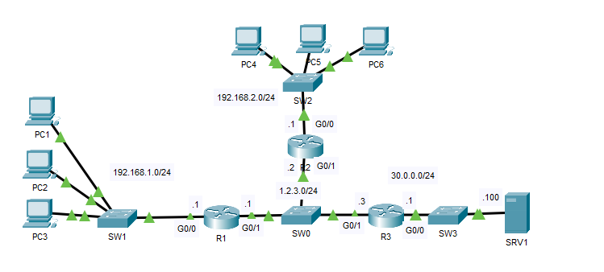
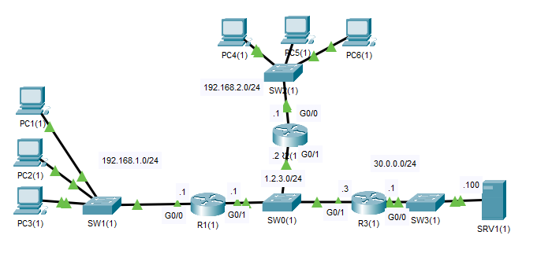
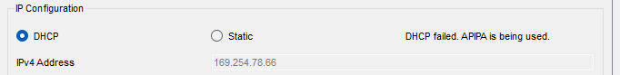
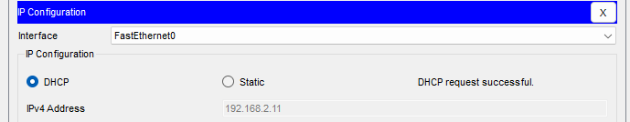
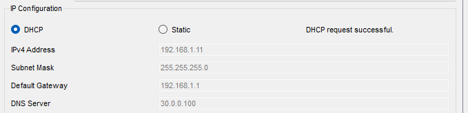
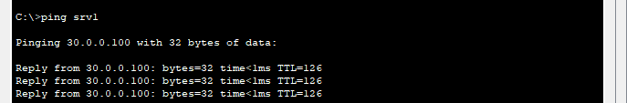
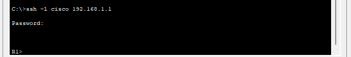

## 22 - LABORATORIO - Review Configuration 02 - CCNA

#### A)



1. Configure RIP entre R1, R2 y R3, anunciando todas las redes conectadas.  
   - Usar RIP versión 2
   - Deshabilitar el resumen automático
2. Configurar R1, R2 y R3 para enviar mensajes de syslog a SRV1
3. Configurar PAT en R1 y R2 para traducir sus hosts internos a su interfaz G0/1
4. Configurar R1 como servidor DHCP con dos grupos:

   Grupo:
   Red: 192.168.1.0/24
   Puerta de enlace predeterminada: 192.168.1.1
   Servidor DNS: 30.0.0.100
   Rango excluido: 192.168.1.1 - 192.168.1.10

   Grupo:
   Red: 192.168.2.0/24
   Puerta de enlace predeterminada: 192.168.2.1
   Servidor DNS: 30.0.0.100
   Rango excluido: 192.168.2.1 - 192.168.2.10

5. Configure R2 para reenviar solicitudes DHCP a R1
6. Configure R1 para acceso SSH versión 2 en las líneas VTY:

   Nombre de usuario: cisco, contraseña: ccna
   Nombre de dominio: cisco.com
   Módulo de clave: 1024 bits
#### B) Troubleshooting



Solucione y solucione los siguientes problemas de red (en orden):
1. R2 y R3 no reciben una ruta RIP a 192.168.1.0/24 desde R1.
2. Los hosts de la red 192.168.2.0/24 no reciben direcciones IP mediante DHCP.
3. PAT no funciona en R1.
4. Los hosts de la red 192.168.1.0/24 no reciben información del servidor DNS mediante DHCP.
5. No se puede conectar a R1 mediante SSH.

---

#### A)

**1. Configure RIP entre R1, R2 y R3, anunciando todas las redes conectadas.**
   - Usar RIP versión 2
   - Deshabilitar el resumen automático
En R1
```
R1(config)#router rip
R1(config-router)#no auto-summary
R1(config-router)#ver 2
R1(config-router)#net 192.168.1.0
R1(config-router)#net 1.2.3.0
```

En R2

```
R2(config)#router rip
R2(config-router)#ver 2
R2(config-router)#no auto-summary
R2(config-router)#net 192.168.2.0
R2(config-router)#net 1.2.3.0
```

En R3

```
R3(config)#route
R3(config)#router rip
R3(config-router)#ver 2
R3(config-router)#no auto
R3(config-router)#net 30.0.0.0
R3(config-router)#net 1.2.3.0
```

**2. Configurar R1, R2 y R3 para enviar mensajes de syslog a SRV1**

```
R1(config)#logging 30.0.0.10
```

```
R2(config-router)#logging 30.0.0.10
```

```
R3(config)#loggin 30.0.0.100
```

**3. Configurar PAT en R1 y R2 para traducir sus hosts internos a su interfaz G0/1**


```
R1(config)#int g0/0
R1(config-if)#ip nat inside
R1(config-if)#int g0/1
R1(config-if)#ip nat outside

R1(config)#access-list 1 permit 192.168.1.0 0.0.0.255

R1(config)#ip nat inside source list 1 int g0/1 overload 
```

En R2
```
R2(config)#int g0/0
R2(config-if)#ip nat inside
R2(config-if)#ip nat outside

R2(config)#access-list 1 permit 192.168.2.0 0.0.0.255

R2(config)#ip nat inside source list 1 int g0/1 overload
```

**4. Configurar R1 como servidor DHCP con dos grupos:**

   Grupo:
   Red: 192.168.1.0/24
   Puerta de enlace predeterminada: 192.168.1.1
   Servidor DNS: 30.0.0.100
   Rango excluido: 192.168.1.1 - 192.168.1.10

```
R1(config)#ip dhcp excluded-address 192.168.1.1 192.168.1.10
R1(config)#ip dhcp excluded-address 192.168.2.1 192.168.2.10
R1(config)#ip dhcp pool 1POOL
R1(dhcp-config)#net 192.168.1.0 255.255.255.0
R1(dhcp-config)#default-router 192.168.1.1
R1(dhcp-config)#dns-server 30.0.0.100
```

   Grupo:
   Red: 192.168.2.0/24
   Puerta de enlace predeterminada: 192.168.2.1
   Servidor DNS: 30.0.0.100
   Rango excluido: 192.168.2.1 - 192.168.2.10

```
R1(config)#ip dhcp pool 2POOL
R1(dhcp-config)#net 192.168.2.0 255.255.255.0
R1(dhcp-config)#default-router 192.168.2.1
R1(dhcp-config)#dns-server 30.0.0.100
```

**5. Configure R2 para reenviar solicitudes DHCP a R1**

```
R2(config)#int g0/0
R2(config-if)#ip helper-address 1.2.3.1
```


**6. Configure R1 para acceso SSH versión 2 en las líneas VTY:**

   Nombre de usuario: cisco, contraseña: ccna
   Nombre de dominio: cisco.com
   Módulo de clave: 1024 bits

Requisitos antes de activar el SSH
```
R1(config)#hostname R1
R1(config)#ip domain-name cisco.com
R1(config)#username cisco password ccna
R1(config)#crypto key generate rsa

How many bits in the modulus [512]: 1024
```

Activamos el ssh
```
R1(config)#line vty 0 15
*Feb 28 10:23:33.693: %SSH-5-ENABLED: SSH 1.99 has been enabled
R1(config-line)#login local
R1(config-line)#transport input ssh

R1(config)#ip ssh ver 2
```

#### B) Troubleshooting

**1. R2 y R3 no reciben una ruta RIP a 192.168.1.0/24 desde R1.**

En R1
```
R1#sho ip prot

Passive Interface(s):
GigabitEthernet0/1
```
Una interface pasiva escuchara los anuncios de ruta, pero no anunciara ninguna.


```
R1(config)#route rip
R1(config-router)#no passive-interface g0/1
```

**2. Los hosts de la red 192.168.2.0/24 no reciben direcciones IP mediante DHCP.**



Debido a que el servidor DHCP no esta conectado directamente a 192.168.2.0/24 podria haber un problema con el agente de retransmición DHCP R2


```
R2#sh ip int g0/0

Helper address is not set
```

Lo solucionamos:
```
R2(config)#int g0/0
R2(config-if)#ip helper-address 1.2.3.1
```



**3. PAT no funciona en R1.**

Buscamos el problema:

Verificamos si las interfaces internas y externas son correctas.
```
R1#sh ip nat stat

Total translations: 0 (0 static, 0 dynamic, 0 extended)
Outside Interfaces: GigabitEthernet0/1
Inside Interfaces: GigabitEthernet0/0
```

Vemos la configuración del nat
```
R1#sh run | inc nat

ip nat inside
ip nat outside
ip nat inside source list 2 interface GigabitEthernet0/1 overload
```

Vemos las ACL.
```
R1#sh access-lists

Standard IP access list 1
10 permit 192.168.1.0 0.0.0.255
```
Ahí vemos el problema, no hay ninguna lista de acceso **2**.

Corregimos:

```
R1(config)#no ip nat inside source list 2 interface GigabitEthernet0/1 overload

R1(config)#ip nat inside source list 1 interface GigabitEthernet0/1 overload
```

Verificamos:
```
R1(config)#do sho ip nat tra

Pro Inside global Inside local Outside local Outside global
icmp 1.2.3.1:5 192.168.1.11:5 30.0.0.100:5 30.0.0.100:5
icmp 1.2.3.1:6 192.168.1.11:6 30.0.0.100:6 30.0.0.100:6
icmp 1.2.3.1:7 192.168.1.11:7 30.0.0.100:7 30.0.0.100:7
icmp 1.2.3.1:8 192.168.1.11:8 30.0.0.100:8 30.0.0.100:8
```


**4. Los hosts de la red 192.168.1.0/24 no reciben información del servidor DNS mediante DHCP.**

No hay ningún servidor DNS configurado en el pool DHCP

Para agregarlo
```
R1(config)#ip dhcp pool 1pool
R1(dhcp-config)#dns-server 30.0.0.100
```






**5. No se puede conectar a R1 mediante SSH.**

Vemos cual es el problema

```
R1#sh ru | begin line

line con 0
line aux 0
line vty 0 4
login local
transport input telnet
line vty 5 15
login local
transport input telnet
```

Solucionamos

```
R1(config)#line vty 0 15
R1(config-line)#transport input ssh
```



