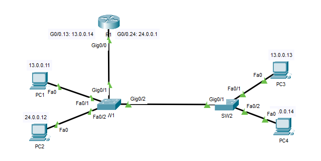
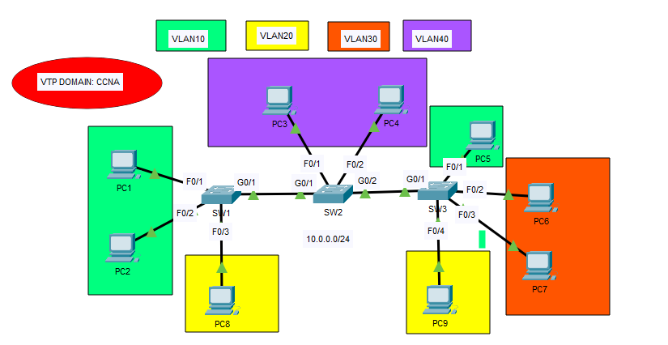
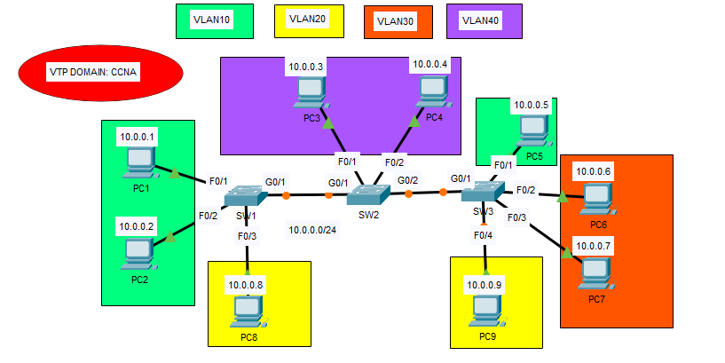
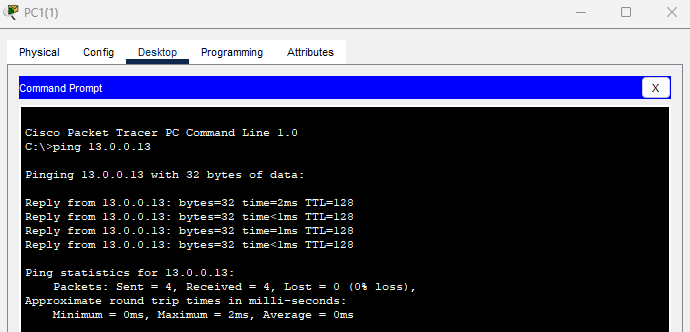

## 23 - LABORATORIO -  DTP y VTP - CCNA

#### A) DTP 



VLAN 13: PC1, PC3
VLAN 24: PC2, PC4

1. Desactive la negociación de puertos troncales. Configure manualmente el modo de cada puerto de switch en uso.
2. Asigne las PC a las VLAN correctas.
Ha completado con éxito el laboratorio cuando DTP está deshabilitado y hay conectividad completa en toda la red.

#### B) VTP (VLAN Trunking Protocol)



1. Configure los puertos de switch que conectan los switches como puertos troncales.
   Desactive DTP en los puertos.
2. Configure SW2 como VTP transparente, versión 2.
   Configure VLAN40 (nombre: Contabilidad) en SW2
3. Configure SW1 como servidor VTP, versión 2.
   Configure VLAN10 (nombre: RR. HH.), VLAN20 (nombre: Ventas) y VLAN30 (nombre: Ingeniería) en SW1.
4. Configure SW3 como cliente VTP.
5. Asigne todos los puertos de switch conectados a los hosts a sus VLAN correspondientes y desactive DTP.
6. Configure los puertos troncales para permitir solo las VLAN 1, 10 y 20.

#### C) VTP / VLAN Troubleshooting



Hay problemas de conectividad en la red.
Hay una configuración incorrecta por dispositivo de red.
Solucione los problemas y corríjalos.
Ha completado el laboratorio correctamente cuando las PC pueden hacer ping a otras PC en la misma VLAN, pero no en VLAN diferentes.

---
#### A) DTP 

**1. Desactive la negociación de puertos troncales. Configure manualmente el modo de cada puerto de switch en uso.**

Verificamos
```
SW1#sh int g0/2 sw

Administrative Mode: dynamic auto
```

Desactivamos

En SW1
```
SW1(config)#int g0/0
SW1(config-if)#switchport nonegotiate
SW1(config-if)#switchport mode trunk


SW1(config-if)#int g0/1
SW1(config-if)#switchport mode trunk
SW1(config-if)#switchport nonegotiate

SW1(config-if)#int range F0/1 - 2
SW1(config-if-range)#switchport mode access
SW1(config-if-range)#switchport nonegotiate
```

En SW2

```
SW2(config)# int g0/1
SW2(config-if)#switchport mode trunk
SW2(config-if)#switchport nonegotiate

SW2(config-if)#int range f0/1 - 2
SW2(config-if-range)#switchport mode access
SW2(config-if-range)#switchport nonegotiate
```


**2. Asigne las PC a las VLAN correctas.**

En SW2
```
SW2(config-if-range)#int f0/1
SW2(config-if)#switchport access vlan 13

% Access VLAN does not exist. Creating vlan 13

SW2(config-if)#int f0/2
SW2(config-if)#switchport access vlan 24

% Access VLAN does not exist. Creating vlan 24
```

En SW1

```
SW1(config)#int f0/1
SW1(config-if)#switchport access vlan 13

% Access VLAN does not exist. Creating vlan 13

SW1(config-if)#int fa0/2
SW1(config-if)#switchport access vlan 24

% Access VLAN does not exist. Creating vlan 24
```

Ha completado con éxito el laboratorio cuando DTP está deshabilitado y hay conectividad completa en toda la red.



#### B) VTP (VLAN Trunking Protocol)

**1. Configure los puertos de switch que conectan los switches como puertos troncales.
   Desactive DTP en los puertos.**

En SW1
```
SW1(config)#int g0/1
SW1(config-if)#switchport mode trunk
SW1(config-if)#switchport nonegotiate
```

En SW2
```
SW2(config-if)#int range g0/1 - 2
SW2(config-if-range)#switchport mode trunk
SW2(config-if-range)#switchport nonegotiate
```

En SW3
```
SW3(config)#int g0/1
SW3(config-if)#switchport mode trunk
SW3(config-if)#switchport nonegotiate
```

**2. Configure SW2 como VTP transparente, versión 2.
   Configure VLAN40 (nombre: Contabilidad) en SW2**

En este labo el SW1 será el servidor y el SW2 sera el transparente

En SW2
```
SW2(config)#vtp mode transparent
Setting device to VTP TRANSPARENT mode.
SW2(config)#vtp domain CCNA
Changing VTP domain name from NULL to CCNA
SW2(config)#vtp version 2
SW2(config)#vlan 40
SW2(config-vlan)#name CONTABILIDAD
```

**3. Configure SW1 como servidor VTP, versión 2.
   Configure VLAN10 (nombre: RR. HH.), VLAN20 (nombre: Ventas) y VLAN30 (nombre: Ingeniería) en SW1.**

En SW1
```
SW1(config)#vtp domain CCNA
SW1(config)#vtp ver 2
SW1(config)#vtp mode server
Device mode already VTP SERVER.
SW1(config)#vlan 10
SW1(config-vlan)#name RRHH
SW1(config-vlan)#vlan 20
SW1(config-vlan)#name VENTAS
SW1(config-vlan)#vlan 30
SW1(config-vlan)#name INGENIERIA
```

**4. Configure SW3 como cliente VTP.**

En SW3
```
SW3(config)#vtp mode client
Setting device to VTP CLIENT mode
```

```
SW3#sho vtp status

VTP Version : 2
Configuration Revision : 7
Maximum VLANs supported locally : 255
Number of existing VLANs : 8
VTP Operating Mode : Client
VTP Domain Name : CCNA
VTP Pruning Mode : Disabled
VTP V2 Mode : Enabled
VTP Traps Generation : Disabled
MD5 digest : 0x4C 0x89 0xA7 0xBF 0xCE 0xD2 0xE8 0x83
Configuration last modified by 0.0.0.0 at 2-28-93 10:15:29
```

**5. Asigne todos los puertos de switch conectados a los hosts a sus VLAN correspondientes y desactive DTP.**

En SW3
```
SW3(config)#int f0/1
SW3(config-if)#switchport mode access
SW3(config-if)#switchport access vlan 10
SW3(config-if)#switchport nonegotiate

SW3(config-if)#int range fa0/2 - 3
SW3(config-if-range)#switchport mode access
SW3(config-if-range)#switchport access vlan 30
SW3(config-if-range)#switchport nonegotiate

SW3(config-if-range)#int f0/4
SW3(config-if)#switchport mode access
SW3(config-if)#switchport access VLAn 20
SW3(config-if)#switchport nonegotiate
```

En SW2
```
SW2(config)#int range f0/1 - 2
SW2(config-if-range)#switchport mode access
SW2(config-if-range)#switchport access vlan 40
SW2(config-if-range)#switchport nonegotiate
```

En SW1

```
SW1(config)#int range f0/1 - 2
SW1(config-if-range)#switchport mode access
SW1(config-if-range)#switchport access vlan 10
SW1(config-if-range)#switchport nonegotiate

SW1(config-if-range)#int Fa0/3
SW1(config-if)#switchport mode access
SW1(config-if)#switchport access vlan 20
SW1(config-if)#switchport nonegotiate
```

**6. Configure los puertos troncales para permitir solo las VLAN 1, 10 y 20.**

En SW1
```
SW1(config-if)#int g0/1
SW1(config-if)#switchport trunk allowed vlan 1,10,20
```

En SW2
```
SW2(config-if-range)#int range g0/1 - 2
SW2(config-if-range)#switchport trunk allowed vlan 1,10,20
```

En SW3
```
SW3(config-if)#int g0/1
SW3(config-if)#switchport trunk allowed vlan 1,10,20
```
#### C)

**Hay problemas de conectividad en la red.**
**Hay una configuración incorrecta por dispositivo de red.**

En SW1
```
interface GigabitEthernet0/1
switchport trunk allowed vlan 1,10,20
switchport mode access
```
La interfas g0/1 esta configurada como mode access, lo cambiamos a mode trunk.

```
SW1(config)#int g0/1
SW1(config-if)#switchport mode trunk
```

En SW2
```
SW2#show vlan br

40 Accounting active Fa0/1
50 VLAN0050 active Fa0/2
```
Vemos que la vlan fa0/2 esta en la 50 y no en la 40. Lo cambiamos

```
SW2(config)#int fa0/2
SW2(config-if)#switchport access vlan 40
SW2(config-if)#exit
SW2(config)#no vlan 50
```

En SW3
```
SW3#sh vlan br

VLAN Name Status Ports
---- -------------------------------- --------- -------------------------------
1 default active                                Fa0/5, Fa0/6, Fa0/7, Fa0/8
                                                Fa0/9, Fa0/10, Fa0/11, Fa0/12
                                                Fa0/13, Fa0/14, Fa0/15, Fa0/16
                                                Fa0/17, Fa0/18, Fa0/19, Fa0/20
                                                Fa0/21, Fa0/22, Fa0/23, Fa0/24
                                                Gig0/2
1002 fddi-default                               active
1003 token-ring-default                         active
1004 fddinet-default                            active
1005 trnet-default                              active
```
Vemos que en SW3 las vlan no estan ni creadas.

```
interface FastEthernet0/1
switchport access vlan 10
switchport mode access
switchport nonegotiate

interface FastEthernet0/2
switchport access vlan 30
switchport mode access
switchport nonegotiate

interface FastEthernet0/3
switchport access vlan 30
switchport mode access
switchport nonegotiate

interface FastEthernet0/4
switchport access vlan 20
switchport mode access
switchport nonegotiate
```
pero que las interfaces si estan asignadas a las vlans.

Pero como el SW3 es el vtp cliente vamos a verificar si esta recibiendo las actualizaciones

```
SW3(config)#do show vtp status

VTP Version : 2
Configuration Revision : 3
Maximum VLANs supported locally : 255
Number of existing VLANs : 5
VTP Operating Mode : Client
VTP Domain Name : CCNP
VTP Pruning Mode : Disabled
VTP V2 Mode : Enabled
VTP Traps Generation : Disabled
MD5 digest : 0x60 0x06 0x66 0xDA 0x5C 0x7C 0xCB 0xB8
Configuration last modified by 0.0.0.0 at 3-1-93 00:49:58
```
Vemos que estamos en el dominio incorrecto.

```
SW3(config)#vtp domain CCNA
```

