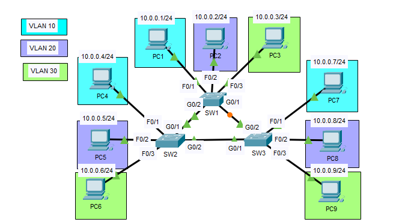
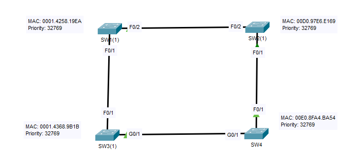

## 24 - LABORATORIO - STP (Spanning Tree Protocol) - CCNA

#### A)



1. ¿Cuál es la versión actual (predeterminada) de STP que se ejecuta en los switches?
   ¿Cuál es el ID de puente de cada switch?
   ¿Cuál es el puente raíz de cada VLAN?
   ¿Cuál es el costo de STP de cada interfaz?
   ¿Qué interfaz está bloqueada? ¿Por qué?
2. Cambie el modo de árbol de expansión de cada switch a RPVST.
3. Configure lo siguiente:
   VLAN10 Raíz: SW1, Raíz Secundaria: SW2
   VLAN20 Raíz: SW2, Raíz Secundaria: SW3
   VLAN30 Raíz: SW3, Raíz Secundaria: SW1
4. Habilite Portfast y BPDUGuard en las interfaces correspondientes.

#### B) STP Election



Intenta resolver estas preguntas SIN USAR LA CLI:
VLAN 1
¿Cuál switch es el root brige?
(Puertos raíz)
SW1:
SW2: 
SW3: 
SW4: 
(Puertos designados)
SW1: 
SW2:
SW3: 
SW4: 
(Puertos alternativos/bloqueados)
SW1:
SW2:
SW3:
SW4: 
Usa el comando show para comprobar tus respuestas después

---
#### A)

**1. ¿Cuál es la versión actual (predeterminada) de STP que se ejecuta en los switches?**

```
#sh spanning-tree summary
Switch is in pvst mode
```

   **¿Cuál es el root ID de cada switch?**

En SW1
```
SW1#show spanning-tree

VLAN0001
Bridge ID Priority 32769 (priority 32768 sys-id-ext 1)
Address 0060.3E50.6B2C

VLAN0010
Bridge ID Priority 32778 (priority 32768 sys-id-ext 10)
Address 0060.3E50.6B2C

VLAN0020
Bridge ID Priority 32788 (priority 32768 sys-id-ext 20)
Address 0060.3E50.6B2C
```

En SW2


```
SW2#show spanning-tree
VLAN0001
Bridge ID Priority 32769 (priority 32768 sys-id-ext 1)
Address 0001.435C.8630

VLAN0010
Bridge ID Priority 32778 (priority 32768 sys-id-ext 10)
Address 0001.435C.8630

VLAN0020
Bridge ID Priority 32788 (priority 32768 sys-id-ext 20)
Address 0001.435C.8630

  

VLAN0030
Bridge ID Priority 32798 (priority 32768 sys-id-ext 30)
Address 0001.435C.8630
```

En SW3

```
SW3#show spanning-tree

VLAN0001
Bridge ID Priority 32769 (priority 32768 sys-id-ext 1)
Address 0004.9A73.4E46

VLAN0010
Bridge ID Priority 32778 (priority 32768 sys-id-ext 10)
Address 0004.9A73.4E46
  
VLAN0020
Bridge ID Priority 32788 (priority 32768 sys-id-ext 20)
Address 0004.9A73.4E46
  
VLAN0030

Bridge ID Priority 32798 (priority 32768 sys-id-ext 30)
Address 0004.9A73.4E46
```

   **¿Cuál es el root brige de cada VLAN?**

En SW1
```
SW1#show spanning-tree

VLAN0001
Root ID Priority 32769
Address 0001.435C.8630
Cost 4
Port 26(GigabitEthernet0/2)
  
VLAN0010
Root ID Priority 32778
Address 0001.435C.8630
Cost 4
Port 26(GigabitEthernet0/2)

VLAN0020
Root ID Priority 32788
Address 0001.435C.8630
Cost 4
Port 26(GigabitEthernet0/2)
```

En SW2

```
SW2#show spanning-tree

VLAN0001
Root ID Priority 32769
Address 0001.435C.8630
This bridge is the root

VLAN0010
Root ID Priority 32778
Address 0001.435C.8630
This bridge is the root

VLAN0020
Root ID Priority 32788
Address 0001.435C.8630
This bridge is the root
  
VLAN0030
Root ID Priority 32798
Address 0001.435C.8630
This bridge is the root
```

En SW3

```
SW3#show spanning-tree

VLAN0001
Root ID Priority 32769
Address 0001.435C.8630
Cost 4
Port 25(GigabitEthernet0/1)

VLAN0010
Root ID Priority 32778
Address 0001.435C.8630
Cost 4
Port 25(GigabitEthernet0/1)

VLAN0020
Root ID Priority 32788
Address 0001.435C.8630
Cost 4
Port 25(GigabitEthernet0/1)
  
VLAN0030
Root ID Priority 32798
Address 0001.435C.8630
Cost 4
Port 25(GigabitEthernet0/1)
```

   **¿Cuál es el costo de STP de cada interfaz?**

```
SW#show spanning-tree
Interface Role Sts Cost Prio.Nbr Type
---------------- ---- --- --------- -------- --------------------------------
Fa0/3 Desg FWD 19 128.3 P2p
Gi0/1 Root FWD 4 128.25 P2p
Gi0/2 Desg FWD 4 128.26 P2p
```

   **¿Qué interfaz está bloqueada? ¿Por qué?**

La Gi0/1 de SW1

```
Interface Role Sts Cost Prio.Nbr Type
---------------- ---- --- --------- -------- --------------------------------
Fa0/2 Desg FWD 19 128.2 P2p
Gi0/2 Root FWD 4 128.26 P2p
Gi0/1 Altn BLK 4 128.25 P2p
```

La int G0/1 esta en estado Blocking para evitar bucles de capa 2.
STP bloquea la interfaz que tiene: Mayor costo hacia el Root Bridge, Si hay empate → mayor Bridge ID, Si sigue el empate → mayor Port ID.

En este caso, la interfaz fue bloqueada porque presenta un mayor costo hacia el Root Bridge en comparación con el otro enlace redundante.

**2. Cambie el modo de árbol de expansión de cada switch a RPVST.**

```
(config)#spanning-tree mode rapid-pvst
```

**3. Configure lo siguiente:**
   VLAN10 Raíz: SW1, Raíz Secundaria: SW2

```
SW1(config)#spanning-tree vlan 10 root primary
```

```
SW2(config)#spanning-tree vlan 10 root secondary
```

   VLAN20 Raíz: SW2, Raíz Secundaria: SW3

```
SW2(config)#spanning-tree vlan 20 root primary
```

```
SW3(config)#spanning-tree vlan 20 root secondary
```

   VLAN30 Raíz: SW3, Raíz Secundaria: SW1

```
SW3(config)#spanning-tree vlan 30 root primary
```

```
SW1(config)#spanning-tree vlan 30 root secondary
```

**4. Habilite Portfast y BPDUGuard en las interfaces correspondientes.**

Se habilita PortFast y BPDU Guard en interfaces que conectan a dispositivos finales o en interfaces que no estén conectadas a otro switch.

Con
```
SW(config)#spanning-tree portfast default
SW(config)# spanning-tree bpduguard default
```
Habilita PortFast automáticamente en TODOS los puertos access del switch

A nivel de interfaz

```
SW(config)#int range F0/1 - 3
SW(config-if-range)#spanning-tree portfast 
SW(config-if-range)#spanning-tree bpduguard enable 
```

#### B) STP Election

VLAN 1
¿Cuál switch es el puente raíz?
El root bridge es aquel que tiene la prioridad mas baja
`SW1`

Identifica las siguientes interfaces en todos los switches:
SW2: F0/2
SW3: F0/1
SW4: G0/1

(Puertos designados)
SW1: F0/1, F0/2
SW2: F0/1
SW3: G0/1
SW4: 

(Puertos alternativos/bloqueados)
SW1:
SW2:
SW3:
SW4: F0/1

**Usa el comando show para comprobar tus respuestas después**

En SW1

```
SW1#sho spanning-tree

VLAN0001

Root ID Priority 32769
Address 0002.4AB1.2B34
Cost 19
Port 2(FastEthernet0/2)

Bridge ID Priority 32769 (priority 32768 sys-id-ext 1)
Address 0007.ECBA.BA11
Hello Time 2 sec Max Age 20 sec Forward Delay 15 sec
Aging Time 20

Interface Role Sts Cost Prio.Nbr Type
---------------- ---- --- --------- -------- --------------------------------
Fa0/1 Desg FWD 19 128.1 P2p
Fa0/2 Root FWD 19 128.2 P2p
```

En SW2
```
SW1#sho spanning-tree

VLAN0001

Root ID Priority 32769
Address 0002.4AB1.2B34
Cost 19
Port 2(FastEthernet0/2)
Hello Time 2 sec Max Age 20 sec Forward Delay 15 sec

Bridge ID Priority 32769 (priority 32768 sys-id-ext 1)
Address 0007.ECBA.BA11
Hello Time 2 sec Max Age 20 sec Forward Delay 15 sec
Aging Time 20

Interface Role Sts Cost Prio.Nbr Type
---------------- ---- --- --------- -------- --------------------------------
Fa0/1 Desg FWD 19 128.1 P2p
Fa0/2 Root FWD 19 128.2 P2p
```

En SW3
```
SW3#show spanning-tree

VLAN0001

Root ID Priority 32769
Address 0002.4AB1.2B34
Cost 23
Port 25(GigabitEthernet0/1)
Hello Time 2 sec Max Age 20 sec Forward Delay 15 sec

Bridge ID Priority 32769 (priority 32768 sys-id-ext 1)
Address 0060.5C9C.57C4
Hello Time 2 sec Max Age 20 sec Forward Delay 15 sec
Aging Time 20

Interface Role Sts Cost Prio.Nbr Type
---------------- ---- --- --------- -------- --------------------------------
Fa0/1 Altn BLK 19 128.1 P2p
Gi0/1 Root FWD 4 128.25 P2p
```

En SW4

```
SW4#sho spanning-tree

VLAN0001

Root ID Priority 32769
Address 0002.4AB1.2B34
Cost 19
Port 1(FastEthernet0/1)
Hello Time 2 sec Max Age 20 sec Forward Delay 15 sec

Bridge ID Priority 32769 (priority 32768 sys-id-ext 1)
Address 000C.CF6D.823D
Hello Time 2 sec Max Age 20 sec Forward Delay 15 sec
Aging Time 20

Interface Role Sts Cost Prio.Nbr Type
---------------- ---- --- --------- -------- --------------------------------
Fa0/1 Root FWD 19 128.1 P2p
Gi0/1 Desg FWD 4 128.25 P2p
```
