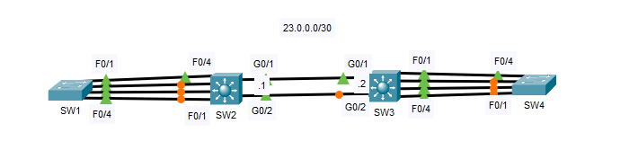
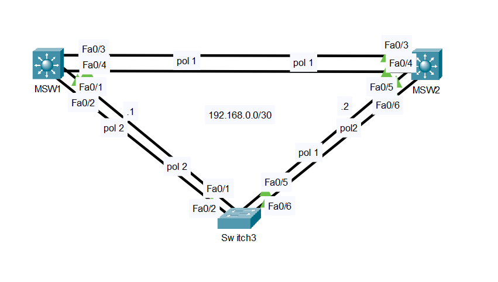
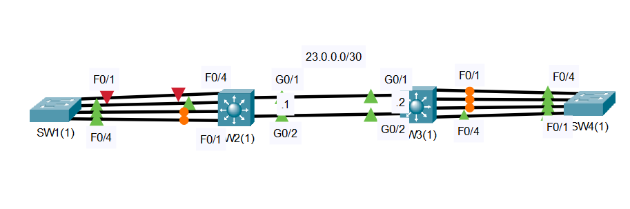

## 25 - LABORATORIO - EtherChannel - CCNA

#### A) EtherChannel



1. Analice la topología desde la perspectiva del protocolo de árbol de expansión:
   ¿Qué switch es el puente raíz?
   ¿Qué interfaces son puertos raíz? ¿Puertos designados? ¿Puertos alternativos?
   Explique el proceso que STP utilizó para determinar estas asignaciones de puertos.
2. Configure un EtherChannel de capa 2 entre SW1 y SW2 utilizando un protocolo propietario de Cisco. Configure el EtherChannel como enlace troncal.
3. Configure un EtherChannel de capa 3 entre SW2 y SW3. Configúrelo como un EtherChannel estático. Configure las direcciones IP adecuadas.
4. Configure un EtherChannel de capa 2 entre SW3 y SW4 utilizando un protocolo estándar IEEE. Configure el EtherChannel como enlace troncal.

#### B) Link aggregation/Etherchannels



1. Crear las VLANs 10 y 20 en todos los switches. Usa los bloques IP 192.168.10.0/24 y 192.168.20.0/24 para asignar las direcciones IP .1, .2 y .3 en cada switch respectivamente
2. Levantar un Etherchannel de tipo LACP entre S1 y S3 y verificar que funcione en modo trunk
3. Levantar un Etherchannel de tipo PAgP entre S3 y S2 y verificar que funcione en modo trunk
4. Levantar un Etherchannel manual de capa 3 entre S1 y S2 con el bloque IP 192.168.0.0/30

#### C) EtherChannel Troubleshooting



Los EtherChannels de la red no funcionan correctamente.
Solucione los problemas.
SW1 - SW2 = Capa 2 PAgP
SW2 - SW3 = Capa 3 Estática
SW3 - SW4 = Capa 2 LACP

---
#### A)

**1. Analice la topología desde la perspectiva del protocolo de árbol de expansión:**

   ¿Qué switch es el puente raíz?

En SW1
```
SW1#show spanning-tree

VLAN0001
Root ID Priority 32769
Address 0004.9A9D.E23D
This bridge is the root
```

¿Qué interfaces son puertos raíz?

En SW1
Regla STP: _en el puente raíz todos los puertos son designados._
```
Interface Role Sts Cost Prio.Nbr Type
---------------- ---- --- --------- -------- --------------------------------
Fa0/4 Desg FWD 19 128.4 P2p
Fa0/1 Desg FWD 19 128.1 P2p
Fa0/2 Desg FWD 19 128.2 P2p
Fa0/3 Desg FWD 19 128.3 P2p
```

En SW2 F0/4, en SW3 G0/1, en SW4 F0/4

¿Puertos designados?¿Puertos alternativos?

Se designan las interfaces frente a los puertos raíz.

El coste raíz decide que lado bloquear y que lado designar los puertos, el coste mas bajo es aquel que es asignado y el otro lado es el bloqueado.

**2. Configure un EtherChannel de capa 2 entre SW1 y SW2 utilizando un protocolo propietario de Cisco. Configure el EtherChannel como enlace troncal.**

En SW1
```
SW1(config)#int range f0/1 - 4
SW1(config-if-range)#channel-group 1 mode desirable
```

```
SW1(config-if-range)#do sh eth sum

Number of channel-groups in use: 1
Number of aggregators: 1
Group Port-channel Protocol Ports
------+-------------+-----------+----------------------------------------------
1 Po1(SD) PAgP Fa0/1(I) Fa0/2(I) Fa0/3(I) Fa0/4(I)
```

```
SW1(config-if-range)#switchport mode trunk
```


En SW2
```
SW2(config)#int range F0/1 - 4
SW2(config-if-range)#shut
SW2(config-if-range)#channel-group 2 mode auto

Creating a port-channel interface Port-channel 2

SW2(config-if-range)#int po2
SW2(config-if)#switchport mode trunk

Command rejected: An interface whose trunk encapsulation is "Auto" can not be configured to "trunk" mode.

SW2(config-if)#switchport trunk encapsulation dot1q
SW2(config-if)#switchport mode trunk

SW2(config-if)#int range F0/1 - 4
SW2(config-if-range)#no shut
```

```
SW2#show etherchannel summary

Number of channel-groups in use: 1
Number of aggregators: 1
Group Port-channel Protocol Ports
------+-------------+-----------+----------------------------------------------
2 Po2(SU) PAgP Fa0/1(P) Fa0/2(P) Fa0/3(P) Fa0/4(P)
```

**3. Configure un EtherChannel de capa 3 entre SW2 y SW3. Configúrelo como un EtherChannel estático. Configure las direcciones IP adecuadas.**


```
SW2(config)#ip routing
SW2(config)#int range g0/1 - 2
SW2(config-if-range)#no switchport

SW2(config-if-range)#channel-group 1 mode on
SW2(config-if-range)#int po1
SW2(config-if)#ip address 23.0.0.1 255.255.255.0
```

En SW3
```
SW3(config)#ip routing
SW3(config)#int range g0/1-2
SW3(config-if-range)#no switchport
SW3(config-if-range)#channel-group 1 mode on

SW3(config-if-range)#int po1
SW3(config-if)#ip add 23.0.0.2 255.255.255.0
```

```
SW3(config-if)#do sh eth sum

Number of channel-groups in use: 1
Number of aggregators: 1
Group Port-channel Protocol Ports
------+-------------+-----------+----------------------------------------------
1 Po1(RU) - Gig0/1(P) Gig0/2(P)
```

**4. Configure un EtherChannel de capa 2 entre SW3 y SW4 utilizando un protocolo estándar IEEE. Configure el EtherChannel como enlace troncal.**

Utilizaremos el protocolo LACP

```
SW3(config-if-range)#int range f0/1 - 4
SW3(config-if-range)#channel-group 2 mode active

SW3(config-if-range)#int po2
SW3(config-if)#switchport trunk encapsulation dot1q
SW3(config-if)#switchport mode trunk
```

En SW4
```
SW4(config)#int range f0/1 - 4
SW4(config-if-range)#shut
SW4(config-if-range)#channel-group 1 mode active
SW4(config-if-range)#int po1
SW4(config-if)#switchport mode trunk
SW4(config-if)#int range f0/1 - 4
SW4(config-if-range)#no shut
```

```
SW4(config-if-range)#do sh eth sum

Number of channel-groups in use: 1
Number of aggregators: 1
Group Port-channel Protocol Ports
------+-------------+-----------+----------------------------------------------
1 Po1(SU) LACP Fa0/1(P) Fa0/2(P) Fa0/3(P) Fa0/4(P)
```

#### B)

**1. Crear las VLANs 10 y 20 en todos los switches. Usa los bloques IP 192.168.10.0/24 y 192.168.20.0/24 para asignar las direcciones IP .1, .2 y .3 en cada switch respectivamente**

En MSW1
```
conf t
interface vlan 10
 ip address 192.168.10.1 255.255.255.0
 no shutdown
interface vlan 20
 ip address 192.168.20.1 255.255.255.0
 no shutdown
```

En MSW2
```
conf t
interface vlan 10
 ip address 192.168.10.2 255.255.255.0
 no shutdown
interface vlan 20
 ip address 192.168.20.2 255.255.255.0
 no shutdown
```

En SW3
```
conf t
interface vlan 10
 ip address 192.168.10.3 255.255.255.0
 no shutdown
interface vlan 20
 ip address 192.168.20.3 255.255.255.0
 no shutdown
```

**2. Levantar un Etherchannel de tipo LACP entre S1 y S3 y verificar que funcione en modo trunk**

Modo LACP

MSW1
```
interface range fa0/1 - 2
 switchport mode trunk
 channel-group 2 mode active
exit
interface port-channel 2
 switchport trunk encapsulation dot1q
 switchport mode trunk
```

En S3
```
interface range fa0/1 - 2
 switchport mode trunk
 channel-group 1 mode pasive
exit
interface port-channel 1
 switchport trunk encapsulation dot1q
 switchport mode trunk
```

**3. Levantar un Etherchannel de tipo PAgP entre S3 y S2 y verificar que funcione en modo trunk**

Modo PAgP

MSW2
```
interface range fa0/5 - 6
 switchport mode trunk
 channel-group 1 mode desirable
exit
interface port-channel 1
 switchport trunk encapsulation dot1q
 switchport mode trunk
```

S3
```
interface range fa0/5 - 6
 switchport mode trunk
 channel-group 2 mode auto
exit
interface port-channel 2
 switchport trunk encapsulation dot1q
 switchport mode trunk
```

**4. Levantar un Etherchannel manual de capa 3 entre S1 y S2 con el bloque IP 192.168.0.0/30**

Modo MANUAL

MSW1
```
interface range fa0/3 - 4
 no switchport
 channel-group 1 mode on
exit
interface port-channel 1
 no switchport
 ip address 192.168.0.1 255.255.255.252
 no shutdown
```

MSW2
```
interface range fa0/3 - 4
 no switchport
 channel-group 1 mode on
exit
interface port-channel 1
 no switchport
 ip address 192.168.0.2 255.255.255.252
 no shutdown
```

Y verificamos con: 
```
show etherchannel summary
```

#### C) EtherChannel Troubleshooting

Los EtherChannels de la red no funcionan correctamente.
Solucione los problemas.
SW1 - SW2 = Capa 2 PAgP
SW2 - SW3 = Capa 3 Estática
SW3 - SW4 = Capa 2 LACP

En SW1
```
SW1#show eth sum

Flags: D - down P - in port-channel
I - stand-alone s - suspended
H - Hot-standby (LACP only)
R - Layer3 S - Layer2
U - in use f - failed to allocate aggregator
u - unsuitable for bundling
w - waiting to be aggregated
d - default port

Number of channel-groups in use: 1
Number of aggregators: 1
Group Port-channel Protocol Ports
------+-------------+-----------+----------------------------------------------  
1 Po1(SD) LACP Fa0/1(D) Fa0/2(I) Fa0/3(I) Fa0/4(I)
```
Vemos que esta po1 esta apagado y con las interfaces `I` independientes.
Y esta usando LACP y segun la configuracion nos piden PAgP.

**Troubleshooting**

```
SW1(config)#int range f0/1 - 4
SW1(config-if-range)#no channel-group 1
SW1(config-if-range)#no int po1

SW1(config)#int range f0/1 - 4
SW1(config-if-range)#channel-group 1 mode desirable
```

Verificamos
```
SW1(config-if-range)#do sh eth sum
------+-------------+-----------+----------------------------------------------
1 Po1(SU) PAgP Fa0/1(D) Fa0/2(P) Fa0/3(P) Fa0/4(P)
```
Vemos que la int Fa0/1 esta apagado o no emparejada

Tiene que coincidir el duplex, la velocidad para que funcione el canal.

Verificamos 
En SW2
```
SW2#sh int fa0/4

Full-duplex, 10Mb/s
```


```
SW1#sh int Fa0/1

Full-duplex, 100Mb/s
```
y vemos que la int Fa0/4 de SW2 tiene una velocidad diferente, lo cambiamos

```
SW2(config)#int f0/4
SW2(config-if)#speed 100
```

Verificamos en SW2
```
SW2(config-if)#do sh eth sum

Group Port-channel Protocol Ports
------+-------------+-----------+----------------------------------------------
1 Po1(RD) -
2 Po2(SU) PAgP Fa0/1(P) Fa0/2(P) Fa0/3(P) Fa0/4(P)
```
Ahora vemos que el Po1 esta inactivo sin ninguna interfaz.


```
SW2(config-if)#int range g0/1 - 2
SW2(config-if-range)#channel-g
SW2(config-if-range)#channel-group 1 mode on
```

Verificamos en SW3

```
SW3#sh eth sum

Group Port-channel Protocol Ports
------+-------------+-----------+----------------------------------------------
1 Po1(SU) - Gig0/1(P) Gig0/2(P)
2 Po2(SD) LACP Fa0/1(I) Fa0/2(I) Fa0/3(I) Fa0/4(I)
```
Vemos que Po1 esta en capa 2 `S` inactiva y según la configuración debería ser capa 3.

En SW3
```
SW3#sh ip int g0/1
GigabitEthernet0/1 is up, line protocol is up
Internet protocol processing disabled

SW3#sh ip int g0/2
GigabitEthernet0/2 is up, line protocol is up
Internet protocol processing disabled
```
Verificamos que las interfaces de S3 están `Internet protocol processing disabled` y están en capa 2.

```
SW3#sh run
interface GigabitEthernet0/1
channel-group 1 mode on

interface GigabitEthernet0/2
channel-group 1 mode on
```
También vemos que las interfaces no tiene configurado el comando `no switchport`.

**Troubleshooting**
```
SW3(config-if-range)#int range g0/1 - 2
SW3(config-if-range)#no switch
SW3(config-if-range)#no channel-group 1
SW3(config-if-range)#no int po1
SW3(config)#int range g0/1 - 2
SW3(config-if-range)#no sw
SW3(config-if-range)#channel-group 1 mode on
SW3(config-if-range)#int po1
SW3(config-if)#ip add 23.0.0.2 255.255.255.0
```

Verificamos
```
SW3(config-if)# do show eth sum
Group Port-channel Protocol Ports
------+-------------+-----------+----------------------------------------------
1 Po1(RU) - Gig0/1(P) Gig0/2(P)
2 Po2(SD) LACP Fa0/1(I) Fa0/2(I) Fa0/3(I) Fa0/4(I)
```
Ahora vemos que el canal del puerto con el SW4 esta inactivo

```
SW3#sh run
interface FastEthernet0/1
switchport trunk encapsulation dot1q
switchport mode trunk
channel-group 2 mode passive
```

En SW4
```
interface FastEthernet0/1
switchport mode trunk
channel-group 1 mode passive
```
Vemos que en ambos conmutadores están en modo pasivo.

**Troubleshooting**

```
SW4(config)#int range fa0/1 - 4
SW4(config-if-range)#channel-group 1 mode active
```

Verificamos
```
SW4(config-if-range)#do sh eth sum

Group Port-channel Protocol Ports
------+-------------+-----------+----------------------------------------------
1 Po1(SU) LACP Fa0/1(P) Fa0/2(P) Fa0/3(P) Fa0/4(P)
```
Vemos que el canal del puerto esta activo y todas las interfaces tienen el indicador del canal del puerto.

Esta solucionado todos los problemas con los canales.