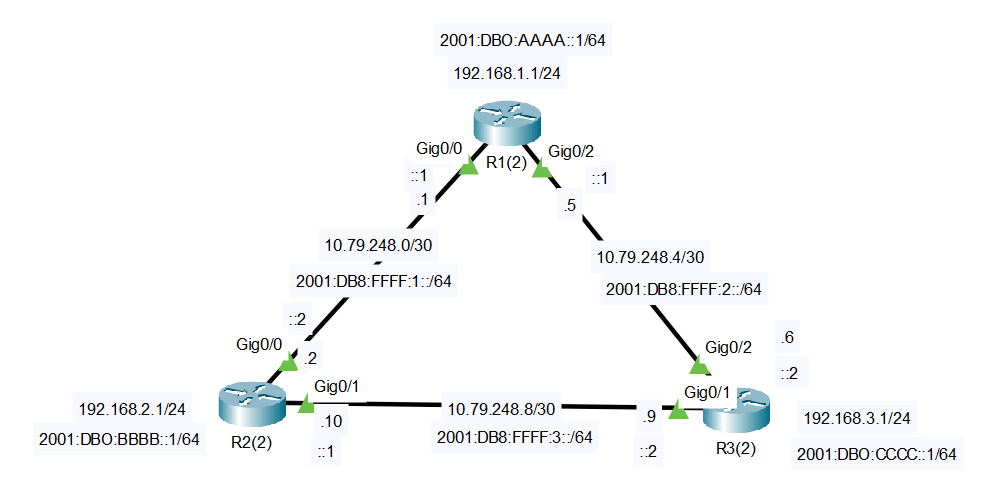
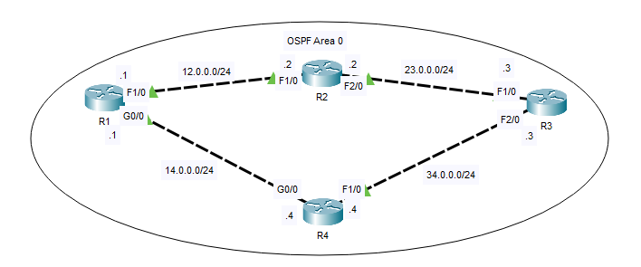
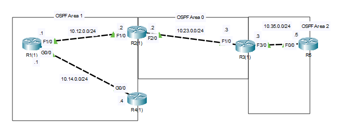

## 26 - LABORATORIO - OSPF 01 - CCNA

#### A) OSPFv2 y OSPFv3 área única




#### B) Single Area



1. Configure una dirección de loopback en cada enrutador (1.1.1.1/32 para R1, 2.2.2.2/32 para R2, etc.)
2. Configure OSPF en cada enrutador. Anuncie todas las interfaces, incluido el loopback.
3. Suprima los mensajes OSPF en la interfaz loopback de cada enrutador.
4. Configure el ancho de banda de referencia OSPF de cada enrutador para que una interfaz de 10 GigabitEthernet tenga un costo OSPF de 1.
5. Ajuste el costo de la interfaz OSPF cuando corresponda para hacer que R1 envíe tráfico al loopback de R3 a través de R2 en lugar de R4. 
   (Existen múltiples soluciones posibles)

#### C) Multi-Area



1. Configure OSPF multiárea según los diagramas. Anuncie todas las interfaces configuradas en el enrutador.
   (Los loopbacks de R2 y R3 deben estar en el Área 0)
   Configure las interfaces loopback como interfaces pasivas.
   Configure el ancho de banda de referencia para que una interfaz de 100 Gigabit tenga un coste de 1.
2. Configure el resumen de rutas en los ABR.

---

#### A) OSPFv2 y OSPFv3 área única

Primero configuramos las interfaces en IPv4 y IPv6
Luego configuramos el enrutamiento con OSPF

En R1
```
router ospf 1
 router-id 1.1.1.1  
 network 10.79.248.0 0.0.0.255 area 0
 network 10.79.248.5 0.0.0.3 area 0	
 network 192.168.1.1 0.0.0.255 area 0	
```

En R2
```
router ospf 1
 router-id 2.2.2.2  
 network 10.79.248.2 0.0.0.3 area 0	
 network 10.79.248.0 0.0.0.255 area 0	
 network 192.168.2.0 0.0.0.255 area 0	
```

En R3
```
router ospf 1
 router-id 3.3.3.3  
 network 10.79.248.8 0.0.0.3 área 0	
 network 10.79.248.0 0.0.0.255 área 0	
 network 192. 168.3.0 0.0.0.255 área 0	
```

**En IPv6**

En R1
```
ipv6 unicast-routing
ipv6 router ospf 2
 router-id 1.1.1.1 
 exit
int g0/0
 ipv6 ospf 2 area 0
int g0/2
 ipv6 ospf 2 area 0
int lo0
 ipv6 ospf 2 area 0 
```

En R2
```
ipv6 unicast-routing
ipv6 router ospf 2
 router-id 2.2.2.2 
 exit
int g0/0
 ipv6 ospf 2 area 0
int g0/1
 ipv6 ospf 2 area 0
int lo0
 ipv6 ospf 2 area 0 
```

En R3
```
ipv6 unicast-routing
ipv6 router ospf 2
 router-id 3.3.3.3
 exit
int g0/1
 ipv6 ospf 2 area 0
int g0/2
 ipv6 ospf 2 area 0
int lo0
 ipv6 ospf 2 area 0 
```

#### B) Single Area

**1. Configure una dirección de loopback en cada enrutador (1.1.1.1/32 para R1, 2.2.2.2/32 para R2, etc.)**


En R1
```
R1(config)#int lo0
R1(config-if)#ip address 1.1.1.1 255.255.255.255
```

En R2
```
R2(config)#int l0
R2(config-if)#ip address 2.2.2.2 255.255.255.255
```

En R3
```
R3(config)#int l0
R3(config-if)#ip address 3.3.3.3 255.255.255.255
```

En R4
```
R4(config)#int l0
R4(config-if)#ip address 4.4.4.4 255.255.255.255
```

**2. Configure OSPF en cada enrutador. Anuncie todas las interfaces, incluido el loopback.**

En R1
```
R1(config)#router ospf 1
R1(config-router)#network 12.0.0.0 0.255.255.255 area 0
R1(config-router)#network 14.0.0.0 0.255.255.255 area 0
R1(config-router)#network 1.1.1.1 0.0.0.0 area 0
```

En R2
```
R2(config)#router ospf 1
R2(config-router)#network 12.0.0.0 0.0.0.255 area 0
R2(config-router)#network 23.0.0.0 0.0.0.255 area 0
R2(config-router)#network 2.2.2.2 0.0.0.0 area 0
```

En R3
```
R3(config)#router ospf 1
R3(config-router)#network 23.0.0.0 0.0.0.255 area 0
R3(config-router)#network 34.0.0.0 0.0.0.255 area 0
R3(config-router)#network 3.3.3.3 0.0.0.0 area 0
```

En R4
```
R4(config)#router ospf 1
R4(config-router)#network 34.0.0.0 0.0.0.255 area 0
R4(config-router)#network 14.0.0.0 0.0.0.255 area 0
R4(config-router)#network 4.4.4.4 0.0.0.0 area 0
```

**3. Suprima los mensajes OSPF en la interfaz loopback de cada enrutador.**

En R1
```
R1(config-router)#passive-interface lo0
```

En R2
```
R2(config-router)#passive-interface lo0
```

En R3
```
R3(config-router)#passive-interface lo0
```

En R4
```
R4(config-router)#passive-interface lo0
```

**4. Configure el ancho de banda de referencia OSPF de cada enrutador para que una interfaz de 10 GigabitEthernet tenga un costo OSPF de 1.**

En R1
```
R1(config-router)#do sh ip route

3.0.0.0/32 is subnetted, 1 subnets
O 3.3.3.3 [110/111] via 12.0.0.2, 00:00:7, FastEthernet1/0
O 3.3.3.3 [110/111] via 14.0.0.4, 00:00:7, GigabitEthernet0/0
```

Configuramos en ancho de banda OSPF

En R1
```
R1(config-router)#auto-cost reference-bandwidth 10000
```

En R2
```
R2(config-router)#auto-cost reference-bandwidth 10000
```

En R3
```
R3(config-router)#auto-cost reference-bandwidth 10000
```

En R4
```
R4(config-router)#auto-cost reference-bandwidth 10000
```

Ahora

```
R1(config-router)#do sh ip route

3.0.0.0/32 is subnetted, 1 subnets
O 3.3.3.3 [110/111] via 14.0.0.4, 00:01:43, GigabitEthernet0/0
```

**5. Ajuste el costo de la interfaz OSPF cuando corresponda para hacer que R1 envíe tráfico al loopback de R3 a través de R2 en lugar de R4.** 
   (Existen múltiples soluciones posibles)

Lo haremos  aumentando el coste de del enlace g0/0 entre R1 y R4 a 10000

En R1
```
R1(config)#int g0/0
R1(config-if)#ip ospf cost 1000
```

En R4
```
R4(config)#int g0/0
R4(config-if)#ip ospf cost 10000
```

Verificamos

```
#sh ip rou

 3.0.0.0/32 is subnetted, 1 subnets
 O 3.3.3.3 [110/201] via 12.0.0.2, 00:01:29, FastEthernet1/0
```

#### C) Multi-Area

**1. Configure OSPF multiárea según los diagramas. Anuncie todas las interfaces configuradas en el enrutador.**
   (Los loopbacks de R2 y R3 deben estar en el Área 0)
   
   * Configure las interfaces loopback como interfaces pasivas.
   -  Configure el ancho de banda de referencia para que una interfaz de 100 Gigabit tenga un coste de 1.

En R1
```
R1(config)#router ospf 1
R1(config-router)#network 0.0.0.0 255.255.255.255 area 1
R1(config-router)#passive-interface lo0
R1(config-router)#auto-cost reference-bandwidth 100000
```

En R2
```
R2(config)#router ospf 2
R2(config-router)#network 10.12.0.0 0.0.0.255 area 1
R2(config-router)#network 10.23.0.0 0.0.0.255 area 0
R2(config-router)#network 2.2.2.2 0.0.0.0 area 0
```

En R3
```
R3(config)#router ospf 1
R3(config-router)#net 10.23.0.0 0.0.0.255 area 0
R3(config-router)#net 10.35.0.0 0.0.0.255 area 2
R3(config-router)#net 3.3.3.3 0.0.0.0 area 0
R3(config-router)#passive-interface lo0
R3(config-router)#auto-cost reference-bandwidth 100000
```

En R4
```
R4(config)#router ospf 1
R4(config-router)#net 0.0.0.0 255.255.255.255 area 1
R4(config-router)#passive-interface lo0
R4(config-router)#auto-cost reference-bandwidth 100000
```

En R5
```
R5(config)#router ospf 1
R5(config-router)#net 0.0.0.0 255.255.255.255 area 2
R5(config-router)#passive-interface lo0
R5(config-router)#auto-cost reference-bandwidth 100000
```

**2. Configure el resumen de rutas en los ABR.**

En R3 vemos que
```
R5(config-router)#do sh ip ro

Gateway of last resort is not set
1.0.0.0/32 is subnetted, 1 subnets
O IA 1.1.1.1 [110/2013] via 10.35.0.3, 00:01:15, FastEthernet0/0
3.0.0.0/32 is subnetted, 1 subnets
O IA 3.3.3.3 [110/1012] via 10.35.0.3, 00:01:15, FastEthernet0/0
4.0.0.0/32 is subnetted, 1 subnets
O IA 4.4.4.4 [110/2113] via 10.35.0.3, 00:01:15, FastEthernet0/0
5.0.0.0/32 is subnetted, 1 subnets
C 5.5.5.5 is directly connected, Loopback0
10.0.0.0/24 is subnetted, 4 subnets
O IA 10.12.0.0 [110/2001] via 10.35.0.3, 00:01:15, FastEthernet0/0
O IA 10.14.0.0 [110/2101] via 10.35.0.3, 00:01:15, FastEthernet0/0
O IA 10.23.0.0 [110/2000] via 10.35.0.3, 00:01:15, FastEthernet0/0
C 10.35.0.0 is directly connected, FastEthernet0/0
```

Entonces
```
R3(config-router)#area 0 range 10.0.0.0 255.0.0.0
```

```
R5(config-router)#do sh ip ro

Gateway of last resort is not set
1.0.0.0/32 is subnetted, 1 subnets
O IA 1.1.1.1 [110/2013] via 10.35.0.3, 00:04:01, FastEthernet0/0
3.0.0.0/32 is subnetted, 1 subnets
O IA 3.3.3.3 [110/1012] via 10.35.0.3, 00:04:01, FastEthernet0/0
4.0.0.0/32 is subnetted, 1 subnets
O IA 4.4.4.4 [110/2113] via 10.35.0.3, 00:04:01, FastEthernet0/0
5.0.0.0/32 is subnetted, 1 subnets
C 5.5.5.5 is directly connected, Loopback0
10.0.0.0/8 is variably subnetted, 2 subnets, 2 masks
O IA 10.0.0.0/8 [110/2000] via 10.35.0.3, 00:01:22, FastEthernet0/0
C 10.35.0.0/24 is directly connected, FastEthernet0/0
```
Vemos que a perdido una ruta

Ahora en R2
```
R2(config-router)#area 0 range 10.0.0.0 255.0.0.0
```
Y con esto se resume las rutas y también para reducir el tamaño de la tabla de enrutamiento

