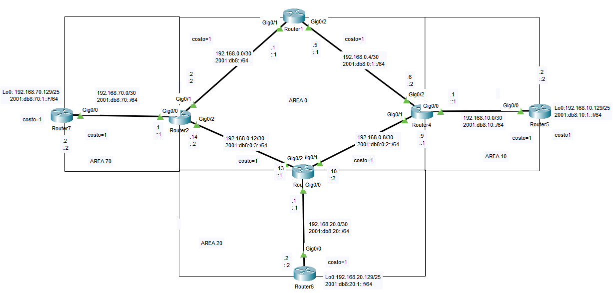
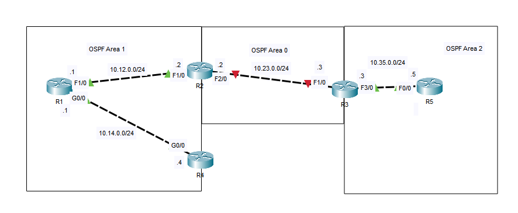
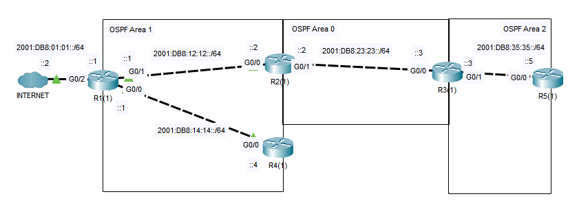

## 27 - LABORATORIO - OSPF 02 - CCNA

#### A) Multi-Area



1. Configuración de OSPFv2
   1.1 Levantar OSPF entre todos los routers de la topología y verificar conectividad entre todos los extremos
   1.2 Permitir que todos los routers tengan acceso a Internet propagando por medio de OSPF la ruta por defecto instalada en R1
   1.3 Habilitar el área 70 como Stubby Area
   1.4 Configurar el área 10 como Totally Stubby Area 
   1.5 Configurar el área 20 como NSSA


2. Configuración de OSPFv3
   2.1 Configurar OSPFV3 en totda la topología y verificar conectividad entre los
   extremos
   2.2 Permitir que todos los routers tengan acceso a Internet propagando por medio
   de OSPF la ruta por defecto instalada en R1
   2.3 Habilitar el área 70 como Stubby Area
   2.4 Configurar el área 10 como Totally Stubby Area 
   2.5 Configurar el área 20 como NSSA

3. Ajustes de OSPF
   3.1 Para OSPFv2 se debe modificar la métrica en el área 0 de tal manera que la ruta primaria   desde el área 20 hacia las demás áreas siempre sea utilizando la ruta entre R2 y R3
   3.2 Para OSPv3 se debe modificar la métrica en el área 0 de tal manera que la ruta primaria  desde el á rea 20 hacia las demás siempre utilice el enlace entre R3 yR4.
   3.3 Asegurarse que en el área 70, R2 siempre sea electo DR en su enlace con R7. 
   3.4 Ajustar los temporizadores Hello y Dead Interval entre R4 y R5 para que reaccionen en la  mitad del tiempo predeterminado.
   3.5 Configurar OSPF para limitar el envío de mensajes Hello solamente donde sea   estrictamente necesario.

#### B) OSPF Troubleshooting



Los enrutadores de la red no reciben las rutas que deberían de OSPF.
R5 no recibe la ruta de resumen 10.0.0.0/8 que debería.
Troubleshoot and fix the issues.
No todos los enrutadores están mal configurados.

#### C) OSPFv3



1. Configure una interfaz de bucle invertido en cada enrutador con una dirección IPv4 (1.1.1.1, 2.2.2.2, etc.).
2. Configure OSPFv3 en cada enrutador según la topología.
   (No es necesario configurar OSPFv3 en las interfaces de bucle invertido).
3. Configure una ruta estática predeterminada a Internet en el R1.
   Anuncie la ruta en OSPF.

---
#### A) Multi-Area

**1. Configuración de OSPFv2**
 **1.1 Levantar OSPF entre todos los routers de la topología y verificar conectividad entre todos los extremos**

En R1
```
router ospf 1
 router-id 1.1.1.1
 network 192.168.0.0 0.0.0.3 area 0
 network 192.168.0.4 0.0.0.3 area 0
```

En R2
```
router ospf 1
 router-id 2.2.2.2
 network 192.168.0.0 0.0.0.3 area 0
 network 192.168.0.12 0.0.0.3 area 0
 network 192.168.70.0 0.0.0.3 area 70
```

En R3
```
router ospf 1
 router-id 3.3.3.3
 network 192.168.0.12 0.0.0.3 area 0
 network 192.168.0.8 0.0.0.3 area 0
 network 192.168.20.0 0.0.0.3 area 20
```

En R4
```
router ospf 1
 router-id 4.4.4.4
 network 192.168.0.4 0.0.0.3 area 0
 network 192.168.0.8 0.0.0.3 area 0
 network 192.168.10.0 0.0.0.3 area 10
```

En R7
```
router ospf 1
 router-id 7.7.7.7
 network 192.168.70.0 0.0.0.3 area 70
 network 192.168.70.128 0.0.0.127 area 70
```

En R5
```
router ospf 1
 router-id 5.5.5.5
 network 192.168.10.0 0.0.0.3 area 10
 network 192.168.10.128 0.0.0.127 area 10
```

En R6
```
router ospf 1
 router-id 6.6.6.6
 network 192.168.20.0 0.0.0.3 area 20
 network 192.168.20.128 0.0.0.127 area 20
```

**1.2 Permitir que todos los routers tengan acceso a Internet propagando por medio de OSPF la ruta por defecto instalada en R1**

En R1
```
R1(config-router)#default-information originate
```

**1.3 Habilitar el área 70 como Stubby Area**

En R2
```
R2(config-router)#area 70 stub
```

En R7
```
R7(config-router)#area 70 stub
```

**1.4 Configurar el área 10 como Totally Stubby Area**

En R4
```
R4(config-router)#area 10 stub no-summary
```

En R5
```
R5(config-router)#area 10 stub no-summary
```

**1.5 Configurar el área 20 como NSSA**

En R3
```
R3(config-router)#area 20 nssa
```

En R6
```
R6(config-router)#area 20 nssa
```


**2. Configuración de OSPFv3**

**2.1 Configurar OSPFV3 en totda la topología y verificar conectividad entre los
   extremos**
   
En todos los routers
```
conf t
ipv6 unicast-routing
```

En R1
```
ipv6 router ospf 1
 router-id 1.1.1.1
 interface g0/1
 ipv6 ospf 1 area 0
 
 interface g0/2
 ipv6 ospf 1 area 0
```

En R2
```
ipv6 router ospf 1
 router-id 2.2.2.2
 interface g0/1
 ipv6 ospf 1 area 0

 interface g0/2
 ipv6 ospf 1 area 0

 interface g0/0
 ipv6 ospf 1 area 70
```

En R7
```
ipv6 router ospf 1
 router-id 7.7.7.7
 interface g0/0
 ipv6 ospf 1 area 70

 interface loopback0
 ipv6 ospf 1 area 70
```

En R4
```
ipv6 router ospf 1
 router-id 4.4.4.4
 interface g0/2
 ipv6 ospf 1 area 0

 interface g0/1
 ipv6 ospf 1 area 0

 interface g0/0
 ipv6 ospf 1 area 10
```

En R5
```
ipv6 router ospf 1
 router-id 5.5.5.5
 interface g0/0
 ipv6 ospf 1 area 10

 interface loopback0
 ipv6 ospf 1 area 10
```

En R3
```
ipv6 router ospf 1
 router-id 3.3.3.3
 interface g0/2
 ipv6 ospf 1 area 0

 interface g0/1
 ipv6 ospf 1 area 0

 interface g0/0
 ipv6 ospf 1 area 20
```

En R6
```
ipv6 router ospf 1
 router-id 6.6.6.6
 interface g0/0
 ipv6 ospf 1 area 20

 interface loopback0
 ipv6 ospf 1 area 20
```

**2.2 Permitir que todos los routers tengan acceso a Internet propagando por medio**

En R1
Creamos la ruta por defecto
```
ipv6 route ::/0 GigabitEthernet0/0
```

Propagamos la ruta por defecto.
```
ipv6 router ospf 1
 default-information originate
```

**2.3 Habilitar el área 70 como Stubby Area**

En R2
```
R2(config-rtr)#area 70 stub
```

En R7
```
R7(config-rtr)#area 70 stub
```

**2.4 Configurar el área 10 como Totally Stubby Area**

En R5
```
R5(config-rtr)#area 10 stub
```

En R4
```
R4(config-rtr)#area 10 stub no-summary
```

**2.5 Configurar el área 20 como NSSA**

En R3
```
R3(config-rtr)#area 20 nssa
```

En R6
```
R6(config-rtr)#area 20 nssa
```

**3. Ajustes de OSPF**

**3.1 Para OSPFv2 se debe modificar la métrica en el área O de tal manera que la ruta primaria desde el área 20 hacia las demás áreas siempre sea utilizando la ruta entre R2 y R3**

Debemos hacer que:
> Costo(R3–R2) < Costo(R3–R4)

En R3
Enlace R3 → R4
```
R3(config)# interface g0/1
R3(config-if)# ip ospf cost 10
```

Enlace R3 → R2
```
R3(config)# interface g0/2
R3(config-if)# ip ospf cost 1
```

**3.2 Para OSPv3 se debe modificar la métrica en el área 0 de tal manera que la ruta primaria desde el área 20 hacia las demás siempre utilice el enlace entre R3 yR4.**

Es lo contrario del punto 3.1, pero para IPv6.

En R3
Enlace R3 → R4
```
R3(config)# interface g0/1
R3(config-if)# ipv6 ospf cost 1
```

Enlace R3 → R2
```
R3(config)# interface g0/2
R3(config-if)# ipv6 ospf cost 200
```

**3.3 Asegurarse que en el área 70, R2 siempre sea electo DR en su enlace con R7.**

En OSPF:

- DR se elige por prioridad
- Default = 1
- 0 = nunca DR
- Si hay empate → Router-ID

En el enlace R2 ↔ R7
En R2
```
interface g0/0
 ip ospf priority 20
```

En R7
```
interface g0/0  
 ip ospf priority 0
```

**3.4 Ajustar los temporizadores Hello y Dead Interval entre R4 y R5 para que reaccionen en la mitad del tiempo predeterminado.**

Valores por defecto (Ethernet)
- Hello = 10 s
- Dead = 40 s

Mitad: Hello = 5 , Dead = 20

Debe ser IGUAL en ambos routers

En R4
```
interface g0/0
 ip ospf hello-interval 5
 ip ospf dead-interval 20
```

En R5
```
interface g0/0
 ip ospf hello-interval 5
 ip ospf dead-interval 20
```


**3.5 Configurar OSPF para limitar el envío de mensajes Hello solamente donde sea  estrictamente necesario.**

Ideal para:
- Loopbacks
- Interfaces hacia hosts
- Enlaces donde NO hay routers OSPF vecinos

En todos los R7, R5, R6, router donde esta las Loopbacks
```
router ospf 1
 passive-interface lo0
```

o 

```
router ospf 1
 passive-interface default
```
Esto indica que a todas las interfaces.

#### B) OSPF Troubleshooting

**Los enrutadores de la red no reciben las rutas que deberían de OSPF.**

 En R1
```
R1#show ip ospf neighbor

Neighbor ID Pri State Dead Time Address Interface
2.2.2.2 1 FULL/DR 00:00:33 10.12.0.2 FastEthernet1/0
```
Vecino con R2 pero no con R4

```
R1#sh ip pro

Routing Protocol is "ospf 1"
Routing for Networks:

10.14.0.0 0.0.0.255 area 1
10.12.0.0 0.0.0.255 area 1

Routing Information Sources:
Gateway Distance Last Update
1.1.1.1 110 00:04:52
2.2.2.2 110 00:04:52
Distance: (default is 110)
```

En R2
```
R2#sh ip ro

Gateway of last resort is not set
2.0.0.0/32 is subnetted, 1 subnets
C 2.2.2.2 is directly connected, Loopback0
10.0.0.0/24 is subnetted, 2 subnets
C 10.12.0.0 is directly connected, FastEthernet1/0
O 10.14.0.0 [110/1100] via 10.12.0.1, 00:06:18, FastEthernet1/0
```
No estamos recibiendo la ruta 1.1.1.1 de R1

Entonces en R1
```
R1(config)#router ospf 1
R1(config-router)#net 1.1.1.1 0.0.0.0 area 1
R1(config-router)#passive-interface lo0
```

Verificamos en R2
```
R2#sh ip ro
     1.0.0.0/32 is subnetted, 1 subnets
O       1.1.1.1 [110/1012] via 10.12.0.1, 00:00:54, FastEthernet1/0
     2.0.0.0/32 is subnetted, 1 subnets
C       2.2.2.2 is directly connected, Loopback0
     10.0.0.0/24 is subnetted, 2 subnets
C       10.12.0.0 is directly connected, FastEthernet1/0
O       10.14.0.0 [110/1100] via 10.12.0.1, 00:09:36, FastEthernet1/0
```

Ahora nos dirigimos a R4
En R4
```
R4#sho ip ospf neighbor

```
Vemos que no hay nada

```
R4#sh ip pro

Routing Protocol is "ospf 1"
Routing for Networks:
4.4.4.4 0.0.0.0 area 1
10.14.0.0 0.0.0.255 area 1
Passive Interface(s):
GigabitEthernet0/0
Loopback0
Routing Information Sources:
Gateway Distance Last Update
4.4.4.4 110 00:11:42
Distance: (default is 110)
```
Vemos que la interfaz g0/0 es una interfaz pasiva.

Entonces:
```
R4(config)#router ospf 1
R4(config-router)#no passive-interface g0/0
```
Ahora se debería estar formando una relación de vecinos

Verificamos
```
R4(config-router)#do show ip ospf neig

Neighbor ID Pri State Dead Time Address Interface
1.1.1.1 1 FULL/BDR 00:00:37 10.14.0.1 GigabitEthernet0/0
```
R1 y R4 son vecinos ospf

Ahora nos dirigimos a R2
En R2
```
R2#sh ip ospf neighbor

Neighbor ID Pri State Dead Time Address Interface
1.1.1.1 1 FULL/BDR 00:00:34 10.12.0.1 FastEthernet1/0
```
Vemos que tiene una relación R1 pero no con R3.

Al investigar vemos que
```
R2#sh ip int br

Interface IP-Address OK? Method Status Protocol
GigabitEthernet0/0 unassigned YES unset administratively down down
FastEthernet1/0 10.12.0.2 YES manual up up
FastEthernet2/0 10.23.0.2 YES manual administratively down down
Loopback0 2.2.2.2 YES manual up up
```
La interfaz Fa2/0 esta apagada.

Entonces
```
R2(config)#int Fa2/0
R2(config-if)#no shut
```

Verificamos
```
R2(config-if)#do sh ip ospf nei
Neighbor ID Pri State Dead Time Address Interface
1.1.1.1 1 FULL/BDR 00:00:30 10.12.0.1 FastEthernet1/0
```
R2 aun no forma una relación con R3.

Nos dirigimos a R3
En R3
```
R3#show ip ospf nei

Neighbor ID Pri State Dead Time Address Interface
5.5.5.5 1 FULL/DR 00:00:38 10.35.0.5 FastEthernet3/0
```
Vemos que solo tiene un vecino ospf R5

```
R3#sho ip pro 

Routing Protocol is "ospf 1"
Outgoing update filter list for all interfaces is not set
Incoming update filter list for all interfaces is not set
Router ID 3.3.3.3
Number of areas in this router is 2. 2 normal 0 stub 0 nssa
Maximum path: 4
Routing for Networks:
10.35.0.0 0.0.0.255 area 2
10.23.0.0 0.0.0.255 area 2
3.3.3.3 0.0.0.0 area 0
Passive Interface(s):
Loopback0
Routing Information Sources:
Gateway Distance Last Update
3.3.3.3 110 00:00:59
5.5.5.5 110 00:00:15
Distance: (default is 110)
```
  Vemos que `10.23.0.0 0.0.0.255` esta en el `area 2`.

Lo cambiamos
```
R3(config)#router ospf 1
R3(config-router)#net 10.23.0.0 0.0.0.255 area 0
```

Verificamos si ya establecio una relación
```
R3(config-router)#do sh ip ospf nei

Neighbor ID Pri State Dead Time Address Interface
5.5.5.5 1 FULL/DR 00:00:39 10.35.0.5 FastEthernet3/0
2.2.2.2 1 FULL/BDR 00:00:30 10.23.0.2 FastEthernet1/0
```
Y vemos que ya R2 y R3 ya son vecinos

**R5 no recibe la ruta de resumen 10.0.0.0/8 que debería.**

Ahora nos vamos a R5
En R5
```
R5#sh ip ospf nei

Neighbor ID Pri State Dead Time Address Interface
3.3.3.3 1 FULL/BDR 00:00:32 10.35.0.3 FastEthernet0/0
```
Vemos que es vecino con R3

Como dice: R5 no recibe la ruta de resumen, verificamos
```
R5#sh ip ro


10.0.0.0/24 is subnetted, 4 subnets
O IA 10.12.0.0 [110/3000] via 10.35.0.3, 00:04:17, FastEthernet0/0
O IA 10.14.0.0 [110/3100] via 10.35.0.3, 00:04:17, FastEthernet0/0
O IA 10.23.0.0 [110/2000] via 10.35.0.3, 00:04:27, FastEthernet0/0
```
Vemos que recibe rutas de red individual y debería recibir un resumen de 10.0.0.0/8

Nos fijamos en R3
```
R3#show run
router ospf 1
log-adjacency-changes
area 2 range 10.0.0.0 255.0.0.0
passive-interface Loopback0
auto-cost reference-bandwidth 100000
network 10.35.0.0 0.0.0.255 area 2
network 3.3.3.3 0.0.0.0 area 0
network 10.23.0.0 0.0.0.255 area 0
```
Dice `area 2 range` y debería ser `area 0 range`.

Lo solucionamos 
```
R3(config-router)#no area 2 range 10.0.0.0 255.0.0.0
R3(config-router)#area 0 range 10.0.0.0 255.0.0.0
```
el comando `range` utiliza mascara normal, no una mascara comodín.

Verificamos
En R5 y veamos si esta recibiendo la ruta resumida
```
R5#sho ip rou

1.0.0.0/32 is subnetted, 1 subnets
O IA 1.1.1.1 [110/3012] via 10.35.0.3, 00:12:37, FastEthernet0/0
2.0.0.0/32 is subnetted, 1 subnets
O IA 2.2.2.2 [110/2012] via 10.35.0.3, 00:12:37, FastEthernet0/0
3.0.0.0/32 is subnetted, 1 subnets
O IA 3.3.3.3 [110/1012] via 10.35.0.3, 00:46:15, FastEthernet0/0
4.0.0.0/32 is subnetted, 1 subnets
O IA 4.4.4.4 [110/3112] via 10.35.0.3, 00:12:37, FastEthernet0/0
5.0.0.0/32 is subnetted, 1 subnets
C 5.5.5.5 is directly connected, Loopback0
10.0.0.0/8 is variably subnetted, 2 subnets, 2 masks
O IA 10.0.0.0/8 [110/2000] via 10.35.0.3, 00:01:16, FastEthernet0/0
C 10.35.0.0/24 is directly connected, FastEthernet0/0
```

#### C) OSPFv3

**1. Configure una interfaz de bucle invertido en cada enrutador con una dirección IPv4 (1.1.1.1, 2.2.2.2, etc.).**

En R1
```
R1(config)#int lo0
R1(config-if)#ip address 1.1.1.1 255.255.255.255
```

En R2
```
R2(config)#int lo0
R2(config-if)#ip address 2.2.2.2 255.255.255.255
```

En R4
```
R4(config)#int lo0
R4(config-if)#ip address 4.4.4.4 255.255.255.255
```

En R3
```
R3(config)#int lo0
R3(config-if)#ip address 3.3.3.3 255.255.255.255
```

En R5
```
R5(config)#int lo0
R5(config-if)#ip address 5.5.5.5 255.255.255.255
```

**2. Configure OSPFv3 en cada enrutador según la topología.
   (No es necesario configurar OSPFv3 en las interfaces de bucle invertido).**

En R1
```
R1(config)#ipv6 router ospf 1
R1(config-rtr)#int g0/0
R1(config-if)#ipv6 ospf 1 area 1
R1(config-if)#int g0/1
R1(config-if)#ipv6 ospf 1 area 1
```

En R4
```
R4(config)#ipv6 router ospf 1
R4(config-rtr)#int g0/0
R4(config-if)#ipv6 ospf 1 area 1
```

En R2
```
R2(config)#ipv6 router ospf 1
R2(config-rtr)#int g0/0
R2(config-if)#ipv6 ospf 1 area 1
R2(config-if)#int g0/1
R2(config-if)#ipv6 ospf 1 area 0
```

En R3
```
R3(config)#int g0/0
R3(config-if)#ipv6 ospf 1 area 0
R3(config-if)#int g0/1
R3(config-if)#ipv6 ospf 1 area 2
```

En R5
```
R5(config)#int g0/0
R5(config-if)#ipv6 ospf 1 area 2
```

**3. Configure una ruta estática predeterminada a Internet en el R1.
   Anuncie la ruta en OSPF.**


En R1
Creamos la ruta estatica
```
R1(config)#ipv6 route ::/0 2001:db8:01:01::2
```

Anunciamos la ruta
```
R1(config)#ipv6 router ospf 1
R1(config-rtr)#default-information originate
```

Comando para verificar:

```
do show ipv6 pro
```

```
do show ipv6 ospf
```

```
show ipv6 ospf nei
```
