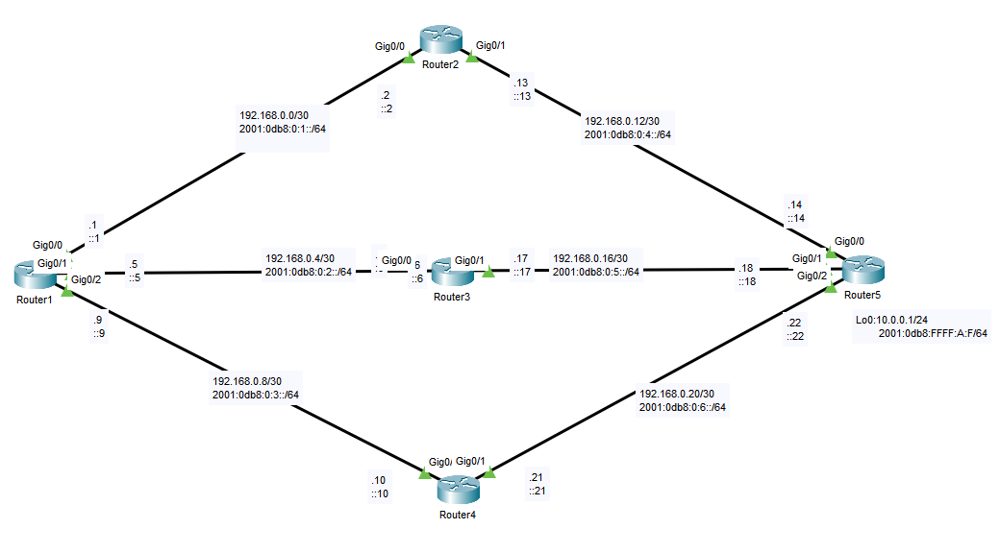
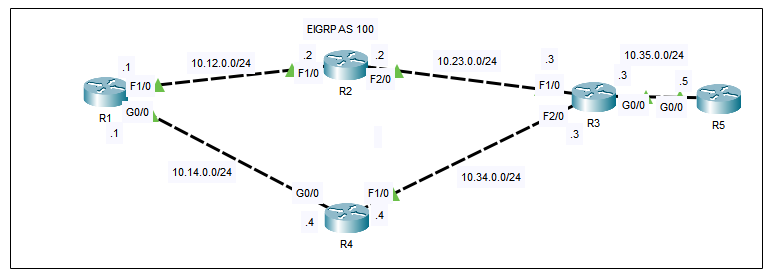

## 28 - LABORATORIO - EIGRP 01 - CCNA

#### A) EIGRP en IPv4 y IPv6



IPv4:

1) Configurar EIGRP con el ASN 300 y verificar conectividad desde R1 hacia la IP 10.0.0.1
2) Desde R1 hacia la red 10.0.0.0/24 identificar:
   -Sucesor
   -Sucesor Factible
   -Distancia Factible
   -Distancia reportada
3) Deshabilitar la sumarización automática donde sea necesario
4) Habilitar tres interfaces Loopback adicionales en R5 con el siguiente direccionamiento:
   Lo10: 172.27.128.1/24
   Lo11: 172.27.130.1/24
   Lo12: 172.27.160.1/24
   Propagar esas tres redes como un único bloque sumarizado hacia los vecinos.
5) Modificar los temporizadores por defecto entre R1 y R2 para que reaccione al menos con el doble de rapidez en caso de falla del enlace.
6) Configurar la varianza en R1 para poder balancear la carga entre los 3 enlaces simultáneamente
7) Crear una ruta por defecto en R1 apuntando a una interfaz Nullo y propagarla a los demás routers.

IPv6:

8) Configurar EIGRP con el sistema autónomo 60. Asignar un router-id manualmente a todos los routers y verificar conexión de extremo a extremo.
9) Configurar la Loopback de R1 como interfaz pasiva.
10) Verificar si la información de enrutamiento es coincidente con la red IPv4.
11) Crear una ruta por defecto en R1 apuntando a una interfaz Nullo y propagarla a los demás routers.

#### B)



1. Configure una dirección de bucle invertido en cada enrutador (1.1.1.1/32 para R1, 2.2.2.2/32 para R2, etc.).
2. Configure EIGRP en cada enrutador y anuncie todas las interfaces configuradas.
   Configure las interfaces de bucle invertido como pasivas.
   Desactive el resumen automático.
3. Configure R1 para que realice un balanceo de carga de costo desigual al enviar tráfico a R5.
4. Configure R3 para que anuncie una red de resumen 10.0.0.0/8 a R5.
---
#### A) EIGRP en IPv4 y IPv6

IPv4:

**1) Configurar EIGRP con el ASN 300 y verificar conectividad desde R1 hacia la IP 10.0.0.1**

En R1
```
router eigrp 300
 network 192.168.0.0 0.0.0.3
 network 192.168.0.4 0.0.0.3
 network 192.168.0.8 0.0.0.3
```

En R2
```
router eigrp 300
 network 192.168.0.12 0.0.0.3
 network 192.168.0.0 0.0.0.3
```

En R3
```
router eigrp 300
 network 192.168.0.4 0.0.0.3
 network 192.168.0.16 0.0.0.3
```

En R4
```
router eigrp 300
 network 192.168.0.8 0.0.0.3
 network 192.168.0.20 0.0.0.3
```

En R5
```
router eigrp 300
 network 192.168.0.0 0.0.0.3
 network 10.0.0.0 0.0.0.255
```

En R1
```
Router#ping 10.0.0.1
Type escape sequence to abort.
Sending 5, 100-byte ICMP Echos to 10.0.0.1, timeout is 2 seconds:
!!!!!
Success rate is 100 percent (5/5), round-trip min/avg/max = 0/0/0 ms
```

**2) Desde R1 hacia la red 10.0.0.0/24 identificar:**

```
Router#show ip eigrp topology

Codes: P - Passive, A - Active, U - Update, Q - Query, R - Reply,
r - Reply status

P 10.0.0.0/24, 3 successors, FD is 131072
       via 192.168.0.6 (13107/130816), GigabitEthernet0/1
       via 192.168.0.10 (131072/130816), GigabitEthernet0/2
```

   -Sucesor
```
via 192.168.0.10 (131072/130816), GigabitEthernet0/2
```

   -Sucesor Factible
`No hay yaque R2 no aparece en la tabla `

   -Distancia Factible
`101072`

   -Distancia reportada
`130816`

**3) Deshabilitar la sumarización automática donde sea necesario**

```
(config-router)no auto-summary
```
En R5 si es necesaria.

**4) Habilitar tres interfaces Loopback adicionales en R5 con el siguiente direccionamiento:**
   Lo10: 172.27.128.1/24
   Lo11: 172.27.130.1/24
   Lo12: 172.27.160.1/24
   
En R5
```
interface loopback10
 ip address 172.27.128.1 255.255.255.0

interface loopback11
 ip address 172.27.130.1 255.255.255.0

interface loopback12
 ip address 172.27.160.1 255.255.255.0
```

Declaramos los loopbacks a eigrp
```
router eigrp 300
 network 172.27.0.0
```

  Propagar esas tres redes como un único bloque sumarizado hacia los vecinos.

Calculamos el bloque sumarizado
```
172.27.128.0/18
Máscara: 255.255.192.0
```

Ahora ingresamos a cada interfaz y lo publicamos
```
interface g0/0
 ip summary-address eigrp 300 172.27.128.0 255.255.192.0

interface g0/1
 ip summary-address eigrp 300 172.27.128.0 255.255.192.0

interface g0/2
 ip summary-address eigrp 300 172.27.128.0 255.255.192.0
```


**5) Modificar los temporizadores por defecto entre R1 y R2 para que reaccione al menos con el doble de rapidez en caso de falla del enlace.**

Default EIGRP:
- Hello: entre 5s -15s

Para el doble de rápido → mitad:
- Hello: entre 2s - 6s

En R1
```
interface g0/0 
 ip hello-interval eigrp 300 2
 ip hold-time eigrp 300 6
```

En R2
```
interface g0/0 
 ip hello-interval eigrp 300 2
 ip hold-time eigrp 300 6
```

**6) Configurar la varianza en R1 para poder balancear la carga entre los 3 enlaces simultáneamente**

Primero hacemos que R1 considere a R2 un sucesor factible
En R2
Vemos si modificando el delay se arregla.
```
int g0/1
 delay 1000
```
 Y si al final si se arreglo, ahora R2 es un sucesor factible.

En R1
```
router eigrp 300
 variance n
```
La variance: n= (la distacia administrativa mayor)/(la distacia administrativa menor), si sale decimal entonces se redondea al numero próximo.

```
Router#sho ip eig topo

P 10.0.0.0/24, 3 successors, FD is 131072
via 192.168.0.6 (131072/130816), GigabitEthernet0/1
via 192.168.0.10 (131072/130816), GigabitEthernet0/2
via 192.168.0.2 (131072/130816), GigabitEthernet0/0
```

**7) Crear una ruta por defecto en R1 apuntando a una interfaz Null0 y propagarla a los demás routers.**

En R1
```
ip route 0.0.0.0 0.0.0.0 Null0
```

Lo redestribuimos en EIGRP
```
router eigrp 300
 redistribute static
```

IPv6:

**8) Configurar EIGRP con el sistema autónomo 60. Asignar un router-id manualmente a todos los routers y verificar conexión de extremo a extremo**

Habilitar IPv6 globalmente
```
ipv6 unicast-routing
```

En R1
```
ipv6 router eigrp 60
 router-id 1.1.1.1
 no shutdown
 
interface g0/0
 ipv6 eigrp 60
interface g0/1
 ipv6 eigrp 60
interface g0/2
 ipv6 eigrp 60
```

En R2
```
ipv6 router eigrp 60
 router-id 2.2.2.2
 no shutdown
 
interface g0/0
 ipv6 eigrp 60
interface g0/1
 ipv6 eigrp 60
```

En R3
```
ipv6 router eigrp 60
 router-id 3.3.3.3
 no shutdown
 
interface g0/0
 ipv6 eigrp 60
interface g0/1
 ipv6 eigrp 60
```

R4
```
ipv6 router eigrp 60
 router-id 4.4.4.4
 no shutdown
 
interface g0/0
 ipv6 eigrp 60
interface g0/1
 ipv6 eigrp 60
```

R5
```
ipv6 router eigrp 60
 router-id 5.5.5.5
 no shutdown
 
interface g0/0
 ipv6 eigrp 60
interface g0/1
 ipv6 eigrp 60
interface g0/2
 ipv6 eigrp 60
```

**9) Configurar la Loopback de R5 como interfaz pasiva.**

En R5
```
ipv6 router eigrp 60
 passive-interface loopback0
```

**10) Verificar si la información de enrutamiento es coincidente con la red IPv4**

Si, la información si es coincidente y podemos verificar con
```
show ip route eigrp
```

Y con
```
show ipv6 route eigrp
```

**11) Crear una ruta por defecto en R1 apuntando a una interfaz Nullo y propagarla a los demás routers.**

En R1
```
ipv6 route ::/0 Null0
```

Redistribuir en EIGRP
```
ipv6 router eigrp 60
 redistribute static
```

#### B)

**1. Configure una dirección de loopback en cada enrutador (1.1.1.1/32 para R1, 2.2.2.2/32 para R2, etc.).**

R1
```
R1(config)#int lo0
R1(config-if)#ip address 1.1.1.1 255.255.255.255
```

R2
```
R2(config)#in lo0
R2(config-if)#ip address 2.2.2.2 255.255.255.255
```

R3
```
R3(config)#int lo0
R3(config-if)#ip address 3.3.3.3 255.255.255.255
```

R4
```
R4(config)#int lo0
R4(config-if)#ip address 4.4.4.4 255.255.255.255
```

R5
```
R5(config)#int lo0
R5(config-if)#ip address 5.5.5.5 255.255.255.255
```

**2. Configure EIGRP en cada enrutador y anuncie todas las interfaces configuradas.***

En R1
```
R1(config)#router eigrp 100
R1(config-router)# network 10.0.0.0
R1(config-router)#network 1.1.1.1 0.0.0.0
R1(config-router)#passive-interface lo0
R1(config-router)# no auto-summary
```

En R2
```
R2(config)#router eigrp 100
R2(config-router)#network 10.0.0.0
R2(config-router)#net 2.2.2.2 0.0.0.0
R2(config-router)#passive-interface lo0
```

En R3
```
R3(config)#router eigrp 100
R3(config-router)#network 10.0.0.0
R3(config-router)#net 3.3.3.3 0.0.0.0
R3(config-router)#passive-interface lo0
R3(config-router)#no auto-summary
```

En R4
```
R4(config)#router eigrp 100
R4(config-router)#net 10.0.0.0
R4(config-router)#net 4.4.4.4 0.0.0.0
R4(config-router)#no auto-summary
R4(config-router)#passive-interface lo0
```

En R5
```
R5(config)#router eigrp 100
R5(config-router)#network 10.0.0.0
R5(config-router)#network 5.5.5.5 0.0.0.0
R5(config-router)#passive-interface lo0
R5(config-router)#no auto-summary
```

**3. Configure R1 para que realice un balanceo de carga de costo desigual al enviar tráfico a R5.**

```
R1(config)#do sh ip route
Gateway of last resort is not set
1.0.0.0/32 is subnetted, 1 subnets
C 1.1.1.1 is directly connected, Loopback0
D 2.0.0.0/8 [90/156160] via 10.12.0.2, 00:12:29, FastEthernet1/0
3.0.0.0/32 is subnetted, 1 subnets
D 3.3.3.3 [90/156416] via 10.14.0.4, 00:04:42, GigabitEthernet0/0
4.0.0.0/32 is subnetted, 1 subnets
D 4.4.4.4 [90/130816] via 10.14.0.4, 00:04:42, GigabitEthernet0/0
5.0.0.0/32 is subnetted, 1 subnets
D 5.5.5.5 [90/156672] via 10.14.0.4, 00:03:27, GigabitEthernet0/0
10.0.0.0/24 is subnetted, 5 subnets
```

Realizamos el balanceo

```
R1(config-router)#variance 2
```

```
R1(config-router)#do sh ip route
Gateway of last resort is not set
1.0.0.0/32 is subnetted, 1 subnets
C 1.1.1.1 is directly connected, Loopback0
D 2.0.0.0/8 [90/156160] via 10.12.0.2, 00:00:59, FastEthernet1/0
3.0.0.0/32 is subnetted, 1 subnets
D 3.3.3.3 [90/156416] via 10.14.0.4, 00:01:01, GigabitEthernet0/0
[90/158720] via 10.12.0.2, 00:00:59, FastEthernet1/0
4.0.0.0/32 is subnetted, 1 subnets
D 4.4.4.4 [90/130816] via 10.14.0.4, 00:01:01, GigabitEthernet0/0
5.0.0.0/32 is subnetted, 1 subnets
D 5.5.5.5 [90/156672] via 10.14.0.4, 00:01:01, GigabitEthernet0/0
[90/158976] via 10.12.0.2, 00:00:59, FastEthernet1/0
10.0.0.0/24 is subnetted, 5 subnets
```

**4. Configure R3 para que anuncie una red de resumen 10.0.0.0/8 a R5.**

```
R3(config)#int g0/0
R3(config-if)#ip summary-address eigrp 100 10.0.0.0 255.0.0.0
```

```
R5(config)#do sh ip route

Gateway of last resort is not set
1.0.0.0/32 is subnetted, 1 subnets
D 1.1.1.1/32 [90/156672] via 10.35.0.3, 00:00:45, GigabitEthernet0/0
D 2.0.0.0/8 [90/156416] via 10.35.0.3, 00:00:45, GigabitEthernet0/0
3.0.0.0/32 is subnetted, 1 subnets
D 3.3.3.3/32 [90/130816] via 10.35.0.3, 00:00:45, GigabitEthernet0/0
4.0.0.0/32 is subnetted, 1 subnets
D 4.4.4.4/32 [90/156416] via 10.35.0.3, 00:00:45, GigabitEthernet0/0
5.0.0.0/32 is subnetted, 1 subnets
C 5.5.5.5/32 is directly connected, Loopback0
10.0.0.0/8 is variably subnetted, 3 subnets, 3 masks
D 10.0.0.0/8 [90/3072] via 10.35.0.3, 00:00:45, GigabitEthernet0/0
C 10.35.0.0/24 is directly connected, GigabitEthernet0/0
L 10.35.0.5/32 is directly connected, GigabitEthernet0/0
```

