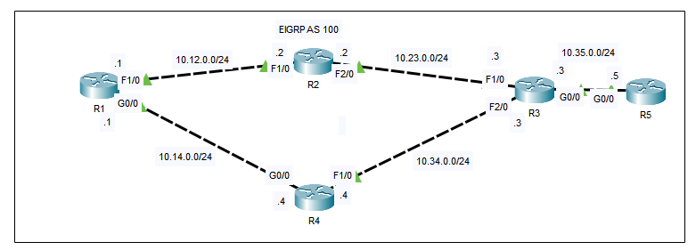
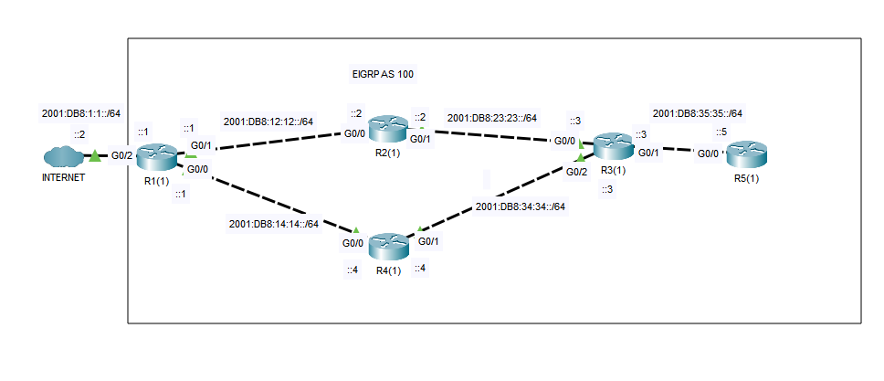

## 29 - LABORATORIO - EIGRP 02 - CCNA

#### A) EIGRP Troubleshooting



Los enrutadores de la red no se están convirtiendo en vecinos EIGRP ni recibiendo las rutas correctas.
R5 debería recibir un resumen 10.0.0.0/8 de R3.
Hay una configuración incorrecta por enrutador.
Solucione los problemas.
#### B) EIGRP for IPv6



1. Configure una interfaz de loopback en cada enrutador con una dirección IPv4 (1.1.1.1/32, 2.2.2.2/32, etc.).
2. Configure EIGRP en cada enrutador según la topología.
3. Configure la interfaz G0/2 del R1 como interfaz pasiva.
4. Anuncie una default route a Internet desde el R1.
---
#### A) EIGRP Troubleshooting

**Los enrutadores de la red no se están convirtiendo en vecinos EIGRP ni recibiendo las rutas correctas.**

**Hay una configuración incorrecta por enrutador.***

En R1
```
R1#sh run

router eigrp 10
passive-interface Loopback0
network 10.0.0.0
network 1.1.1.1 0.0.0.0
no auto-summary
```
En R1 esta usando el as 10 y nosotros hicimos la configuración con as 100, lo cambiamos

```
R1(config)#no router eigrp 10
R1(config)#router eigrp 100
R1(config-router)#network 10.0.0.0
R1(config-router)#network 1.1.1.1 0.0.0.0
R1(config-router)#passive-interface lo0
R1(config-router)#no auto-summary
```

En R4
```
R4#sho ip protocols

Routing for Networks:
10.0.0.0
44.4.4.4/32
Passive Interface(s):
Loopback0
Routing Information Sources:
Gateway Distance Last Update
10.34.0.3 90 0
10.14.0.1 90 8069255
Distance: internal 90 external 170
```

```
R4#sh ip int bri

GigabitEthernet0/0 10.14.0.4 YES manual up up
FastEthernet1/0 10.34.0.4 YES manual up up
FastEthernet2/0 unassigned YES unset administratively down down
Loopback0 4.4.4.4 YES manual up up
```
No vemos ni ningún `44.4.4.4` y la el loopback tiene una ip de `4.4.4.4`.
Asi que ahi esta nuestro problema.

Corregimos
```
R4(config)#router eigrp 100
R4(config-router)#no net 44.4.4.4 0.0.0.0
R4(config-router)#net 4.4.4.4 0.0.0.0

```

En R1 vemos los vecinos
```
R1#sh ip eigrp nei

IP-EIGRP neighbors for process 100
(sec) (ms) Cnt Num
0 10.14.0.4 Gig0/0 12 01:23:24 40 1000 0 27
```
Y solo vemos a R4

Revisemos en R2
En R2
```
R2#sh ip pro

EIGRP maximum hopcount 100
EIGRP maximum metric variance 1
Redistributing: eigrp 100
Automatic network summarization is not in effect
Maximum path: 4
Routing for Networks:
10.0.0.0
2.2.2.2/32
Passive Interface(s):
FastEthernet1/0
Loopback0
Routing Information Sources:
Gateway Distance Last Update
10.23.0.3 90 0
Distance: internal 90 external 170
```
Vemos que Fa0/1 esta configurada como interfaz pasiva.

```
R2(config)#router eigrp 100
R2(config-router)#no passive-interface f1/0
```

Ahora verificamos en R3
En R3
```
R3#sh ip eigrp neighbors

IP-EIGRP neighbors for process 100
(sec) (ms) Cnt Num
0 10.23.0.2 Fa1/0 13 03:45:59 40 1000 0 22
1 10.34.0.4 Fa2/0 11 03:45:59 40 1000 0 31
```
Vemos que no aparece R5.

En R3 esta bien configurado
```
router eigrp 100
passive-interface Loopback0
network 3.3.3.3 0.0.0.0
network 10.0.0.0
no auto-summary
```

En R5
```
R5#sh ip pro

Routing for Networks:
5.5.5.5/32
10.0.0.0/32
Passive Interface(s):
Loopback0
```
Vemos que anuncia la red `10.0.0.0` con el comodín `/32`.

Entonces
```
R5(config)#router eigrp 100
R5(config-router)#no net 10.0.0.0 0.0.0.0
R5(config-router)#net 10.0.0.0
```

**R5 debería recibir un resumen 10.0.0.0/8 de R3.**

Nos fijamos en R3

```
R3#sh run

interface FastEthernet1/0
ip address 10.23.0.3 255.255.255.0
ip summary-address eigrp 100 10.0.0.0 255.0.0.0 5
duplex auto
speed auto
```
Vemos que la configuración de sumary address esa en la interfaz equivocada y no en la hacia R5.

Entonces
```
R3(config)#int f1/0
R3(config-if)#no ip summary-address eigrp 100 10.0.0.0 255.0.0.0 5
R3(config-if)#int g0/0
R3(config-if)#ip summary-address eigrp 100 10.0.0.0 255.0.0.0 5
```

Verificamos en R5
```
R5(config-router)#do sho ip rou

D 10.0.0.0/8 [90/3072] via 10.35.0.3, 00:01:11, GigabitEthernet0/0
```

#### B) EIGRP for IPv6

**1. Configure una interfaz de loopback en cada enrutador con una dirección IPv4 (1.1.1.1/32, 2.2.2.2/32, etc.).**

En R1
```
R1(config)#int lo0
R1(config-if)#ip add 1.1.1.1 255.255.255.255
```
Y así sucesivamente para todos los routers.

**2. Configure EIGRP en cada enrutador según la topología.**

En R1
```
R1(config)#ipv6 router eigrp 100
R1(config-rtr)#no shut
R1(config-rtr)#passive-interface g0/2
R1(config-rtr)#int g0/0
R1(config-if)#ipv6 eigrp 100
R1(config-if)#int g0/1
R1(config-if)#ipv6 eigrp 100
R1(config-if)#int g0/2
R1(config-if)#ipv6 eigrp 100
```

En R2
```
R2(config)#int g0/0
R2(config-if)#ipv6 eigrp 100
R2(config-if)#int g0/1
R2(config-if)#ipv6 eigrp 100
R2(config-if)#ipv6 router eigrp 100
R2(config-rtr)#no shut
```

En R3
```
R3(config)#ipv6 router eigrp 100
R3(config-rtr)#no shut
R3(config-rtr)#int g0/0
R3(config-if)#ipv6 eigrp 100
R3(config-if)#int g0/1
R3(config-if)#ipv6 eigrp 100
R3(config-if)#int g0/2
R3(config-if)#ipv6 eigrp 100
```

En R4
```
R4(config)#ipv6 router eigrp 100
R4(config-rtr)#no shut
R4(config-rtr)#int g0/0
R4(config-if)#ipv6 eigrp 100
R4(config-if)#int g0/1
R4(config-if)#ipv6 eigrp 100
```

En R5
```
R5(config)#ipv6 router eigrp 100
R5(config-rtr)#no shut
R5(config-rtr)#int g0/0
R5(config-if)#ipv6 eigrp 100
```

**3. Configure la interfaz G0/2 del R1 como interfaz pasiva.**

```
R1(config)#ipv6 router eigrp 100
R1(config-rtr)#passive-interface g0/2
```


**4. Anuncie una default route a Internet desde el R1.**

En R1
```
R1(config-rtr)#int g0/0
R1(config-if)#ipv6 summary-address eigrp 100 ::/0
R1(config-if)#int g0/1
R1(config-if)#ipv6 summary-address eigrp 100 ::/0
```
