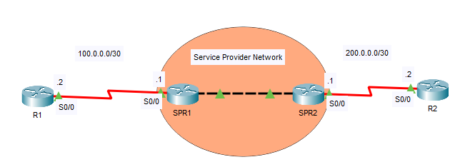
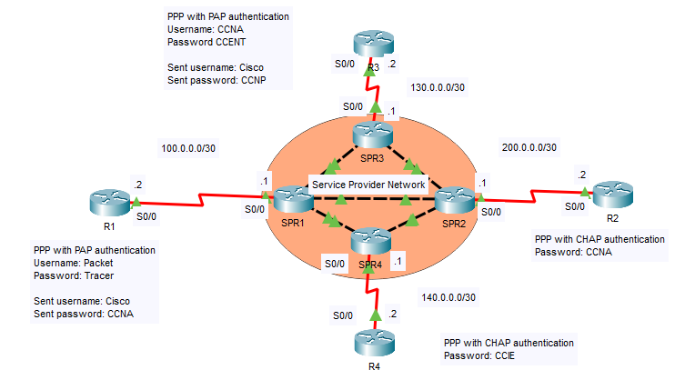

## 30 - LABORATORIO - PPP, MPLPP y PPPoE - CCNA

#### A)



1. Configure PPP con autenticación PAP bidireccional entre R1 y SPR1.
   (Solo puede configurar R1; SPR1 está preconfigurado).
   Configure la siguiente cuenta de usuario en R1:
   Nombre de usuario: Packet
   Contraseña: Tracer
   Configure R1 para que envíe la siguiente información para autenticarse en SPR1:
   Nombre de usuario enviado: Cisco
   Contraseña enviada: CCNA

2. Configure la autenticación CHAP bidireccional PPP entre R2 y SPR2.
   (Solo puede configurar R2; SPR2 está preconfigurado).
   Use la contraseña CCNA.

---

#### B) PPP Troubleshooting



Las conexiones PPP se han configurado según el diagrama.
Sin embargo, se ha producido una configuración incorrecta por dispositivo de red, lo que afecta la conectividad.
Solucione los problemas.
No es necesario configurar los routers del proveedor de servicios (SPR1, SPR2, SPR3, SPR4).

---
#### A)

**1. Configure PPP con autenticación PAP bidireccional entre R1 y SPR1.**
   (Solo puede configurar R1; SPR1 está preconfigurado).
   Configure la siguiente cuenta de usuario en R1:
   Nombre de usuario: Packet
   Contraseña: Tracer
   Configure R1 para que envíe la siguiente información para autenticarse en SPR1:
   Nombre de usuario enviado: Cisco
   Contraseña enviada: CCNA

Habilitemos PPP en R1
En R1
```
R1(config)#int s0/0
R1(config-if)#encapsulation ppp
```

Configuramos las credenciales a R1 para que se autentique con SPR1
En R1
```
R1(config)#username Packet password Tracer
```

 Configure R1 para que envíe la siguiente información para autenticarse en SPR1:
   Nombre de usuario enviado: Cisco
   Contraseña enviada: CCNA

```
R1(config)#int s0/0
R1(config-if)#ppp authentication pap
R1(config-if)#ppp pap sent-username Cisco password CCNA
```

**2. Configure la autenticación CHAP bidireccional PPP entre R2 y SPR2.**
   (Solo puede configurar R2; SPR2 está preconfigurado).
   Use la contraseña CCNA.

En R2
```
R2(config)#username SPR2 password CCNA
R2(config)#int s0/0
R2(config-if)#encapsulation ppp
R2(config-if)#ppp authentication chap
```

#### B) PPP Troubleshooting

Las conexiones PPP se han configurado según el diagrama.
Sin embargo, se ha producido una configuración incorrecta por dispositivo de red, lo que afecta la conectividad.
Solucione los problemas.
No es necesario configurar los routers del proveedor de servicios (SPR1, SPR2, SPR3, SPR4).

Verificamos en R1

```
R1#sh ru

interface Serial0/0
ip address 100.0.0.2 255.255.255.252
encapsulation ppp
ppp authentication pap
clock rate 2000000
```
Vemos que, en s0/0 no esta configurado el  ppp pap sent-username.

Entonces
```
R1(config-if)#ppp pap sent-username Cisco password CCNA
```

Ahora vamos a R3
En R3
```
R3#sh run

interface Serial0/0
ip address 130.0.0.2 255.255.255.252
encapsulation ppp
ppp authentication chap
ppp pap sent-username Cisco password 0 CCNP
no keepalive
clock rate 2000000
```
Vemos que esta en chap, pero se supone que la configuración de R3 esta en pap

Entonces
```
R3(config)#int s0/0
R3(config-if)#no ppp authentication chap
R3(config-if)#pp authentication pap
```

Ahora vamos en R2
```
R2#sh run

username R2 password 0 CCNA
```
Vemos que el nombre del hosts esta configurado con su propio nombre.

Entonces
```
R2(config)#username SPR2 password CCNA
R2(config)#int s0/0
R2(config-if)#no shut
```

Ahora vamos a R4
En R4
```
R4#sh run

interface Serial0/0
ip address 140.0.0.2 255.255.255.252
encapsulation ppp
clock rate 2000000
```
Vemos que le falta la sentencia de auntenticación ppp.

Entonces
```
R4(config)#int s0/0
R4(config-if)#ppp authentication chap
```

 