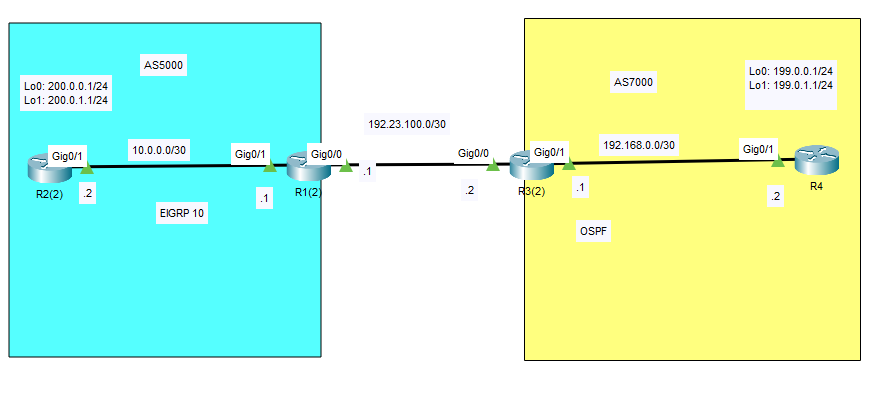
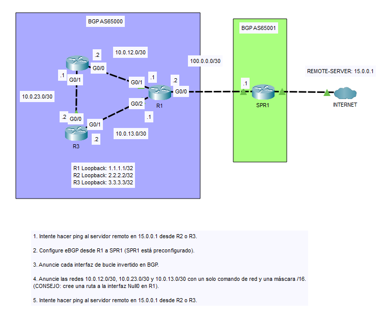
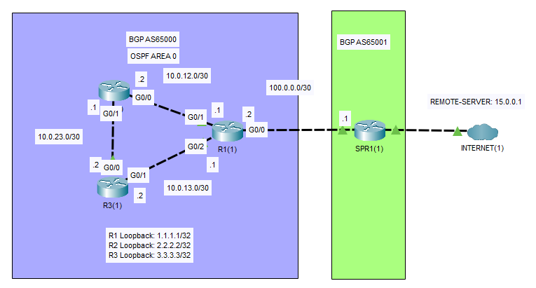

## 31 - LABORATORIO - BGP - CCNA

#### A)



- Publicar las interfaces loopback en el otro sistema autónomo.
  Lo0 y Lo1 son direcciones publicas y `10.0.0./30` y `192168.0.0/30` son direcciones privadas
#### B)



1. Intente hacer ping al servidor remoto en 15.0.0.1 desde R2 o R3.
2. Configure eBGP desde R1 a SPR1 (SPR1 está preconfigurado).
3. Anuncie cada interfaz de loopback en BGP.
4. Anuncie las redes 10.0.12.0/30, 10.0.23.0/30 y 10.0.13.0/30 con un solo comando de red y una máscara /16.
   (CONSEJO: cree una ruta a la interfaz Null0 en R1).
5. Intente hacer ping al servidor remoto en 15.0.0.1 desde R2 o R3.

#### C) Troubleshooting



El R1 está configurado para:
- Establecer un peering eBGP con SPR1
- Anunciar los bucles de retorno de R1, R2 y R3
- Anunciar un resumen 10.0.0.0/16 a SPR1 mediante eBGP
Hay tres configuraciones incorrectas en el R1
Resolver los problemas
Puede probar su solución haciendo ping desde R2 o R3 al servidor externo 15.0.0.1

---
#### A)

- **Publicar las interfaces loopback en el otro sistema autónomo.**

Creamos las loopbacks

En R2
```
interface lo0
 ip address 200.0.0.1 255.255.255.0

interface lo1
 ip address 200.0.1.1 255.255.255.0
```

En R4
```
interface lo0
 ip address 199.0.0.1 255.255.255.0

interface lo1
 ip address 199.0.1.1 255.255.255.0
 ip ospf network point-to-point
```

**El EIGRP para AS5000**

En R2
```
conf t
router eigrp 10
 network 10.0.0.0 0.0.0.3
 network 200.0.0.0 0.0.0.255
 network 200.0.1.0 0.0.0.255
 no auto-summary
exit
```

En R1
```
conf t
router eigrp 10
 network 10.0.0.0 0.0.0.3
 network 192.23.100.0 0.0.0.3
 no auto-summary
exit
```

**OSPF para AS7000**

En R3
```
conf t
router ospf 1
 network 192.168.0.0 0.0.0.3 area 0
 network 192.23.100.0 0.0.0.3 area 0
exit
```

En R4
```
conf t
router ospf 1
 network 192.168.0.0 0.0.0.3 area 0
 network 199.0.0.0 0.0.0.255 area 0
 network 199.0.1.0 0.0.0.255 area 0
exit
```

Ahora Redistribuir

En R1
```
Router(config)#router bgp 5000
Router(config)#neighbor 192.23.100.2 remote-as 7000
 Router(config-router)#network 200.0.0.0 mask 255.255.255.0
 Router(config-router)#network 200.0.1.0 mask 255.255.255.0
```

En R3
```
Router(config)#router bgp 7000
Router(config)#neighbor 192.23.100.1 remote-as 5000
 Router(config-router)#network 199.0.0.0 mask 255.255.255.0
 Router(config-router)#network 199.0.1.0 mask 255.255.255.0
```

Ping de R1 y R3 a las loopbacks.
R1
```
Router#ping 199.0.0.1
Type escape sequence to abort.
Sending 5, 100-byte ICMP Echos to 199.0.0.1, timeout is 2 seconds:
!!!!!
Success rate is 100 percent (5/5), round-trip min/avg/max = 0/0/0 ms
```

R3
```
Router#ping 200.0.1.1
Type escape sequence to abort.
Sending 5, 100-byte ICMP Echos to 200.0.1.1, timeout is 2 seconds:
!!!!!
Success rate is 100 percent (5/5), round-trip min/avg/max = 0/0/0 ms
```
Pero no puede hacer ping desde los extremos R2 y R4 a las loopbacks porque en nuestra tabla de enrutamiento solo tenemos las direcciones/información de nuestro sistema autónomo, entonces para ello redistribuiremos las rutas de R1 y R3 a sistema autónomo.

Entonces
R1
```
Router(config)#router eigrp 10
Router(config-router)#redistribute bgp 5000 metric 1000000 100 255 1 1500
```
Con `show interfaces g0/1` sacamos los valores de la metrica
```
metric = BW  DLY(Delay)  REL(Reliability)  LOAD  MTU
```
Este comando hace que todas las rutas que yo tenga en BGP del AS5000, mételas en EIGRP, y trátalas como si vinieran por un enlace de 1Gbps, con bajo delay, máxima confiabilidad y MTU 1500

En R3
```
Router(config)#router ospf 1
Router(config-router)#redistribute bgp 7000
```
Todas las rutas que tenga en BGP del AS 7000, mételas dentro de OSPF

Verificamos:
De lo0 de R4 a lo1 de R2 `200.0.0.1`
```
ping 200.0.0.1 source lo0
Sending 5, 100-byte ICMP Echos to 200.0.1.1, timeout is 2 seconds:
Packet sent with a source address of 199.0.0.1
!!!!!
Success rate is 100 percent (5/5), round-trip min/avg/max = 0/0/0 ms
```

De lo0 de R2 a lo1 de R4 `199.0.1.1`
```
ping 199.0.1.1 source lo0
Sending 5, 100-byte ICMP Echos to 199.0.1.1, timeout is 2 seconds:
Packet sent with a source address of 200.0.0.1
!!!!!
Success rate is 100 percent (5/5), round-trip min/avg/max = 0/0/0 ms
```

#### B)

**1. Intente hacer ping al servidor remoto en 15.0.0.1 desde R2 o R3.**

De R2
```
R2#ping 15.0.0.1
Type escape sequence to abort.
Sending 5, 100-byte ICMP Echos to 15.0.0.1, timeout is 2 seconds:
.....
Success rate is 0 percent (0/5)
```

**2. Configure eBGP desde R1 a SPR1 (SPR1 está preconfigurado).**

En R1
```
R1(config)#router bgp 65000
R1(config-router)#neighbor 100.0.0.1 remote-as 65001
```

**3. Anuncie cada interfaz de loopback en BGP.**

En R1
```
R1(config-router)#network 1.1.1.1 mask 255.255.255.255
R1(config-router)#network 2.2.2.2 mask 255.255.255.255
R1(config-router)#network 3.3.3.3 mask 255.255.255.255
R1(config-router)#network 10.0.0.0 mask 255.255.0.0
```

**4. Anuncie las redes 10.0.12.0/30, 10.0.23.0/30 y 10.0.13.0/30 con un solo comando de red y una máscara /16.**
   (CONSEJO: cree una ruta a la interfaz Null0 en R1).

```
R1(config)#ip route 10.0.0.0 255.255.0.0 null0
```
Anunciar en BGP
```
R1(config)#router bgp 65000
R1(config-router)#network 10.0.0.0 mask 255.255.0.0
```

**5. Intente hacer ping al servidor remoto en 15.0.0.1 desde R2 o R3.**

En R2
```
R2#ping 15.0.0.1
Type escape sequence to abort.
Sending 5, 100-byte ICMP Echos to 15.0.0.1, timeout is 2 seconds:
!!!!!
Success rate is 100 percent (5/5), round-trip min/avg/max = 0/0/0 ms
```

#### C) Troubleshooting

El R1 está configurado para:
- Establecer un peering eBGP con SPR1
- Anunciar los bucles de retorno de R1, R2 y R3
- Anunciar un resumen 10.0.0.0/16 a SPR1 mediante eBGP

**Hay tres configuraciones incorrectas en el R1**

Al iniciar en la `cli` de R1 nos sale esto:

```
R1#sh ip bgp summary

BGP router identifier 1.1.1.1, local AS number 65000
Neighbor V AS MsgRcvd MsgSent TblVer InQ OutQ Up/Down State/PfxRcd
100.0.0.1 4 6500 0 74 2 0 0 00:35:53 4
```
Vemos que el `AS` esta en 6500 y deberia esta en 65001.

```
R1#sh ip bg neighborg

BGP state = Idle, up for 00:37:22
```
Vemos que el estado de bgp esta inactivo.

**1.Primer problema encontrado**

Entonces lo corregimos 
```
R1(config)#router bgp 65000
R1(config-router)#neighbor 100.0.0.1 remote-as 65001
```

Y en la pantalla nos sigue saliendo este tipo de mensaje:
`R1#10:34:21: %OSPF-4-ERRRCV: Received invalid packet: mismatch area ID, from backbone area must be virtual-link but not found from 10.0.13.1, GigabitEthernet0/2`
Nos dice que el ID del área no es coincidente.

```
R1(config-router)#do sho ip proto

Routing for Networks:
0.0.0.0 255.255.255.255 area 1
```
Y vemos ahi el problema, ospf debería estar en el área 0

**2. Segundo problema encontrado**

Lo corregimos
```
R1(config-router)#router ospf 1
R1(config-router)#no net 0.0.0.0 255.255.255.255 area 1
R1(config-router)#network 0.0.0.0 0.0.0.0 area 0
```


Ahora para la tercera mal configuración nos fijamos en la tabla de rutas
```
R1(config-router)#do sho ip route

10.0.0.0/8 is variably subnetted, 5 subnets, 3 masks
```
Vemos que la red `10.0.0.0` esta con una mascara `/8`

**3. Tercer problema encontrado**

Corregimos
```
R1(config)#router bgp 65000
R1(config-router)#no network 10.0.0.0
R1(config-router)#network 10.0.0.0 mask 255.255.0.0
```

Hacemos ping desde R2

```
R2#ping 15.0.0.1
Type escape sequence to abort.
Sending 5, 100-byte ICMP Echos to 15.0.0.1, timeout is 2 seconds:
!!!!!
Success rate is 100 percent (5/5), round-trip min/avg/max = 0/0/0 ms
```

Se ha resuelto con éxito los problemas de la red.