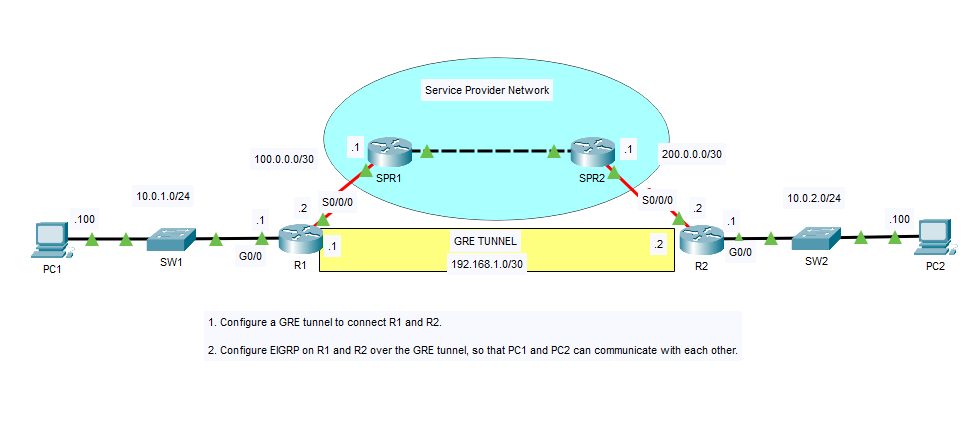
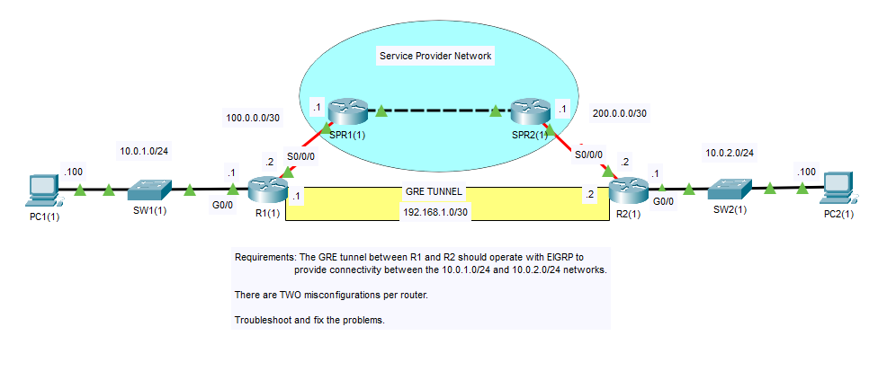
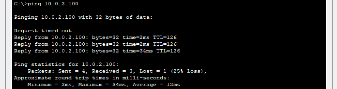
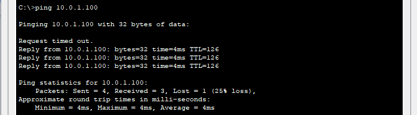

## 32 - LABORATORIO - Túneles GRE - CCNA

#### A)



1. Configure un túnel GRE para conectar R1 y R2.
2. Configure EIGRP en R1 y R2 a través del túnel GRE para que PC1 y PC2 puedan comunicarse entre sí.

#### B) Troubleshooting



Requisitos: El túnel GRE entre R1 y R2 debe funcionar con EIGRP para proporcionar conectividad entre las redes 10.0.1.0/24 y 10.0.2.0/24.
Hay dos configuraciones incorrectas por enrutador.
Resolver los problemas.

---
#### A)

**1. Configure un túnel GRE para conectar R1 y R2.***

En R1
```
R1(config)#int tunnel 0
R1(config-if)#ip add 192.168.1.1 255.255.255.252
R1(config-if)#tunnel source s0/0/0
R1(config-if)#tunnel destination 200.0.0.2
```

En R2
```
R2(config)#int tunnel 0
R2(config-if)#ip add 192.168.1.2 255.255.255.252
R2(config-if)#tunnel source s0/0/0
R2(config-if)#tunnel destination 100.0.0.2
```

Declaramos las rutas

Ruta hacia R1
En R2
```
R2(config)#ip route 0.0.0.0 0.0.0.0 200.0.0.1
```

Ruta hacia R2
En R1
```
R1(config)#ip route 0.0.0.0 0.0.0.0 100.0.0.1
```

**2. Configure EIGRP en R1 y R2 a través del túnel GRE para que PC1 y PC2 puedan comunicarse entre sí.**

En R1
```
R1(config)#router eigrp 100
R1(config-router)#network 10.0.1.0 0.0.0.255
R1(config-router)#network 192.168.1.0 0.0.0.3
```

En R2
```
R2(config)#router eigrp 100
R2(config-router)#net 10.0.2.0 0.0.0.255
R2(config-router)#net 192.168.1.0 0.0.0.3
```

Hacemos un ping de PC1 a PC2



#### B) Troubleshooting

Hay dos configuraciones incorrectas por enrutador.

Chequeamos la configuración del tunel grep 

```
R1#sh int tun 0

Tunnel source 100.0.0.2 (Serial0/0/0), destination 192.168.1.2
```
Vemos que la dirección de destino es incorrecta.

Lo cambiamos
```
R1(config)#int t0
R1(config-if)#tunnel destination 200.0.0.2
```

Ahora chequeamos la configuración del eirgrp.

```
R1(config-if)#do sh ip pr

Routing for Networks:
10.0.1.0/24
100.0.0.0/30
```
En la configuración se activo eigrp para la interfaz g0/0 y la interfaz del túnel `192.168.1.0/30`

Lo corregimos
```
R1(config)#router eigrp 100
R1(config-router)#no net 100.0.0.0 0.0.0.3
R1(config-router)#net
R1(config-router)#network 192.168.1.0 0.0.0.3
```

Ahora en R2
En R2
```
R2#sh int tun 0
Tunnel source 10.0.2.1 (GigabitEthernet0/0), destination 100.0.0.1
```
El origen del túnel esta mal y el destino 

Lo cambiamos
```
R2(config)#int t0
R2(config-if)#tunnel source s0/0/0
R2(config-if)#tunnel destination 100.0.0.2
```

Con 
```
R2(config-if)#do sho ip int br

Interface IP-Address OK? Method Status Protocol
Tunnel0 192.168.1.2 YES manual up down
```
Seguimos viendo que el túnel aún no esta activo.

```
R2(config)#do sho ip rou

 10.0.0.0/8 is variably subnetted, 2 subnets, 2 masks
C 10.0.2.0/24 is directly connected, GigabitEthernet0/0
L 10.0.2.1/32 is directly connected, GigabitEthernet0/0

 200.0.0.0/24 is variably subnetted, 3 subnets, 2 masks
C 200.0.0.0/30 is directly connected, Serial0/0/0
C 200.0.0.1/32 is directly connected, Serial0/0/0
L 200.0.0.2/32 is directly connected, Serial0/0/0
```
Vemos que no hay ninguna ruta que nos lleve al destino del túnel R1.

Configuramos una ruta estática que nos dirija al proveedor de servicios
```
R2(config)#ip route 0.0.0.0 0.0.0.0 200.0.0.1
```

Verificamos con un ping de PC2 a PC1.



