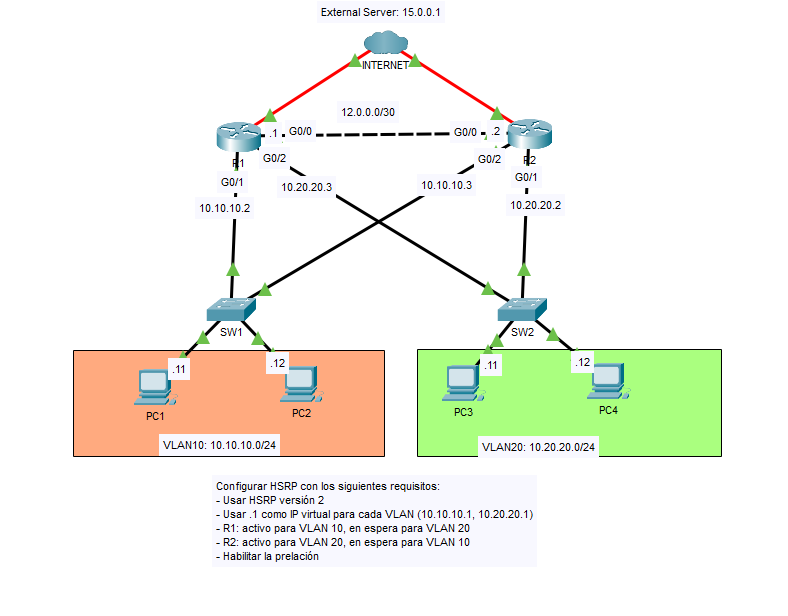
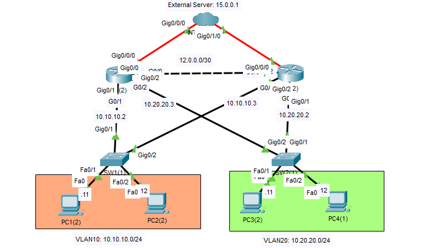
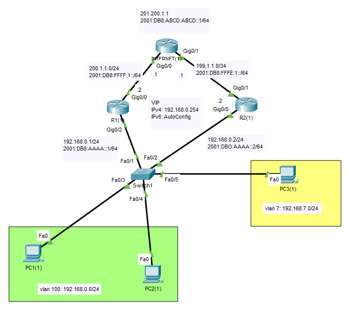
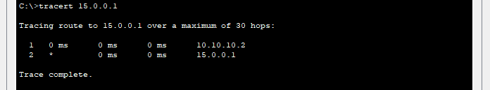
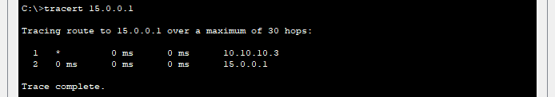
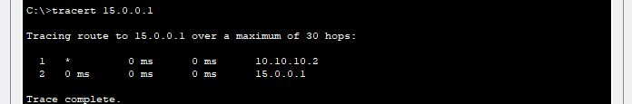
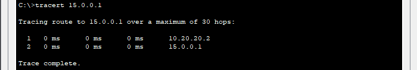
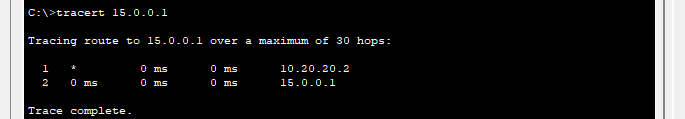
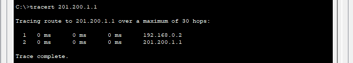

## 33 - LABORATORIO - HSRP - CCNA

#### A)



Configurar HSRP con los siguientes requisitos:
- Usar HSRP versión 2
- Usar .1 como IP virtual para cada VLAN (10.10.10.1, 10.20.20.1)
- R1: activo para VLAN 10, en espera para VLAN 20
- R2: activo para VLAN 20, en espera para VLAN 10
- Habilitar la prelación

#### B) Troubleshooting



HSRP se ha configurado con los siguientes requisitos:
- Usar HSRP versión 2
- Usar .1 como IP virtual para cada VLAN (10.10.10.1, 10.20.20.1)
- R1 es el router activo para la VLAN 10 y el de reserva para la VLAN 20
- R2 es el router activo para la VLAN 20 y el de reserva para la VLAN 10
- Habilitar la prelación

Sin embargo, R1 y R2 muestran mensajes de error, y R2 no recupera su rol como router activo para la VLAN 20 tras recuperarse de un fallo.
Solucione los problemas.
Hay una configuración incorrecta por router.

#### C)



1. Configurar HSRP en IPv4 para que los PC de la VLAN 100 utilicen la dirección 192.168.0.254 como puerta de enlace, asumiendo que R1 será el router activo y R2 el standby. Utilizar el grupo 1 y ajustar la prioridad por defecto.
2. Configurar R1 de tal modo que en caso de perder su conexión a Internet,
   inmediatamente delegue el estado activo a R2.
3. Los PC de la VLAN 7 deben salir a Internet de manera predeterminada usando el router R2, pero si este deja de estar disponible o se genera una falla en Internet, automáticamente debe entregar el estado active a R1.
---
#### A)

**Configurar HSRP con los siguientes requisitos:**
- Usar HSRP versión 2
- Usar .1 como IP virtual para cada VLAN (10.10.10.1, 10.20.20.1)
- R1: activo para VLAN 10, en espera para VLAN 20
- Habilitar la prelación

En R1
```
R1(config)#int g0/1
R1(config-if)#standby version 2
R1(config-if)#standby 10 ip 10.10.10.1
```

Modificamos la prioridad con:
```
R1(config-if)#standby 10 priority 110
```

En R2
```
R2(config)#int g0/2
R2(config-if)#standby ver 2
R2(config-if)#standby 10 ip 10.10.10.1
```

Para habilitar la prelación.
En R1
```
R1(config-if)#standby 10 preempt
```

- R2: activo para VLAN 20, en espera para VLAN 10
- Habilitar la prelación

En R2
```
R2(config)#int g0/1
R2(config-if)#standby ver 2
R2(config-if)#standby 20 ip 10.20.20.1
R2(config-if)#standby 20 preempt
```

En R1
```
R1(config-if)#int g0/2
R1(config-if)#standby ver 2
R1(config-if)#standby 20 ip 10.20.20.1
R1(config-if)#standby 20 priority 90
```

Para verificar
Ahora si hacemos ping de PC1 a Internet



Si desabilitamos R1.



R2 toma relevo.

Y cuando lo volvemos a habilitar.



Ahora pasa por R1

Ahora con R2
Ahora si hacemos ping de PC3 a Internet



Si desabilitamos R2.


R1 toma relevo.

Y cuando lo volvemos a habilitar.



#### B) Troubleshooting

De la configuración anterior:

R1 y R2 muestran mensajes de error, y R2 no recupera su rol como router activo para la VLAN 20 tras recuperarse de un fallo.

Hay una configuración incorrecta por router.

Ejecutaremos el siguiente comando:
```
terminal no monitor
```
Desactiva la visualización de mensajes del sistema en la pantalla.

En R1
```
R1#show standby g0/1

GigabitEthernet0/1 - Group 10
```
Esta usando la versión 1
 
 En g0/2 de R2
```
R2#sh standby g0/2

GigabitEthernet0/2 - Group 10 (version 2)
```
Esta usando la versión 2

**Primera configuración incorrecta encontrada**

Entonces
En R1
```
R1(config)#int g0/1
R1(config-if)#standby version 2
```

Ahora nos fijamos en R2
```
R2#sh standby g0/1

Preemption disabled
```
Y vemos que la prelación esta desabilitada.

**Segunda configuración incorrecta encontrada**

Entonces

```
R2(config)#int g0/1
R2(config-if)#standby 20 preempt
```

#### C)

**Configuración Previa**

En SW1
```
vlan 7
 name VLAN7
vlan 100
 name VLAN100

interface fa0/1
 switchport mode trunk
 no shutdown

interface fa0/2
 switchport mode trunk
 no shutdown
 
interface fa0/3
 switchport mode access
 switchport access vlan 100
 no shutdown

interface fa0/4
 switchport mode access
 switchport access vlan 7
 no shutdown
```

En R1
```
WAN
interface g0/0
 ip address 200.1.1.2 255.255.255.0
 no shutdown

! Trunk
interface g0/2
 no ip address
 no shutdown

! VLAN 100
interface g0/2.100
 encapsulation dot1Q 100
 ip address 192.168.0.1 255.255.255.0

! VLAN 7
interface g0/2.7
 encapsulation dot1Q 7
 ip address 192.168.7.1 255.255.255.0

! Ruta por defecto
ip route 0.0.0.0 0.0.0.0 200.1.1.1
```

En R2
```
! WAN
interface g0/1
 ip address 199.1.1.2 255.255.255.0
 no shutdown

! Trunk
interface g0/0
 no ip address
 no shutdown

! VLAN 100
interface g0/0.100
 encapsulation dot1Q 100
 ip address 192.168.0.2 255.255.255.0

! VLAN 7
interface g0/0.7
 encapsulation dot1Q 7
 ip address 192.168.7.2 255.255.255.0

! Ruta por defecto
ip route 0.0.0.0 0.0.0.0 199.1.1.1
```

ISP
```
interface g0/0
 ip address 200.1.1.1 255.255.255.0
 no shutdown

interface g0/1
 ip address 199.1.1.1 255.255.255.0
 no shutdown

! Internet simulado
interface loopback0
 ip address 8.8.8.8 255.255.255.255

! Rutas de retorno
ip route 192.168.0.0 255.255.255.0 200.1.1.2
ip route 192.168.7.0 255.255.255.0 199.1.1.2
```

**1. Configurar HSRP en IPv4 para que los PC de la VLAN 100 utilicen la dirección 192.168.0.254 como puerta de enlace, asumiendo que R1 será el router activo y R2 el standby. Utilizar el grupo 1 y ajustar la prioridad por defecto.**

En R1
```
interface g0/2.100
 standby 1 ip 192.168.0.254
 standby 1 priority 110
 standby 1 preempt
```

En R2
```
interface g0/0.100
 standby 1 ip 192.168.0.254
 standby 1 priority 100
 standby 1 preempt
```


**2. Configurar R1 de tal modo que en caso de perder su conexión a Internet,
   inmediatamente delegue el estado activo a R2.**

En R1
```
interface g0/2.100
 ip nat inside
interface g0/2.7
 ip nat inside

interface g0/0
 ip nat outside

access-list 1 permit 192.168.0.0 0.0.0.255
access-list 2 permit 192.168.7.0 0.0.0.255

ip nat inside source list 1 interface g0/0 overload
ip nat inside source list 2 interface g0/0 overload
```

En R2
```
interface g0/0.100
 ip nat inside
interface g0/0.7
 ip nat inside

interface g0/1
 ip nat outside

access-list 1 permit 192.168.0.0 0.0.0.255
access-list 2 permit 192.168.7.0 0.0.0.255

ip nat inside source list 1 interface g0/1 overload
ip nat inside source list 2 interface g0/1 overload
```


**3. Los PC de la VLAN 7 deben salir a Internet de manera predeterminada usando el router R2, pero si este deja de estar disponible o se genera una falla en Internet, automáticamente debe entregar el estado active a R1.**

En R2
```
interface g0/0.7

 standby 2 ip 192.168.7.254
 standby 2 priority 150
 standby 2 preempt
```

En R1
```
interface g0/2.7

 standby 2 ip 192.168.7.254
 standby 2 priority 100
 standby 2 preempt
```

Actualizamos los default gateway en las pc

VLAN 100
```
GW: 192.168.0.254
```

VLAN 7
```
GW: 192.168.7.254
```

Verificamos

Si desabilitamos R1.



R2 toma relevo.

