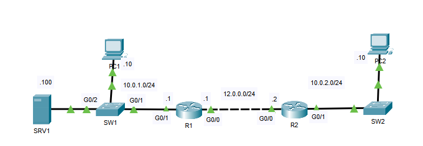
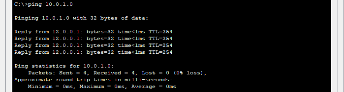
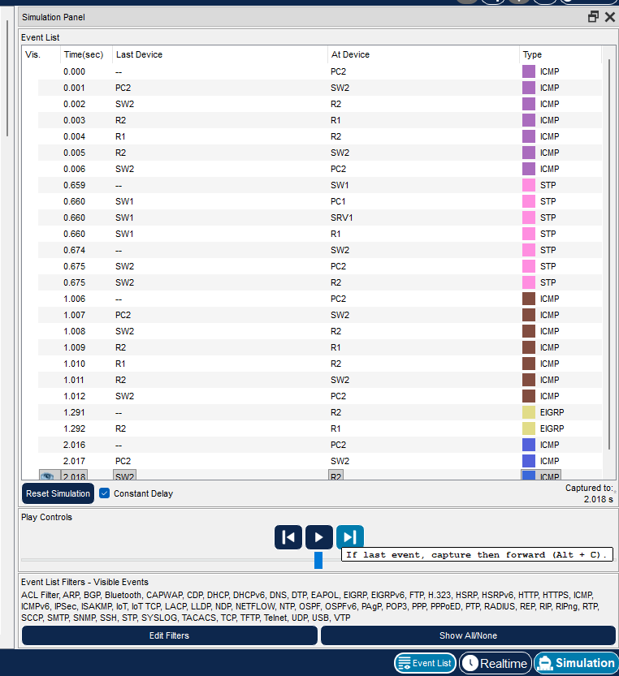
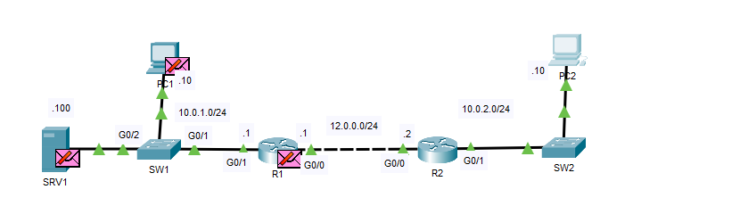

## 34 - LABORATORIO - SPAN - CCNA



1. Haga ping de PC2 a PC1 para completar el proceso ARP.
2. Cambie al modo "Simulación" de Packet Tracer (abajo a la derecha) y haga ping de nuevo de PC2 a PC1.
   Confirme la ruta de los mensajes de eco y respuesta ICMP.
3. Confirme SPAN en SW1 para enviar el tráfico de entrada y salida de G0/1 a SRV1.
4. Haga ping de nuevo de PC2 a PC1 en modo simulación para confirmar que se envían copias de los mensajes de eco y respuesta ICMP a SRV1.
---

**1. Haga ping de PC2 a PC1 para completar el proceso ARP.**



**2. Cambie al modo "Simulación" de Packet Tracer (abajo a la derecha) y haga ping de nuevo de PC2 a PC1.**
   Confirme la ruta de los mensajes de eco y respuesta ICMP

En PC2
```
C:\>ping 10.0.1.0
```



**3. Confirme SPAN en SW1 para enviar el tráfico de entrada y salida de G0/1 a SRV1.**

En SW1
```
SW1(config)#monitor session 1 source interface g0/1 both
```
- `session 1` → Número de sesión SPAN
- `source` → Puerto que quieres monitorear
- `destination` → Puerto donde conectas el sniffer (Wireshark, PC, etc.)
- `both` →Entrada + salida Análisis completo

```
SW1(config)#monitor session 1 source interface g0/2
```

**4. Haga ping de nuevo de PC2 a PC1 en modo simulación para confirmar que se envían copias de los mensajes de eco y respuesta ICMP a SRV1.**+

En PC2
```
C:\>ping 10.0.1.0
```


