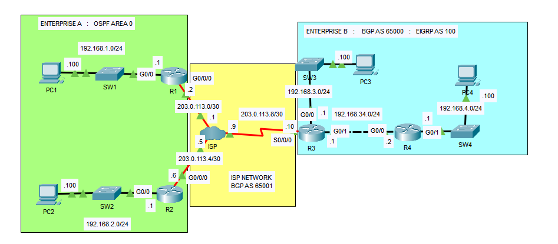
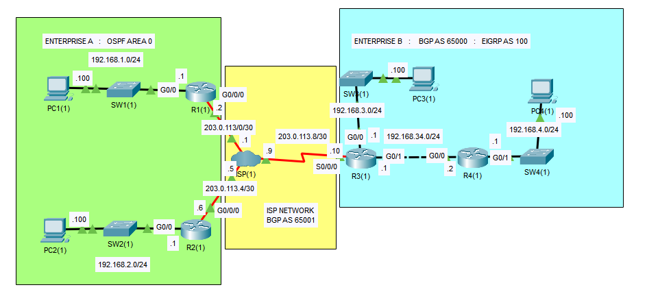
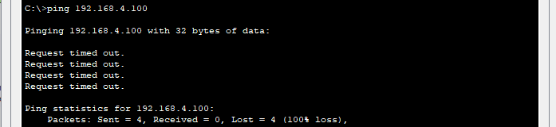
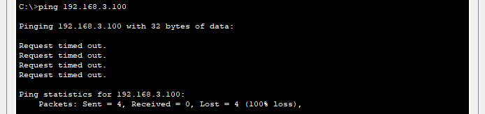
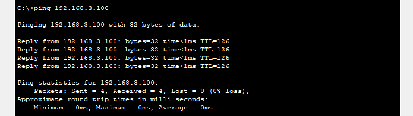

## 35 - LABORATORIO - Review Configuration 03 - CCNA

#### A)



**Enterprise A:**
1. Configure rutas estáticas a Internet en R1 y R2.
2. Configure un túnel GRE de R1 a R2.
   Use direcciones en la red 192.168.12.0/30 para el túnel.
3. Configure OSPF en las interfaces del túnel y las redes internas de R1 y R2.

**Enterprise B:**
1. Configure PPP con autenticación CHAP en el R3 para conectarse al ISP.
   Configure el nombre de usuario ISP y la contraseña CCNA para la autenticación.
2. Configure EIGRP en el R3 y el R4, anunciando todas las rutas conectadas.
   La interfaz S0/0/0 del R3 debe ser pasiva.
3. Configure EBGP en el R3 para conectarse al ISP.
4. ¿Por qué la PC1 no puede hacer ping a la PC4? SUGERENCIA: Observe el R4.

#### B) Troubleshooting



Solucione los siguientes problemas de red:
1. La PC2 no puede hacer ping a la PC1.
2. La PC4 no puede hacer ping a la PC3.
3. Los hosts de la Empresa B no pueden hacer ping a los hosts de la Empresa A.
---
#### A)

**Enterprise A:**
**1. Configure rutas estáticas a Internet en R1 y R2.**

En R1
```
R1(config)#ip route 0.0.0.0 0.0.0.0 g0/0/0
```

En R2
```
R2(config)#ip route 0.0.0.0 0.0.0.0 g0/0/0
```

**2. Configure un túnel GRE de R1 a R2.**
   Use direcciones en la red 192.168.12.0/30 para el túnel.

En R2
```
R2(config)#int tunnel 0
R2(config-if)#tunnel source g0/0/0
R2(config-if)#tunnel destination 203.0.113.2
R2(config-if)#ip address 192.168.12.2 255.255.255.252
```

En R1
```
R1(config)#int tunnel 0
R1(config-if)#tunnel source g0/0/0
R1(config-if)#tunnel destination 203.0.113.6
R1(config-if)#ip address 192.168.12.1 255.255.255.252
```

**3. Configure OSPF en las interfaces del túnel y las redes internas de R1 y R2.**

En R1
```
R1(config)#router ospf 1
R1(config-router)#net 192.168.1.0 0.0.0.255 area 0
R1(config-router)#net 192.168.12.0 0.0.0.3 area 0
```

En R2
```
R2(config)#router ospf 1
R2(config-router)#net 192.168.2.0 0.0.0.255 area 0
R2(config-router)#net 192.168.12.0 0.0.0.3 area 0
```

**Enterprise B:**

**1. Configure PPP con autenticación CHAP en el R3 para conectarse al ISP.
   Configure el nombre de usuario ISP y la contraseña CCNA para la autenticación.**

En R3
```
R3(config)#username ISP password CCNA
R3(config)#int s0/0/0
R3(config-if)#encapsulation ppp
R3(config-if)#ppp authentication chap
```

```
R3(config-if)#do ping 203.0.113.9
Type escape sequence to abort.
Sending 5, 100-byte ICMP Echos to 203.0.113.9, timeout is 2 seconds:
!!!!!
Success rate is 100 percent (5/5), round-trip min/avg/max = 10/18/25 ms
```

**2. Configure EIGRP en el R3 y el R4, anunciando todas las rutas conectadas.
   La interfaz S0/0/0 del R3 debe ser pasiva.**

En R3
```
R3(config)#router eigrp 100
R3(config-router)#net 203.0.113.8 0.0.0.3
R3(config-router)#net 192.168.3.0 0.0.0.255
R3(config-router)#net 192.168.34.0 0.0.0.255
R3(config-router)#passive-interface s0/0/0
```

En R4
```
R4(config)#router eigrp 100
R4(config-router)#net 192.168.34.0 0.0.0.255
R4(config-router)#net 192.168.4.0 0.0.0.255
```

**3. Configure EBGP en el R3 para conectarse al ISP.**

En R3
```
R3(config)#router bgp 65000
R3(config-router)#neighbor 203.0.113.9 re
R3(config-router)#neighbor 203.0.113.9 remote-as 65001
R3(config-router)#net 192.168.3.0 mask 255.255.255.0
R3(config-router)#net 192.168.34.0 mask 255.255.255.0
R3(config-router)#net 192.168.4.0 mask 255.255.255.0
```

**4. ¿Por qué la PC1 no puede hacer ping a la PC4? SUGERENCIA: Observe el R4.**

En PC1



En R4
```
R4(config-router)#do sh ip route

D 192.168.3.0/24 [90/3072] via 192.168.34.1, 00:06:47, GigabitEthernet0/0
192.168.4.0/24 is variably subnetted, 2 subnets, 2 masks
C 192.168.4.0/24 is directly connected, GigabitEthernet0/1
L 192.168.4.1/32 is directly connected, GigabitEthernet0/1
192.168.34.0/24 is variably subnetted, 2 subnets, 2 masks
C 192.168.34.0/24 is directly connected, GigabitEthernet0/0
L 192.168.34.2/32 is directly connected, GigabitEthernet0/0
203.0.113.0/30 is subnetted, 1 subnets
D 203.0.113.8/30 [90/2170112] via 192.168.34.1, 00:06:47, GigabitEthernet0/0
```
R4 no tiene no tiene una ruta a 192.168.1.0/24 ni a ninguna otra red mas allá de R3.

Para ello haremos una ruta estática que apunte a R3
```
R4(config)#ip route 0.0.0.0 0.0.0.0 192.168.34.1
```


#### B) Troubleshooting

Solucione los siguientes problemas de red:

**1. La PC2 no puede hacer ping a la PC1.**


En R2
```
R2#sho ip route

192.168.2.0/24 is variably subnetted, 2 subnets, 2 masks
C 192.168.2.0/24 is directly connected, GigabitEthernet0/0
L 192.168.2.1/32 is directly connected, GigabitEthernet0/0
203.0.113.0/24 is variably subnetted, 2 subnets, 2 masks
C 203.0.113.4/30 is directly connected, GigabitEthernet0/0/0
L 203.0.113.6/32 is directly connected, GigabitEthernet0/0/0
```
R2 solo conoce rutas locales y conectada, falta la ruta por predeterminada a internet.

```
R2(config)#ip route 0.0.0.0 0.0.0.0 g0/0/0
```


**2. La PC4 no puede hacer ping a la PC3.***



En R4
```
R4#sho ip route
S*   0.0.0.0/0 [1/0] via 192.168.34.1
```
Si tiene la ruta predeterminada
Entonces nos dirigimos a R3
En R3
```
R3#sho ip ro

192.168.3.0/24 is variably subnetted, 2 subnets, 2 masks
C 192.168.3.0/24 is directly connected, GigabitEthernet0/0
L 192.168.3.1/32 is directly connected, GigabitEthernet0/0
192.168.34.0/24 is variably subnetted, 2 subnets, 2 masks
C 192.168.34.0/24 is directly connected, GigabitEthernet0/1
L 192.168.34.1/32 is directly connected, GigabitEthernet0/1
```
R3 solo conoce rutas locales y conectada, falta la ruta por predeterminada a internet.

```
R3#sh ip eigrp nei
IP-EIGRP neighbors for process 100
```
Vemos que en R3 no hay vecinos eigrp

```
R3#sh ip protocols
Routing for Networks:

203.0.113.8/30
192.168.3.0
192.168.34.0/32
```
R3 no tiene no tiene ninguna interfaz en la red `192.168.34.0/32`
Lo corregimos por `192.168.34.0/24`

```
R3(config)#router eigrp 100
R3(config-router)#no network 192.168.34.0 0.0.0.0
R3(config-router)#network 192.168.34.0 0.0.0.255
```



**3. Los hosts de la Empresa B no pueden hacer ping a los hosts de la Empresa A.**

Este seguro debe ser de que R3 aún no tenga rutas bgp.

En R3
```
R3#sh ip bgp summary
Neighbor V AS MsgRcvd MsgSent TblVer InQ OutQ Up/Down State/PfxRcd
203.0.113.9 4 65001 0 0 1 0 0 01:18:55 4
```
Esta correcto la configuración del vecino esta correcto

```
R3#sh ip bgp neighbors
BGP state = Active
```
Vemos que el estado esta activo

Vemos la interfaz
```
R3#sh int s0/0/0
```

```
R3#sh run

interface Serial0/0/0
ip address 203.0.113.10 255.255.255.252
clock rate 2000000
```
Vemos que no esta configurado PPP.

```
username ISP password 0 CCNA
```
Vemos que si tiene la combinación de usuario y contraseña si esta configurada.

Entonces
```
R3(config)#int s0/0/0
R3(config-if)#encapsulation ppp
R3(config-if)#ppp authentication chap
```

Probamos el ping


Se ha resuelto el problema de red correctamente.